# Instructor Student Access Flows and Diagrams

## User Flow Diagrams

### Instructor Login and Access Flow
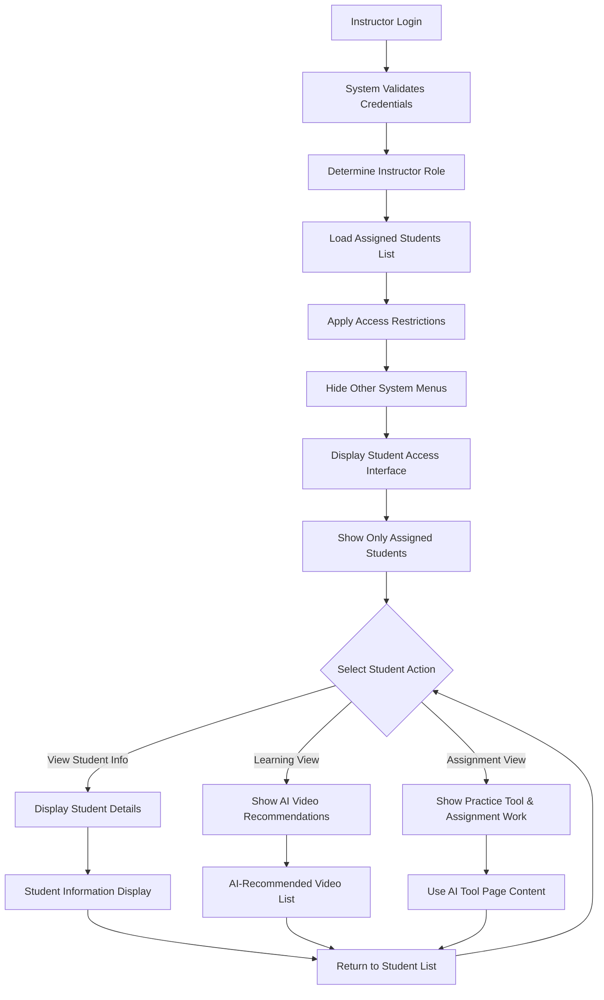

### Student Assignment Access Flow
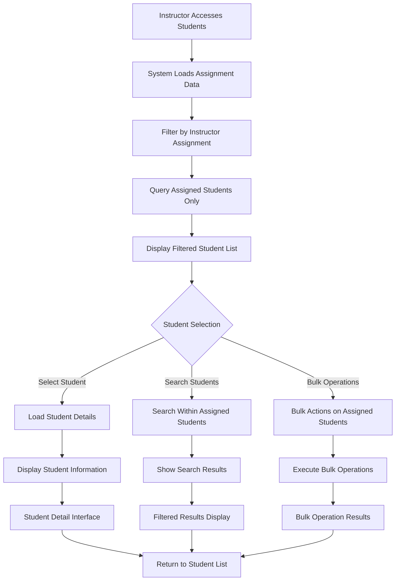

### Access Restriction Enforcement Flow
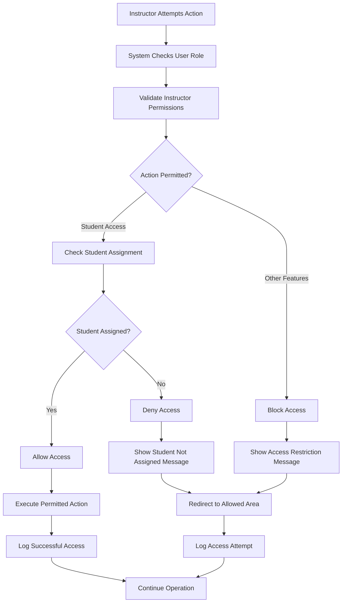

## Sequence Diagrams

### Instructor Authentication and Setup Sequence
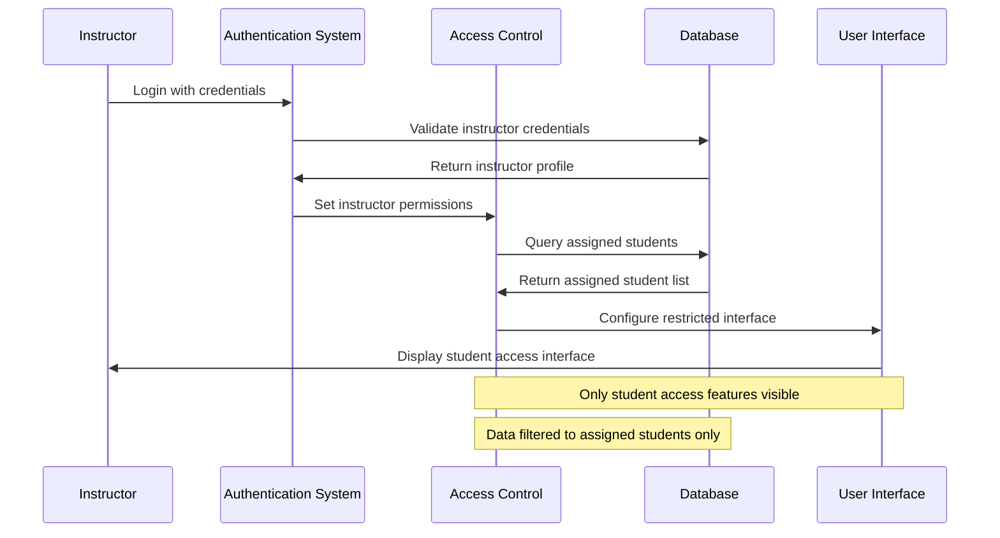

### Student Data Access Sequence
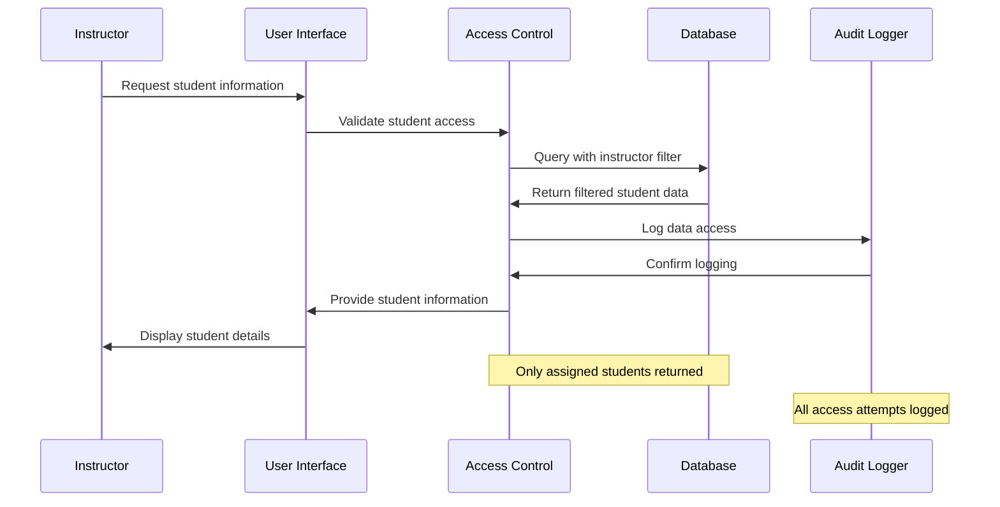

### Assignment Change Propagation Sequence
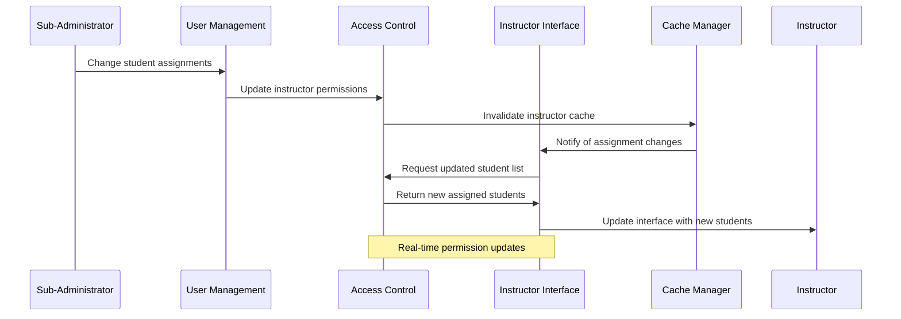

## State Diagrams

### Instructor Session States
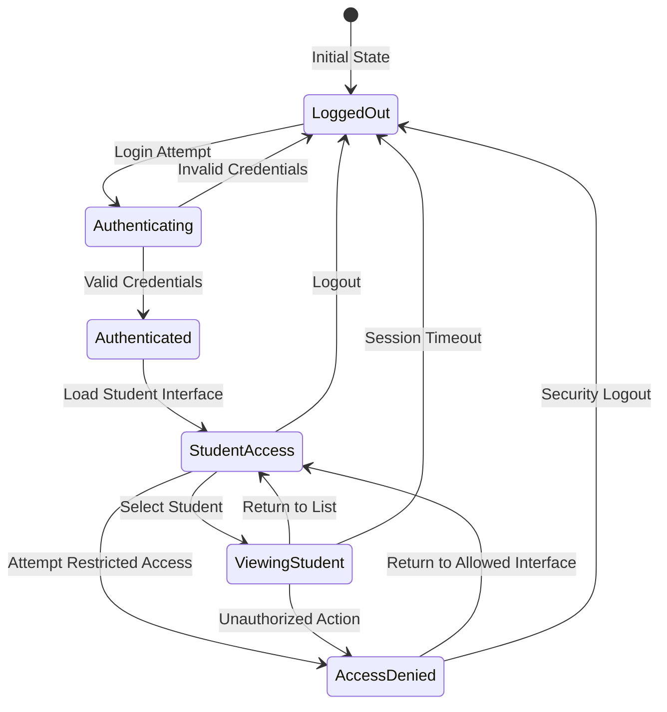

### Student Assignment States
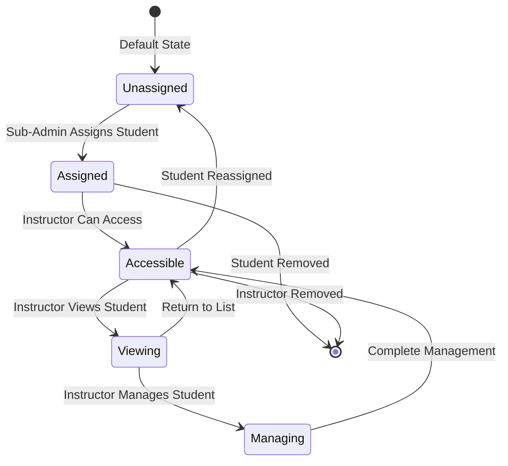

## Activity Diagrams

### Daily Instructor Workflow
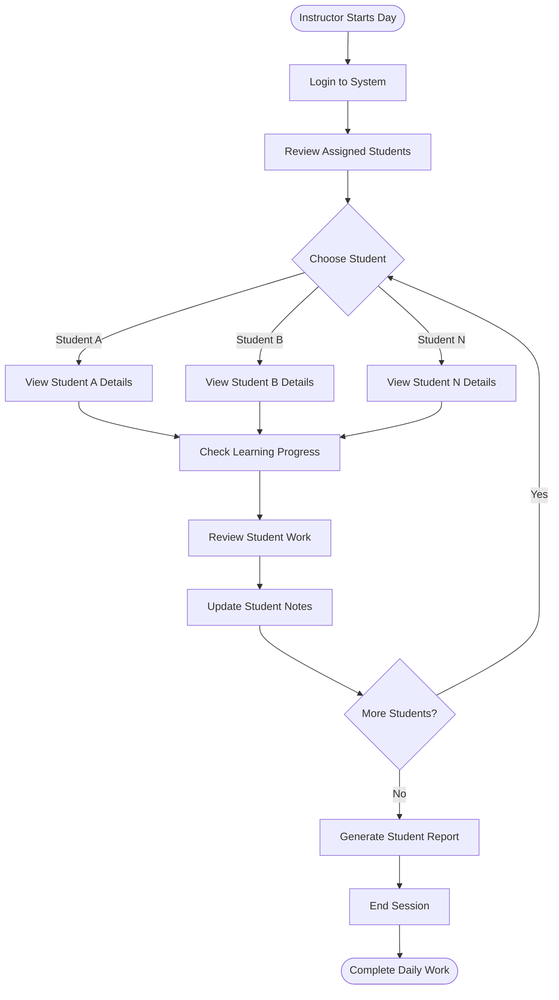

### Student Information Access Workflow
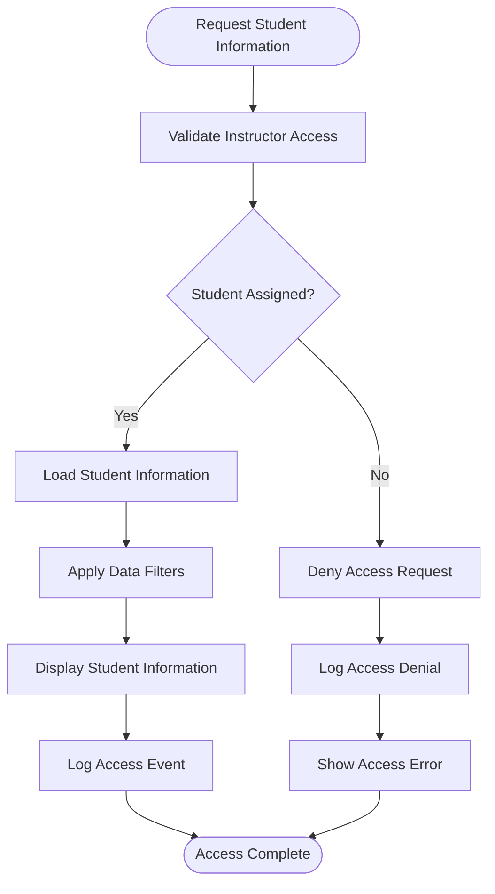

## Use Case Diagrams

### Instructor Student Access Use Cases
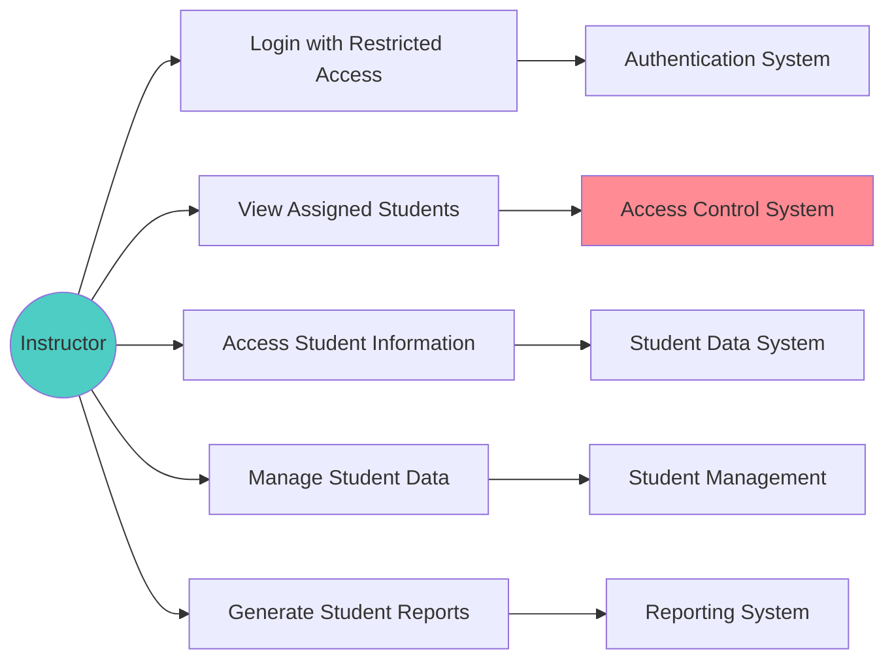

### System Access Control Use Cases
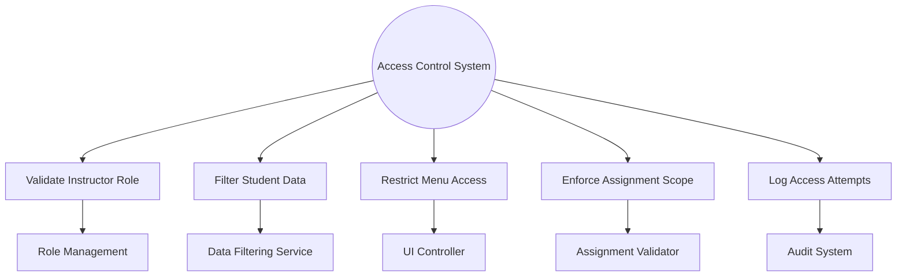

## Component Interaction Diagrams

### Instructor Access Architecture
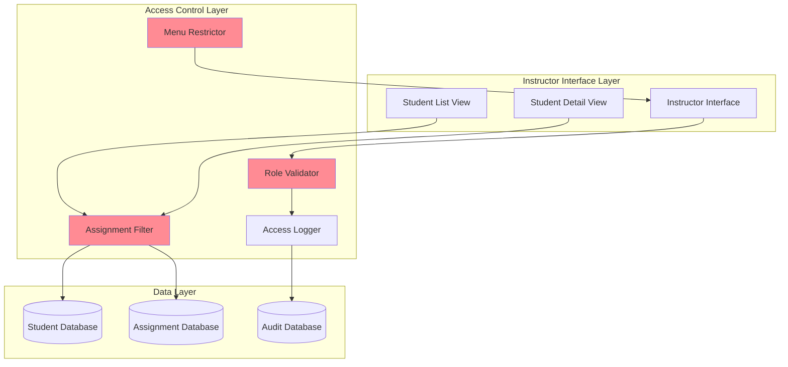

### Real-time Assignment Updates
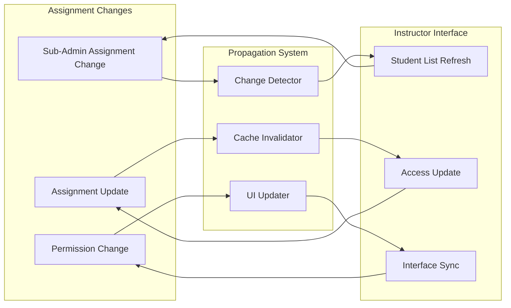

### Security and Audit Integration
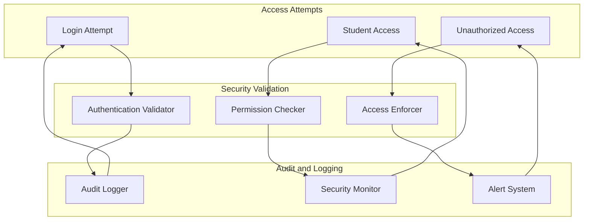