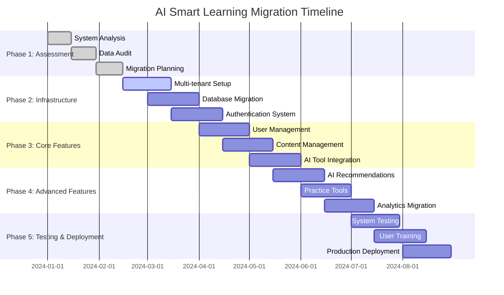

# Data Migration Plan

## Overview
Comprehensive plan for migrating from the existing AI Smart Learning system to the renewed multi-tenant SaaS architecture, including feature removal, data transformation, and system modernization.

## Migration Scope and Timeline

### Migration Phases


## Current System Analysis

### Existing Data Structure
```sql
-- Current system tables (to be migrated or deprecated)
EXISTING_TABLES = {
    'users': {
        'students': ['id', 'name', 'email', 'password', 'age', 'work_field', 'position', 'learning_goals', 'basic_info'],
        'instructors': ['id', 'name', 'email', 'password', 'contact_info'],
        'administrators': ['id', 'name', 'email', 'password', 'permissions']
    },
    'content': {
        'session_videos': ['id', 'session_number', 'title', 'url', 'priority'],
        'recommended_videos': ['id', 'title', 'description', 'url', 'priority', 'comments', 'likes'],
        'ox_simulations': ['id', 'title', 'questions', 'answers'],  # TO BE DELETED
        'vr_simulations': ['id', 'title', 'vr_content']  # TO BE DELETED
    },
    'ai_tools': {
        'api_tasks': ['id', 'task_name', 'api_endpoint', 'status'],  # TO BE REPLACED
        'api_exposure': ['id', 'tool_name', 'visibility', 'permissions']
    },
    'surveys': {
        'pre_surveys': ['id', 'student_id', 'responses']  # TO BE DELETED
    }
}
```

### Features to be Removed
1. **Session-based Video Management (차시별 동영상 관리)**
   - Current session video structure
   - Priority-based video recommendations
   - Manual video session assignments

2. **O/X Simulation System**
   - All O/X simulation content and logic
   - VR O/X simulation components
   - Related user progress data

3. **Pre-survey System (사전설문)**
   - All pre-survey questions and responses
   - Survey-based user profiling
   - Survey analytics and reporting

4. **Legacy AI API Management**
   - Old API task progress management
   - Manual API exposure controls
   - Legacy tool configuration system

## Data Migration Strategy

### Phase 1: User Data Migration

#### Student Data Transformation
```python
def migrate_student_data():
    """Migrate student data with field simplification"""
    
    # Fields to keep: Name, ID, Password, Instructor, Course Schedule, Login Token
    # Fields to remove: Age, Work Field, Position, Learning Goals, Basic Info
    
    migration_mapping = {
        'keep_fields': ['name', 'id', 'password', 'instructor_id', 'course_schedule'],
        'remove_fields': ['age', 'work_field', 'position', 'learning_goals', 'basic_info'],
        'new_fields': ['login_token', 'organization_id', 'created_at', 'updated_at']
    }
    
    for student in get_existing_students():
        new_student = {
            'id': student['id'],
            'name': student['name'],
            'password': encrypt_password_sha256(student['password']),  # Re-encrypt with SHA256
            'instructor_id': student['instructor_id'],
            'course_schedule': student['course_schedule'],
            'login_token': generate_unique_login_token(),
            'organization_id': determine_organization_id(student),  # Assign to default org initially
            'created_at': datetime.utcnow(),
            'updated_at': datetime.utcnow()
        }
        
        insert_new_student(new_student)
        log_migration_action('student_migrated', student['id'])
```

#### Instructor Data Migration
```python
def migrate_instructor_data():
    """Migrate instructor data with enhanced permissions"""
    
    for instructor in get_existing_instructors():
        new_instructor = {
            'id': instructor['id'],
            'name': instructor['name'],
            'email': instructor['email'],
            'password': encrypt_password_sha256(instructor['password']),
            'contact_info': instructor['contact_info'],
            'organization_id': determine_organization_id(instructor),
            'permissions': 'instructor',  # Set role-based permissions
            'created_at': datetime.utcnow(),
            'updated_at': datetime.utcnow()
        }
        
        insert_new_instructor(new_instructor)
        migrate_instructor_student_assignments(instructor['id'])
```

### Phase 2: Content Migration

#### Video Content Transformation
```python
def migrate_video_content():
    """Transform video content for new session-based structure"""
    
    # Migrate from priority-based to session-based (1-40)
    existing_videos = get_existing_recommended_videos()
    
    # Group videos by organization (initially single organization)
    default_org_id = get_default_organization_id()
    
    session_counter = 1
    for video in existing_videos:
        if session_counter <= 40:  # Limit to 40 sessions
            new_video = {
                'id': generate_new_id(),
                'session_number': session_counter,
                'title': video['title'],
                'description': video['description'],
                'url': video['url'],
                'script_content': extract_or_generate_script_content(video),
                'hashtags': generate_hashtags_from_content(video),
                'thumbnail_url': video.get('thumbnail_url'),
                'organization_id': default_org_id,
                'comments_count': video.get('comments', 0),
                'likes_count': video.get('likes', 0),
                'created_at': datetime.utcnow()
            }
            
            insert_session_video(new_video)
            session_counter += 1
        else:
            # Log videos that couldn't be migrated due to 40-session limit
            log_migration_warning('video_limit_exceeded', video['id'])
```

#### Content Cleanup
```python
def cleanup_deprecated_content():
    """Remove deprecated content and features"""
    
    deprecated_tables = [
        'ox_simulations',
        'vr_ox_simulations', 
        'pre_surveys',
        'survey_responses',
        'legacy_api_tasks'
    ]
    
    for table in deprecated_tables:
        # Backup data before deletion
        backup_table_data(table)
        
        # Drop deprecated tables
        drop_table_safely(table)
        
        log_migration_action('table_removed', table)
```

### Phase 3: AI Tool System Migration

#### AI Tool Configuration Migration
```python
def migrate_ai_tool_system():
    """Migrate from legacy API management to new AI tool system"""
    
    # Create default AI tool configurations
    default_tools = get_eden_ai_tool_catalog()
    
    for tool in default_tools:
        new_tool_config = {
            'tool_id': tool['id'],
            'tool_name': tool['name'],
            'provider': tool['provider'],
            'category': tool['category'],
            'master_enabled': True,  # Enable all tools by default for super admin
            'created_at': datetime.utcnow()
        }
        
        insert_ai_tool_config(new_tool_config)
    
    # Migrate existing API configurations where possible
    migrate_existing_api_configs()
```

#### Practice Session Migration
```python
def migrate_practice_sessions():
    """Create practice session structure (1-40) from legacy data"""
    
    # Create default practice session configurations
    for session_num in range(1, 41):
        default_session = {
            'session_number': session_num,
            'organization_id': get_default_organization_id(),
            'session_url': generate_session_url(session_num),
            'pre_practice_message': get_default_practice_message(),
            'available_tools': get_default_tool_selection(),
            'created_at': datetime.utcnow()
        }
        
        insert_practice_session(default_session)
    
    # Create assignment slots (1-10)
    for assignment_num in range(1, 11):
        default_assignment = {
            'assignment_number': assignment_num,
            'organization_id': get_default_organization_id(),
            'assignment_url': generate_assignment_url(assignment_num),
            'instructions': get_default_assignment_instructions(),
            'available_tools': get_default_assignment_tools(),
            'created_at': datetime.utcnow()
        }
        
        insert_assignment_config(default_assignment)
```

## Multi-Tenant Architecture Setup

### Organization Structure Creation
```python
def setup_multi_tenant_structure():
    """Set up initial multi-tenant organization structure"""
    
    # Create default super administrator
    super_admin = {
        'id': generate_admin_id(),
        'username': 'super_admin',
        'email': 'admin@ai-smart-learning.com',
        'password': encrypt_password_sha256(generate_secure_password()),
        'role': 'super_administrator',
        'created_at': datetime.utcnow()
    }
    
    insert_super_administrator(super_admin)
    
    # Create default organization for existing data
    default_organization = {
        'id': generate_organization_id(),
        'name': 'Default Organization',
        'description': 'Migrated from legacy system',
        'logo_url': None,
        'created_at': datetime.utcnow(),
        'status': 'active'
    }
    
    insert_organization(default_organization)
    
    # Create default sub-administrator for the organization
    sub_admin = {
        'id': generate_admin_id(),
        'username': 'default_sub_admin',
        'email': 'subadmin@default-org.com',
        'password': encrypt_password_sha256(generate_secure_password()),
        'role': 'sub_administrator',
        'organization_id': default_organization['id'],
        'created_at': datetime.utcnow()
    }
    
    insert_sub_administrator(sub_admin)
```

### Database Schema Migration
```sql
-- Create new multi-tenant tables
CREATE TABLE organizations (
    id UUID PRIMARY KEY DEFAULT gen_random_uuid(),
    name VARCHAR(255) NOT NULL,
    description TEXT,
    logo_url VARCHAR(500),
    created_at TIMESTAMP DEFAULT CURRENT_TIMESTAMP,
    updated_at TIMESTAMP DEFAULT CURRENT_TIMESTAMP,
    status VARCHAR(50) DEFAULT 'active'
);

CREATE TABLE users (
    id UUID PRIMARY KEY DEFAULT gen_random_uuid(),
    organization_id UUID REFERENCES organizations(id),
    username VARCHAR(100) UNIQUE NOT NULL,
    email VARCHAR(255) UNIQUE NOT NULL,
    password_hash VARCHAR(255) NOT NULL,
    role VARCHAR(50) NOT NULL,
    created_at TIMESTAMP DEFAULT CURRENT_TIMESTAMP,
    updated_at TIMESTAMP DEFAULT CURRENT_TIMESTAMP
);

CREATE TABLE students (
    id UUID PRIMARY KEY DEFAULT gen_random_uuid(),
    organization_id UUID REFERENCES organizations(id),
    name VARCHAR(255) NOT NULL,
    student_id VARCHAR(100) NOT NULL,
    password_hash VARCHAR(255) NOT NULL,
    instructor_id UUID REFERENCES users(id),
    course_schedule JSONB,
    login_token VARCHAR(255) UNIQUE,
    created_at TIMESTAMP DEFAULT CURRENT_TIMESTAMP,
    updated_at TIMESTAMP DEFAULT CURRENT_TIMESTAMP,
    UNIQUE(organization_id, student_id)
);

-- Add organizational isolation indexes
CREATE INDEX idx_students_organization ON students(organization_id);
CREATE INDEX idx_users_organization ON users(organization_id);
CREATE INDEX idx_content_organization ON session_videos(organization_id);
```

## Data Validation and Quality Assurance

### Migration Validation Scripts
```python
def validate_migration_integrity():
    """Validate data integrity after migration"""
    
    validation_results = {
        'user_migration': validate_user_migration(),
        'content_migration': validate_content_migration(),
        'ai_tool_migration': validate_ai_tool_migration(),
        'organizational_isolation': validate_organizational_isolation()
    }
    
    return validation_results

def validate_user_migration():
    """Validate user data migration"""
    original_count = count_original_users()
    migrated_count = count_migrated_users()
    
    validation = {
        'original_users': original_count,
        'migrated_users': migrated_count,
        'migration_success_rate': (migrated_count / original_count) * 100,
        'password_encryption_check': validate_password_encryption(),
        'login_token_generation': validate_login_tokens()
    }
    
    return validation

def validate_organizational_isolation():
    """Ensure organizational data isolation is working"""
    test_cases = [
        test_cross_org_data_access(),
        test_user_scope_filtering(),
        test_content_isolation(),
        test_session_url_isolation()
    ]
    
    return all(test_cases)
```

## Rollback Strategy

### Migration Rollback Plan
```python
def create_rollback_plan():
    """Create comprehensive rollback strategy"""
    
    rollback_steps = [
        {
            'step': 'backup_verification',
            'description': 'Verify all backup data is complete and accessible',
            'rollback_function': verify_backup_integrity
        },
        {
            'step': 'database_restore',
            'description': 'Restore original database from backup',
            'rollback_function': restore_original_database
        },
        {
            'step': 'application_rollback',
            'description': 'Deploy previous application version',
            'rollback_function': deploy_previous_version
        },
        {
            'step': 'data_consistency_check',
            'description': 'Verify data consistency after rollback',
            'rollback_function': verify_rollback_integrity
        }
    ]
    
    return rollback_steps

def execute_rollback():
    """Execute rollback procedure if migration fails"""
    rollback_plan = create_rollback_plan()
    
    for step in rollback_plan:
        try:
            step['rollback_function']()
            log_rollback_step(step['step'], 'success')
        except Exception as e:
            log_rollback_step(step['step'], 'failed', str(e))
            raise RollbackException(f"Rollback failed at step: {step['step']}")
```

## Post-Migration Tasks

### System Optimization
```python
def post_migration_optimization():
    """Optimize system after migration completion"""
    
    optimization_tasks = [
        rebuild_database_indexes(),
        update_database_statistics(),
        configure_caching_layers(),
        setup_monitoring_alerts(),
        validate_performance_benchmarks()
    ]
    
    for task in optimization_tasks:
        execute_optimization_task(task)

def setup_new_features():
    """Configure new features not available in legacy system"""
    
    new_features = [
        setup_ai_recommendation_system(),
        configure_eden_ai_integration(),
        initialize_rag_methodology(),
        setup_multi_tenant_branding(),
        configure_advanced_analytics()
    ]
    
    for feature in new_features:
        initialize_feature(feature)
```

### User Training and Documentation
```python
def prepare_user_training():
    """Prepare training materials for new system"""
    
    training_materials = {
        'super_administrators': create_super_admin_training(),
        'sub_administrators': create_sub_admin_training(),
        'instructors': create_instructor_training(),
        'students': create_student_training()
    }
    
    return training_materials

def create_migration_documentation():
    """Create comprehensive migration documentation"""
    
    documentation = {
        'migration_summary': generate_migration_summary(),
        'feature_changes': document_feature_changes(),
        'new_capabilities': document_new_features(),
        'troubleshooting_guide': create_troubleshooting_guide(),
        'api_documentation': generate_api_docs()
    }
    
    return documentation
```

## Success Metrics and Validation

### Migration Success Criteria
- **Data Integrity**: 100% of critical user and content data successfully migrated
- **Feature Parity**: All retained features function equivalently or better than legacy system
- **Performance**: New system performs at least as well as legacy system
- **Security**: Enhanced security with SHA256 encryption and multi-tenant isolation
- **User Adoption**: >90% user acceptance of new system within 30 days

### Post-Migration Monitoring
- System performance metrics and response times
- User login success rates and authentication issues
- Data access patterns and organizational isolation effectiveness
- AI tool usage and integration success rates
- Cost optimization and resource utilization improvements

## Risk Mitigation

### Identified Risks and Mitigation Strategies
1. **Data Loss Risk**
   - Mitigation: Comprehensive backup strategy with multiple restore points
   - Validation: Automated data integrity checks throughout migration

2. **Extended Downtime Risk**
   - Mitigation: Phased migration with minimal downtime windows
   - Contingency: Rollback procedures for quick recovery

3. **User Adoption Risk**
   - Mitigation: Comprehensive training and gradual feature rollout
   - Support: Dedicated support team during transition period

4. **Integration Failure Risk**
   - Mitigation: Extensive testing of AI integrations and fallback providers
   - Monitoring: Real-time monitoring of all integrated services

## Dependencies and Prerequisites
- Complete system backup and disaster recovery procedures
- Multi-tenant infrastructure setup and testing
- AI service provider account setup (Eden AI, OpenAI, etc.)
- User training program development and delivery
- Performance testing and optimization procedures
- Security audit and compliance verification