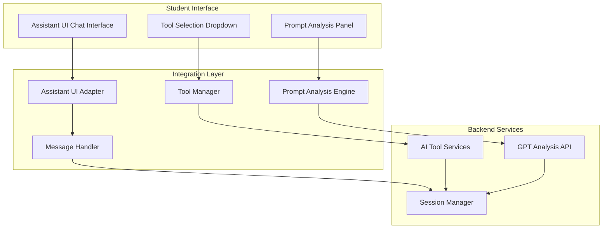

# Assistant UI Integration Specifications

## Overview
Integration with Assistant UI (https://www.assistant-ui.com/) for the AI practice tool interface, providing a modern, responsive chat-like interface for student AI interactions.

## Integration Requirements from docs.txt

### Core Integration Points
Based on Page 15 of docs.txt:
- **Practice Window Integration**: Use https://www.assistant-ui.com/ as the primary interface
- **Tool Selection**: Insert tool selection as a select box at the top
- **Administrator Control**: Only show practice tools set by administrator for each session
- **Prompt Analysis**: Integrate GPT API for prompt analysis and improvement suggestions

## Assistant UI Component Integration

### Primary Interface Components
```typescript
// Core Assistant UI Components to integrate
interface AssistantUIComponents {
  ChatInterface: {
    component: 'AssistantUI.Chat',
    props: {
      messages: Message[],
      onSendMessage: (message: string) => void,
      tools: SelectedTool[],
      isLoading: boolean
    }
  },
  
  ToolSelector: {
    component: 'Custom.ToolSelector', 
    props: {
      availableTools: AITool[],
      selectedTool: string,
      onToolChange: (toolId: string) => void
    }
  },
  
  PromptAnalysisPanel: {
    component: 'Custom.AnalysisPanel',
    props: {
      analysis: PromptAnalysis,
      suggestions: ImprovementSuggestion[],
      isAnalyzing: boolean
    }
  }
}
```

### Integration Architecture


## Implementation Specifications

### Assistant UI Configuration
```javascript
// Assistant UI Setup Configuration
const assistantUIConfig = {
  // Base configuration for chat interface
  chat: {
    theme: 'light', // Match organizational branding
    layout: 'fullscreen',
    showTimestamps: true,
    enableMarkdown: true,
    placeholder: '프롬프트를 입력하고 Enter (또는 Ctrl+Enter)로 전송'
  },
  
  // Tool integration configuration
  tools: {
    position: 'top', // Tool selector at top as specified
    style: 'dropdown',
    showOnlyConfigured: true, // Only administrator-configured tools
    allowSwitching: true
  },
  
  // Analysis panel configuration
  analysis: {
    position: 'side',
    autoAnalyze: true,
    showSuggestions: true,
    realTimeAnalysis: true
  }
}
```

### Custom Tool Selector Implementation
```typescript
interface ToolSelectorProps {
  sessionId: string;
  organizationId: string;
  onToolSelect: (toolId: string) => void;
}

const ToolSelector: React.FC<ToolSelectorProps> = ({ 
  sessionId, 
  organizationId, 
  onToolSelect 
}) => {
  const [availableTools, setAvailableTools] = useState<AITool[]>([]);
  const [selectedTool, setSelectedTool] = useState<string>('');
  
  useEffect(() => {
    // Load only administrator-configured tools for this session
    loadSessionTools(sessionId, organizationId)
      .then(tools => setAvailableTools(tools));
  }, [sessionId, organizationId]);
  
  const handleToolChange = (toolId: string) => {
    setSelectedTool(toolId);
    onToolSelect(toolId);
  };
  
  return (
    <select 
      value={selectedTool}
      onChange={(e) => handleToolChange(e.target.value)}
      className="tool-selector"
    >
      <option value="">도구를 선택하세요</option>
      {availableTools.map(tool => (
        <option key={tool.id} value={tool.id}>
          {tool.name}
        </option>
      ))}
    </select>
  );
};
```

### Message Flow Integration
```typescript
// Integration with Assistant UI message system
class AssistantUIMessageHandler {
  constructor(
    private aiToolService: AIToolService,
    private promptAnalyzer: PromptAnalyzer,
    private sessionManager: SessionManager
  ) {}
  
  async handleUserMessage(message: string, toolId: string): Promise<void> {
    // 1. Analyze prompt in parallel with AI tool processing
    const [aiResponse, promptAnalysis] = await Promise.all([
      this.aiToolService.processPrompt(message, toolId),
      this.promptAnalyzer.analyzePrompt(message)
    ]);
    
    // 2. Display AI response in chat
    this.displayAIResponse(aiResponse);
    
    // 3. Show prompt analysis in side panel
    this.displayPromptAnalysis(promptAnalysis);
    
    // 4. Log interaction for session tracking
    this.sessionManager.logInteraction({
      prompt: message,
      toolId,
      response: aiResponse,
      analysis: promptAnalysis,
      timestamp: new Date()
    });
  }
  
  private displayAIResponse(response: AIResponse): void {
    // Integrate with Assistant UI to show AI response
    AssistantUI.addMessage({
      role: 'assistant',
      content: response.content,
      toolUsed: response.toolId,
      timestamp: new Date()
    });
  }
  
  private displayPromptAnalysis(analysis: PromptAnalysis): void {
    // Update analysis panel with suggestions
    AnalysisPanel.updateAnalysis({
      score: analysis.qualityScore,
      issues: analysis.identifiedIssues,
      suggestions: analysis.improvements,
      strengths: analysis.strengths
    });
  }
}
```

## Prompt Analysis Integration

### GPT Analysis Integration (from docs.txt reference)
```typescript
// Integration with GPT API for prompt analysis
// Reference: https://promptlab-vercel-ready.vercel.app/
class PromptAnalysisService {
  constructor(private gptApiKey: string) {}
  
  async analyzePrompt(prompt: string): Promise<PromptAnalysis> {
    const analysisPrompt = `
      Analyze the following prompt for a Korean AI learning system:
      "${prompt}"
      
      Provide analysis in Korean focusing on:
      1. 불명확한 대상 (Unclear targets)
      2. 세부요구없음 (Missing details) 
      3. 시간제약누락 (Missing time constraints)
      4. 형식미지정 (Format not specified)
      5. 안전·윤리조건언급없음 (Safety/ethics not mentioned)
      
      Return JSON with issues and improvement suggestions.
    `;
    
    const response = await this.callGPTAPI(analysisPrompt);
    return this.parseAnalysisResponse(response);
  }
  
  private parseAnalysisResponse(response: string): PromptAnalysis {
    // Parse GPT response and format for display
    const parsed = JSON.parse(response);
    
    return {
      qualityScore: parsed.score || 75,
      identifiedIssues: parsed.issues || [],
      improvements: parsed.suggestions || [],
      strengths: parsed.strengths || [],
      categories: {
        clarity: parsed.clarity || 'good',
        specificity: parsed.specificity || 'needs_improvement',
        format: parsed.format || 'missing',
        ethics: parsed.ethics || 'not_mentioned'
      }
    };
  }
}
```

## UI Customization and Branding

### Organizational Branding Integration
```css
/* Custom CSS for Assistant UI to match organizational branding */
.assistant-ui-chat {
  --primary-color: var(--org-primary-color);
  --secondary-color: var(--org-secondary-color);
  --background-color: var(--org-background-color);
  --text-color: var(--org-text-color);
}

.tool-selector {
  background: var(--org-primary-color);
  color: white;
  border: none;
  padding: 8px 16px;
  border-radius: 4px;
  font-family: var(--org-font-family);
}

.analysis-panel {
  background: var(--org-background-light);
  border-left: 3px solid var(--org-accent-color);
  padding: 16px;
}
```

### Responsive Design Configuration
```typescript
// Responsive breakpoints for Assistant UI
const responsiveConfig = {
  mobile: {
    maxWidth: '768px',
    layout: 'stacked',
    toolSelector: 'bottom',
    analysisPanel: 'modal'
  },
  tablet: {
    maxWidth: '1024px', 
    layout: 'sidebar',
    toolSelector: 'top',
    analysisPanel: 'sidebar'
  },
  desktop: {
    minWidth: '1025px',
    layout: 'full',
    toolSelector: 'top',
    analysisPanel: 'side'
  }
};
```

## Session Management Integration

### Session Context Preservation
```typescript
// Maintain session context with Assistant UI
class SessionContextManager {
  constructor(private sessionId: string) {}
  
  preserveContext(): AssistantUIContext {
    return {
      sessionId: this.sessionId,
      organizationId: this.getOrganizationId(),
      configuredTools: this.getSessionTools(),
      userPreferences: this.getUserPreferences(),
      conversationHistory: this.getConversationHistory()
    };
  }
  
  restoreContext(context: AssistantUIContext): void {
    // Restore Assistant UI state from session context
    AssistantUI.loadContext({
      messages: context.conversationHistory,
      selectedTool: context.lastUsedTool,
      preferences: context.userPreferences
    });
  }
}
```

### Real-time Updates and Synchronization
```typescript
// Real-time synchronization with backend
class RealTimeSyncService {
  constructor(private websocket: WebSocket) {}
  
  syncWithAssistantUI(): void {
    // Sync tool availability changes
    this.websocket.on('toolsUpdated', (tools: AITool[]) => {
      ToolSelector.updateAvailableTools(tools);
    });
    
    // Sync session configuration changes
    this.websocket.on('sessionConfigUpdated', (config: SessionConfig) => {
      AssistantUI.updateConfiguration(config);
    });
    
    // Sync organizational branding changes
    this.websocket.on('brandingUpdated', (branding: OrgBranding) => {
      AssistantUI.updateTheme(branding);
    });
  }
}
```

## Performance Optimization

### Lazy Loading and Code Splitting
```typescript
// Lazy load Assistant UI components for better performance
const LazyAssistantUI = React.lazy(() => import('@assistant-ui/react'));
const LazyAnalysisPanel = React.lazy(() => import('./AnalysisPanel'));

const PracticeInterface: React.FC = () => {
  return (
    <Suspense fallback={<LoadingSpinner />}>
      <div className="practice-interface">
        <ToolSelector />
        <LazyAssistantUI />
        <LazyAnalysisPanel />
      </div>
    </Suspense>
  );
};
```

### Caching and State Management
```typescript
// Efficient state management for Assistant UI integration
const useAssistantUIState = () => {
  const [messages, setMessages] = useState<Message[]>([]);
  const [selectedTool, setSelectedTool] = useState<string>('');
  const [analysis, setAnalysis] = useState<PromptAnalysis | null>(null);
  
  // Cache frequently used data
  const cachedTools = useMemo(() => 
    getSessionTools(sessionId), [sessionId]
  );
  
  // Debounce prompt analysis to avoid excessive API calls
  const debouncedAnalyze = useCallback(
    debounce((prompt: string) => analyzePrompt(prompt), 500),
    []
  );
  
  return {
    messages,
    selectedTool,
    analysis,
    cachedTools,
    debouncedAnalyze,
    setMessages,
    setSelectedTool,
    setAnalysis
  };
};
```

## Success Metrics and Monitoring

### Integration Success Metrics
- Assistant UI loading time < 2 seconds
- Real-time prompt analysis response < 1 second  
- Tool switching time < 500ms
- Zero UI crashes or freezes during practice sessions
- 95%+ user satisfaction with interface responsiveness

### Monitoring and Analytics
```typescript
// Monitor Assistant UI performance and usage
class AssistantUIMonitor {
  trackInteraction(event: UIInteractionEvent): void {
    analytics.track('assistant_ui_interaction', {
      eventType: event.type,
      toolUsed: event.toolId,
      responseTime: event.responseTime,
      sessionId: event.sessionId,
      organizationId: event.organizationId
    });
  }
  
  trackPerformance(metrics: PerformanceMetrics): void {
    analytics.track('assistant_ui_performance', {
      loadTime: metrics.loadTime,
      renderTime: metrics.renderTime,
      memoryUsage: metrics.memoryUsage,
      errorCount: metrics.errorCount
    });
  }
}
```

## Dependencies and Integration Points
- Assistant UI React components (@assistant-ui/react)
- GPT API for prompt analysis
- WebSocket connection for real-time updates
- Session management system
- AI tool routing and management
- Organizational branding system
- Performance monitoring and analytics