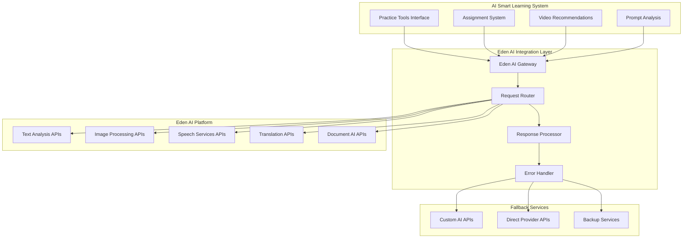

# Eden AI Integration Specifications

## Overview
Comprehensive integration with Eden AI platform (https://www.edenai.co/) as the primary AI service provider for the AI Smart Learning Renewal system, supporting multiple AI capabilities with unified API access and cost management.

## Eden AI Platform Integration

### Core Integration Architecture


## Eden AI Service Categories

### Text Analysis Services
| Service | Eden AI Endpoint | Use Case | Fallback Provider |
|---------|------------------|----------|-------------------|
| Sentiment Analysis | `/text/sentiment_analysis` | Student feedback analysis | Custom NLP API |
| Keyword Extraction | `/text/keyword_extraction` | Content tagging | OpenAI GPT |
| Topic Classification | `/text/topic_extraction` | Content categorization | Custom classifier |
| Language Detection | `/text/language_detection` | Multi-language support | Google Translate API |
| Text Summarization | `/text/summarize` | Content summarization | OpenAI GPT |
| Named Entity Recognition | `/text/named_entity_recognition` | Content analysis | spaCy NER |

### Image Processing Services
| Service | Eden AI Endpoint | Use Case | Fallback Provider |
|---------|------------------|----------|-------------------|
| Object Detection | `/vision/object_detection` | Image content analysis | Google Vision API |
| OCR (Text Extraction) | `/vision/ocr` | Document processing | Tesseract OCR |
| Image Classification | `/vision/explicit_content` | Content moderation | Custom vision model |
| Face Detection | `/vision/face_detection` | User verification | Azure Face API |
| Logo Detection | `/vision/logo_detection` | Brand recognition | Custom logo detector |

### Speech Services
| Service | Eden AI Endpoint | Use Case | Fallback Provider |
|---------|------------------|----------|-------------------|
| Speech-to-Text | `/audio/speech_to_text_async` | Voice input processing | OpenAI Whisper |
| Text-to-Speech | `/audio/text_to_speech` | Audio content generation | Google TTS |
| Audio Analysis | `/audio/audio_analysis` | Audio content processing | Custom audio processor |

### Translation Services
| Service | Eden AI Endpoint | Use Case | Fallback Provider |
|---------|------------------|----------|-------------------|
| Text Translation | `/translation/automatic_translation` | Multi-language support | Google Translate |
| Document Translation | `/translation/document_translation` | Document localization | DeepL API |

## Implementation Details

### Eden AI Client Configuration
```python
class EdenAIClient:
    def __init__(self, api_key, organization_id):
        self.api_key = api_key
        self.organization_id = organization_id
        self.base_url = "https://api.edenai.run/v2"
        self.session = requests.Session()
        self.session.headers.update({
            'Authorization': f'Bearer {api_key}',
            'Content-Type': 'application/json'
        })
    
    def make_request(self, endpoint, data, provider_preference=None):
        """Make request to Eden AI with fallback handling"""
        try:
            response = self._call_eden_ai(endpoint, data, provider_preference)
            return self._process_response(response)
        except EdenAIException as e:
            return self._handle_fallback(endpoint, data, e)
    
    def _call_eden_ai(self, endpoint, data, provider_preference):
        """Direct call to Eden AI API"""
        url = f"{self.base_url}/{endpoint}"
        
        # Add provider preference if specified
        if provider_preference:
            data['providers'] = provider_preference
        
        response = self.session.post(url, json=data)
        response.raise_for_status()
        return response.json()
    
    def _handle_fallback(self, endpoint, data, error):
        """Handle fallback to alternative providers"""
        fallback_provider = self._get_fallback_provider(endpoint)
        if fallback_provider:
            return fallback_provider.process_request(data)
        else:
            raise error
```

### Service-Specific Implementations

#### Text Analysis Integration
```python
class EdenTextAnalysis:
    def __init__(self, eden_client):
        self.client = eden_client
    
    def analyze_sentiment(self, text, language='auto'):
        """Analyze sentiment of student input or feedback"""
        data = {
            'text': text,
            'language': language,
            'providers': ['openai', 'google', 'amazon']  # Provider preference order
        }
        
        result = self.client.make_request('text/sentiment_analysis', data)
        return self._normalize_sentiment_response(result)
    
    def extract_keywords(self, text, max_keywords=10):
        """Extract keywords for content tagging"""
        data = {
            'text': text,
            'max_keywords': max_keywords
        }
        
        result = self.client.make_request('text/keyword_extraction', data)
        return self._normalize_keyword_response(result)
    
    def _normalize_sentiment_response(self, response):
        """Normalize response across different providers"""
        # Handle different provider response formats
        if 'openai' in response:
            return self._process_openai_sentiment(response['openai'])
        elif 'google' in response:
            return self._process_google_sentiment(response['google'])
        else:
            return self._process_generic_sentiment(response)
```

#### Image Processing Integration
```python
class EdenImageProcessing:
    def __init__(self, eden_client):
        self.client = eden_client
    
    def detect_objects(self, image_data):
        """Detect objects in uploaded images"""
        data = {
            'file': image_data,
            'providers': ['google', 'amazon', 'microsoft']
        }
        
        result = self.client.make_request('vision/object_detection', data)
        return self._normalize_object_detection(result)
    
    def extract_text_ocr(self, image_data, language='auto'):
        """Extract text from images using OCR"""
        data = {
            'file': image_data,
            'language': language,
            'providers': ['google', 'amazon', 'microsoft']
        }
        
        result = self.client.make_request('vision/ocr', data)
        return self._normalize_ocr_response(result)
```

### Cost Management Integration
```python
class EdenAICostManager:
    def __init__(self, organization_id):
        self.organization_id = organization_id
        self.usage_tracker = UsageTracker(organization_id)
        self.cost_calculator = CostCalculator()
    
    def track_api_usage(self, service_type, provider, input_size, response_data):
        """Track API usage for cost calculation"""
        usage_data = {
            'organization_id': self.organization_id,
            'service_type': service_type,
            'provider': provider,
            'input_size': input_size,
            'timestamp': datetime.utcnow(),
            'cost': self._calculate_cost(service_type, provider, input_size)
        }
        
        self.usage_tracker.record_usage(usage_data)
        self._check_budget_limits(usage_data)
    
    def _calculate_cost(self, service_type, provider, input_size):
        """Calculate cost based on Eden AI pricing"""
        pricing_model = self.cost_calculator.get_pricing(service_type, provider)
        return pricing_model.calculate_cost(input_size)
    
    def _check_budget_limits(self, usage_data):
        """Check if usage exceeds budget limits"""
        current_usage = self.usage_tracker.get_monthly_usage(self.organization_id)
        budget_limit = self._get_budget_limit()
        
        if current_usage['cost'] > budget_limit * 0.8:  # 80% threshold
            self._send_budget_alert(current_usage, budget_limit)
```

## Error Handling and Fallback Strategy

### Error Classification
```python
class EdenAIErrorHandler:
    def __init__(self):
        self.fallback_providers = {
            'text_analysis': [OpenAIProvider(), CustomNLPProvider()],
            'image_processing': [GoogleVisionProvider(), AzureVisionProvider()],
            'speech_services': [OpenAIWhisperProvider(), GoogleSpeechProvider()],
            'translation': [GoogleTranslateProvider(), DeepLProvider()]
        }
    
    def handle_error(self, error, service_type, request_data):
        """Handle Eden AI errors with appropriate fallback"""
        if self._is_rate_limit_error(error):
            return self._handle_rate_limit(service_type, request_data)
        elif self._is_service_unavailable(error):
            return self._use_fallback_provider(service_type, request_data)
        elif self._is_authentication_error(error):
            return self._handle_auth_error(error)
        else:
            return self._handle_generic_error(error, service_type, request_data)
    
    def _use_fallback_provider(self, service_type, request_data):
        """Use fallback provider when Eden AI is unavailable"""
        fallback_providers = self.fallback_providers.get(service_type, [])
        
        for provider in fallback_providers:
            try:
                result = provider.process_request(request_data)
                self._log_fallback_usage(service_type, provider.name)
                return result
            except Exception as e:
                continue  # Try next provider
        
        raise NoAvailableProviderError(f"No available providers for {service_type}")
```

### Retry Logic and Circuit Breaker
```python
class EdenAICircuitBreaker:
    def __init__(self, failure_threshold=5, recovery_timeout=60):
        self.failure_threshold = failure_threshold
        self.recovery_timeout = recovery_timeout
        self.failure_count = 0
        self.last_failure_time = None
        self.state = 'CLOSED'  # CLOSED, OPEN, HALF_OPEN
    
    def call(self, func, *args, **kwargs):
        """Execute function with circuit breaker protection"""
        if self.state == 'OPEN':
            if self._should_attempt_reset():
                self.state = 'HALF_OPEN'
            else:
                raise CircuitBreakerOpenError("Circuit breaker is OPEN")
        
        try:
            result = func(*args, **kwargs)
            self._on_success()
            return result
        except Exception as e:
            self._on_failure()
            raise e
    
    def _on_success(self):
        """Handle successful request"""
        self.failure_count = 0
        self.state = 'CLOSED'
    
    def _on_failure(self):
        """Handle failed request"""
        self.failure_count += 1
        self.last_failure_time = time.time()
        
        if self.failure_count >= self.failure_threshold:
            self.state = 'OPEN'
```

## Performance Optimization

### Request Batching
```python
class EdenAIBatchProcessor:
    def __init__(self, eden_client, batch_size=10):
        self.client = eden_client
        self.batch_size = batch_size
        self.pending_requests = []
    
    def add_request(self, service_type, data, callback):
        """Add request to batch queue"""
        self.pending_requests.append({
            'service_type': service_type,
            'data': data,
            'callback': callback,
            'timestamp': time.time()
        })
        
        if len(self.pending_requests) >= self.batch_size:
            self._process_batch()
    
    def _process_batch(self):
        """Process batch of requests"""
        # Group requests by service type
        grouped_requests = self._group_by_service_type(self.pending_requests)
        
        for service_type, requests in grouped_requests.items():
            if self._supports_batch_processing(service_type):
                self._process_batch_requests(service_type, requests)
            else:
                self._process_individual_requests(requests)
        
        self.pending_requests.clear()
```

### Caching Strategy
```python
class EdenAICache:
    def __init__(self, redis_client):
        self.redis = redis_client
        self.default_ttl = 3600  # 1 hour
    
    def get_cached_result(self, service_type, request_hash):
        """Get cached result if available"""
        cache_key = f"eden_ai:{service_type}:{request_hash}"
        cached_result = self.redis.get(cache_key)
        
        if cached_result:
            return json.loads(cached_result)
        return None
    
    def cache_result(self, service_type, request_hash, result, ttl=None):
        """Cache API result"""
        cache_key = f"eden_ai:{service_type}:{request_hash}"
        ttl = ttl or self.default_ttl
        
        self.redis.setex(
            cache_key,
            ttl,
            json.dumps(result, default=str)
        )
```

## Monitoring and Analytics

### Usage Analytics
```python
class EdenAIAnalytics:
    def __init__(self, analytics_db):
        self.db = analytics_db
    
    def track_service_usage(self, organization_id, service_type, provider, 
                          response_time, success, cost):
        """Track service usage for analytics"""
        usage_record = {
            'organization_id': organization_id,
            'service_type': service_type,
            'provider': provider,
            'response_time': response_time,
            'success': success,
            'cost': cost,
            'timestamp': datetime.utcnow()
        }
        
        self.db.insert_usage_record(usage_record)
    
    def generate_usage_report(self, organization_id, start_date, end_date):
        """Generate usage report for organization"""
        usage_data = self.db.query_usage(organization_id, start_date, end_date)
        
        return {
            'total_requests': len(usage_data),
            'total_cost': sum(record['cost'] for record in usage_data),
            'success_rate': self._calculate_success_rate(usage_data),
            'average_response_time': self._calculate_avg_response_time(usage_data),
            'service_breakdown': self._breakdown_by_service(usage_data),
            'provider_performance': self._analyze_provider_performance(usage_data)
        }
```

### Health Monitoring
```python
class EdenAIHealthMonitor:
    def __init__(self):
        self.health_checks = {
            'text_analysis': self._check_text_analysis_health,
            'image_processing': self._check_image_processing_health,
            'speech_services': self._check_speech_services_health,
            'translation': self._check_translation_health
        }
    
    def check_service_health(self):
        """Check health of all Eden AI services"""
        health_status = {}
        
        for service_name, health_check in self.health_checks.items():
            try:
                status = health_check()
                health_status[service_name] = {
                    'status': 'healthy' if status else 'unhealthy',
                    'response_time': status.get('response_time'),
                    'last_check': datetime.utcnow()
                }
            except Exception as e:
                health_status[service_name] = {
                    'status': 'error',
                    'error': str(e),
                    'last_check': datetime.utcnow()
                }
        
        return health_status
```

## Security and Compliance

### API Key Security
```python
class EdenAISecurityManager:
    def __init__(self, encryption_service):
        self.encryption = encryption_service
    
    def store_api_key(self, organization_id, api_key):
        """Securely store Eden AI API key"""
        encrypted_key = self.encryption.encrypt(api_key)
        
        # Store with organization isolation
        key_record = {
            'organization_id': organization_id,
            'encrypted_key': encrypted_key,
            'created_at': datetime.utcnow(),
            'last_used': None,
            'usage_count': 0
        }
        
        return self._save_key_record(key_record)
    
    def get_api_key(self, organization_id):
        """Retrieve and decrypt API key"""
        key_record = self._get_key_record(organization_id)
        if key_record:
            decrypted_key = self.encryption.decrypt(key_record['encrypted_key'])
            self._update_key_usage(key_record['id'])
            return decrypted_key
        return None
```

## Success Metrics and KPIs
- **API Response Time**: <2 seconds average for Eden AI requests
- **Service Availability**: >99.5% uptime including fallback providers
- **Cost Efficiency**: 20% cost reduction through intelligent provider selection
- **Error Rate**: <1% failed requests after fallback handling
- **Cache Hit Rate**: >60% for frequently used services
- **Provider Diversity**: Successful fallback usage when Eden AI is unavailable

## Dependencies and Integration Points
- Multi-tenant API key management system
- Cost tracking and billing infrastructure
- Caching layer (Redis) for performance optimization
- Monitoring and alerting systems
- Fallback provider integrations (OpenAI, Google, Azure, etc.)
- Usage analytics and reporting platform