# Multi-Role Authentication Flows and Diagrams

## User Flow Diagrams

### Multi-Role Login Flow
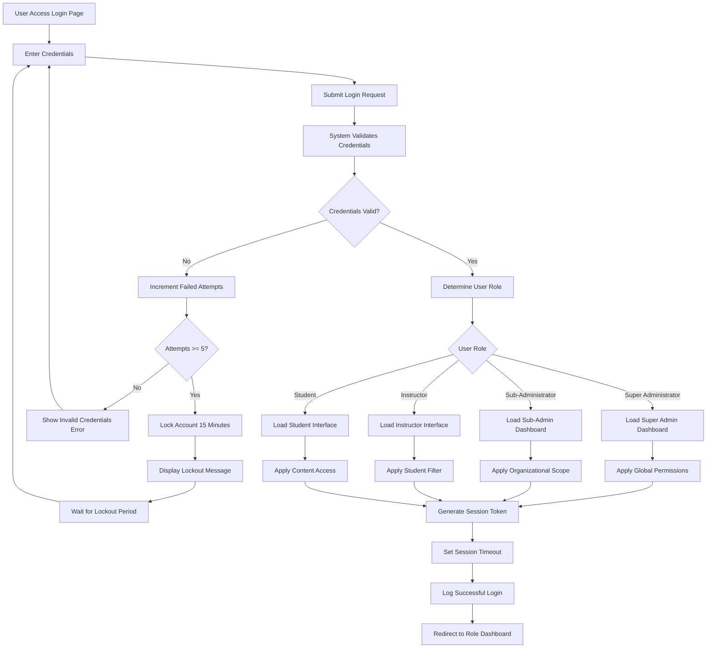

### Password Management Flow
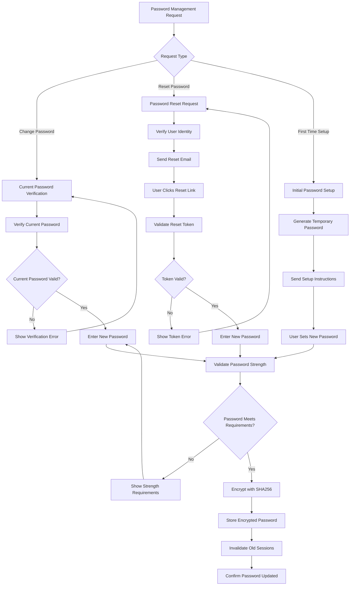

### Organizational Context Setup Flow
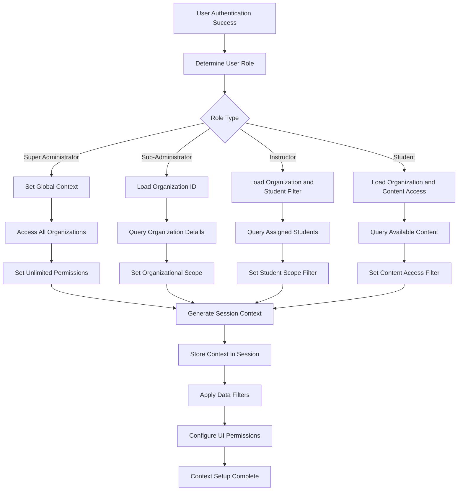

## Sequence Diagrams

### Multi-Role Authentication Sequence
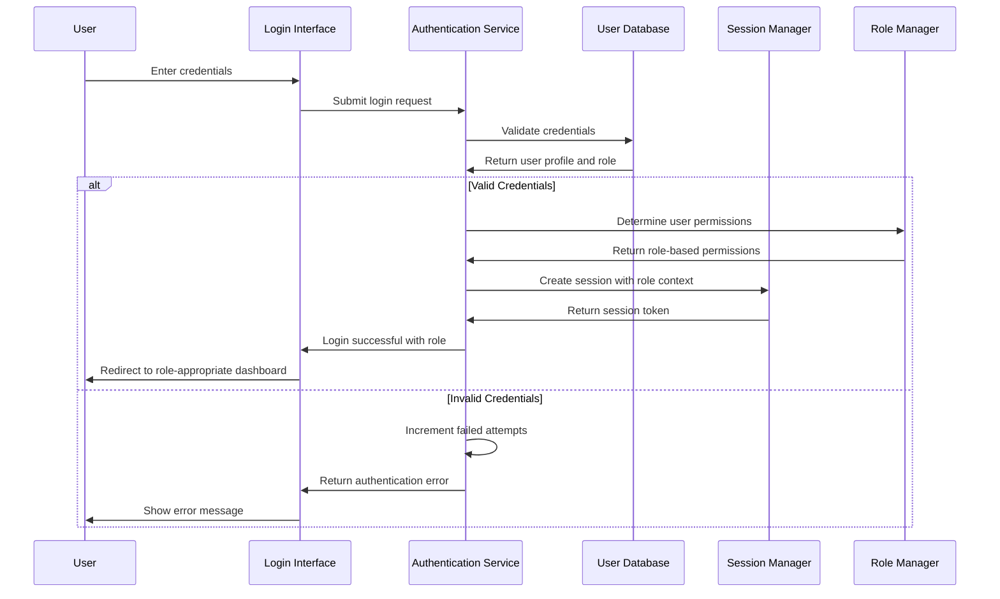

### Organizational Context Establishment Sequence
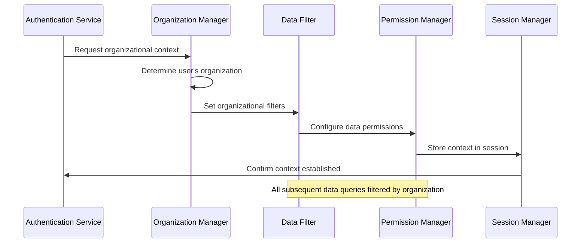

### Session Management Sequence
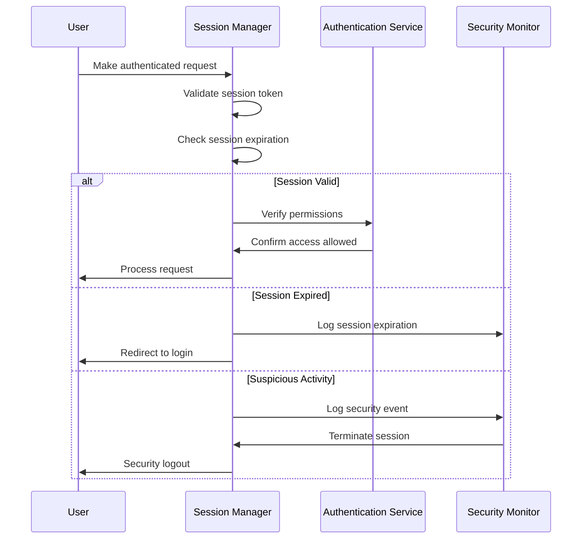

## State Diagrams

### User Authentication States
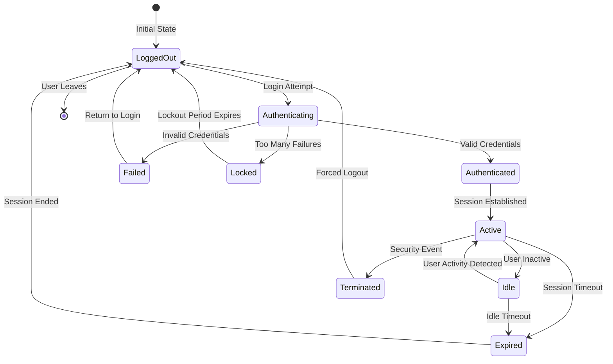

### Session Lifecycle States
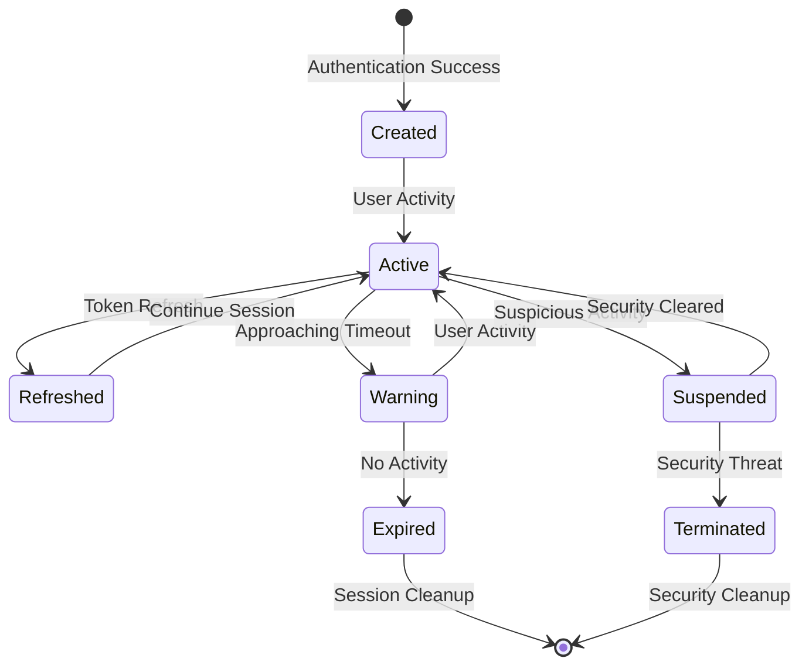

### Password Security States
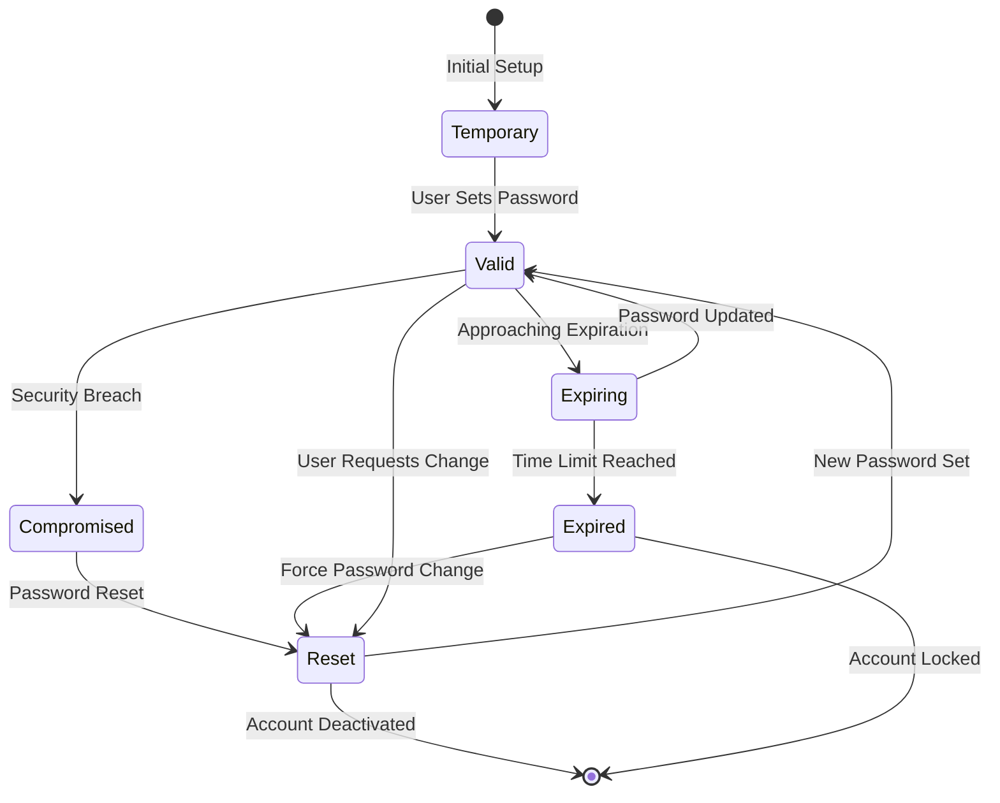

## Activity Diagrams

### Daily Authentication Management Workflow
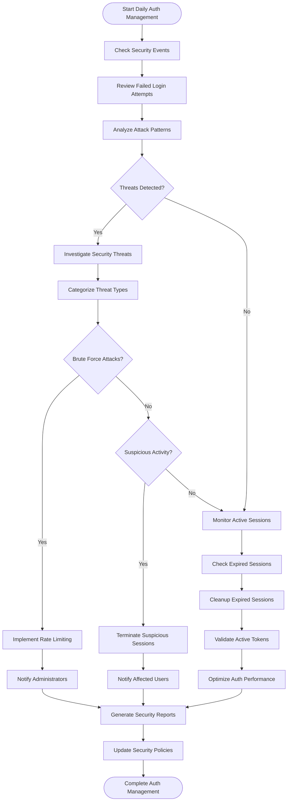

### User Onboarding Authentication Setup
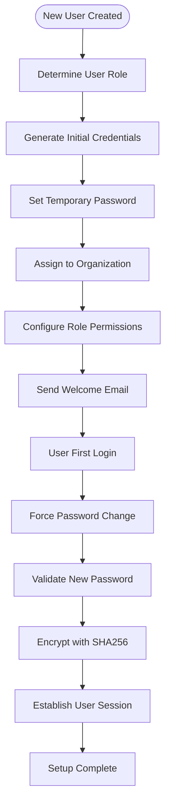

## Use Case Diagrams

### Multi-Role Authentication Use Cases
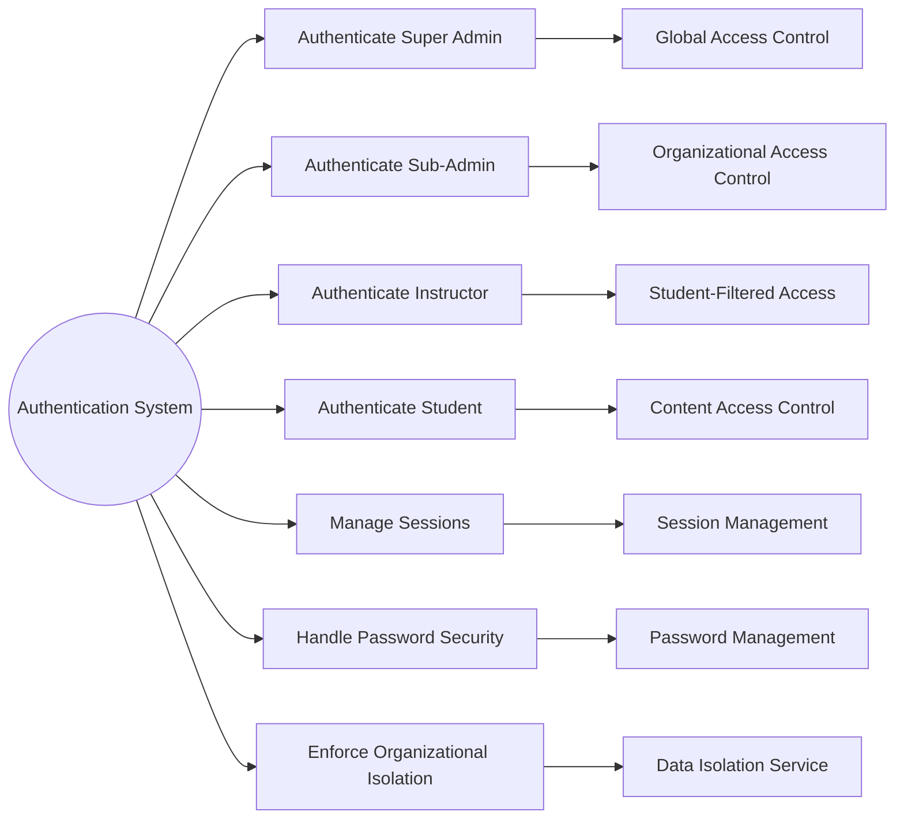

### Security and Compliance Use Cases
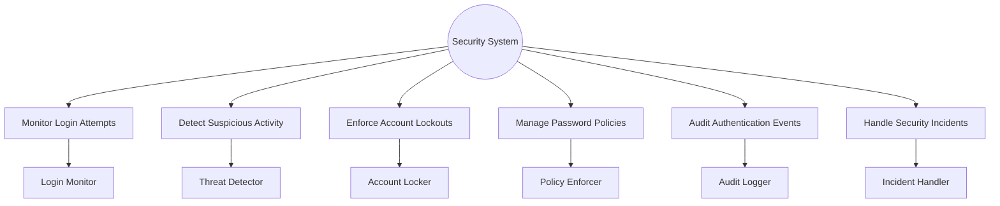

## Component Interaction Diagrams

### Authentication System Architecture
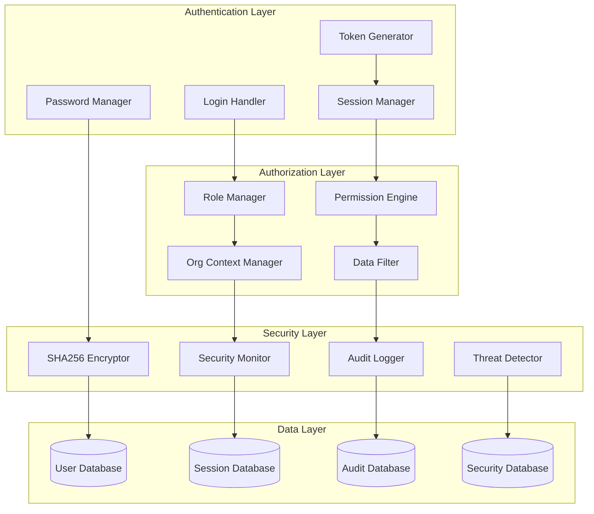

### Multi-Tenant Authentication Flow
```mermaid
graph LR
    subgraph "User Request"
        UserLogin[User Login]
        CredentialValidation[Credential Validation]
        RoleIdentification[Role Identification]
    end
    
    subgraph "Organizational Context"
        OrgDetermination[Organization Determination]
        ContextSetup[Context Setup]
        DataScoping[Data Scoping]
    end
    
    subgraph "Session Establishment"
        TokenGeneration[Token Generation]
        PermissionAssignment[Permission Assignment]
        SessionCreation[Session Creation]
    end
    
    UserLogin --> CredentialValidation
    CredentialValidation --> RoleIdentification
    RoleIdentification --> OrgDetermination
    
    OrgDetermination --> ContextSetup
    ContextSetup --> DataScoping
    DataScoping --> TokenGeneration
    
    TokenGeneration --> PermissionAssignment
    PermissionAssignment --> SessionCreation
    SessionCreation --> UserLogin
```

### Security Monitoring Integration
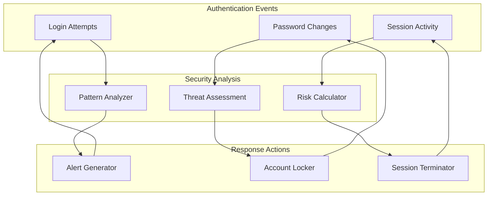