# AI Practice Tools Flows and Diagrams

## User Flow Diagrams

### Complete Practice Session Flow
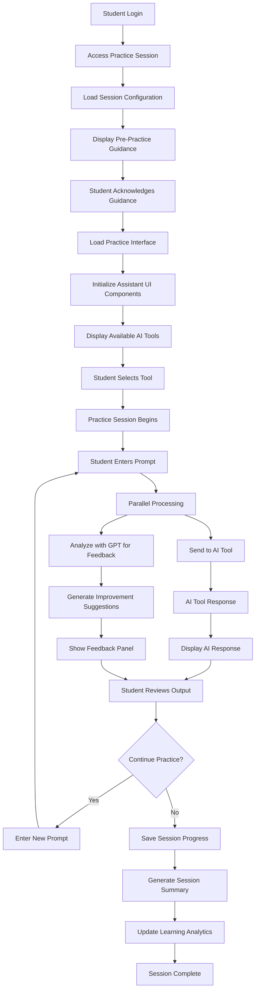

### Prompt Analysis and Feedback Flow
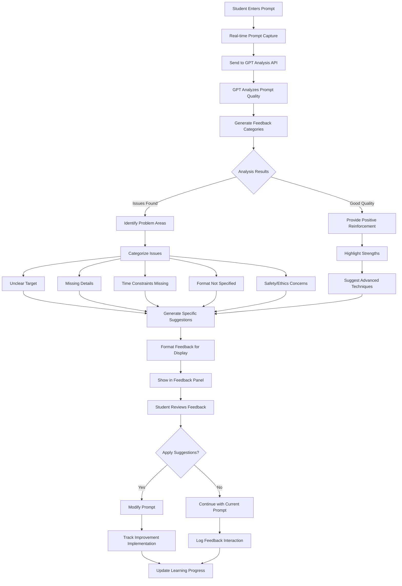

### AI Tool Selection and Usage Flow
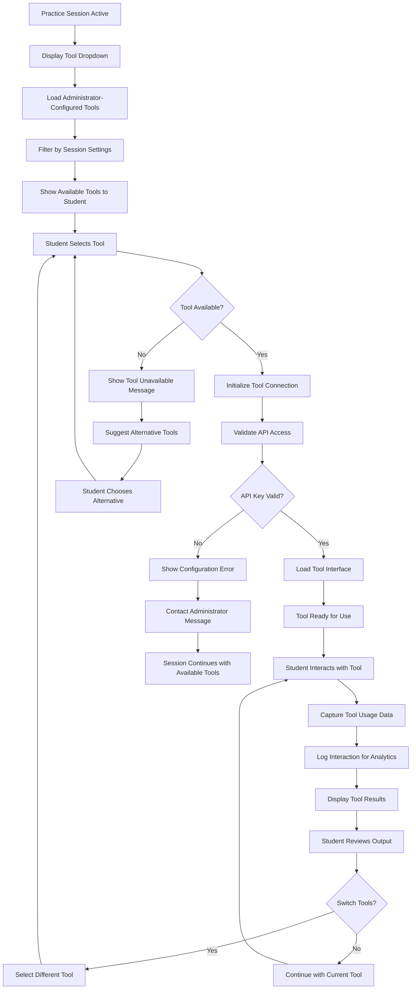

## Sequence Diagrams

### Practice Session Initialization Sequence
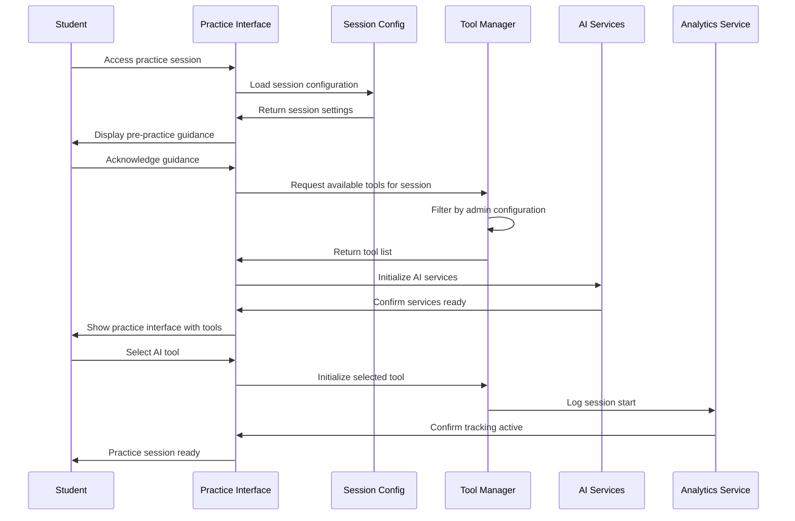

### Prompt Analysis and Feedback Sequence
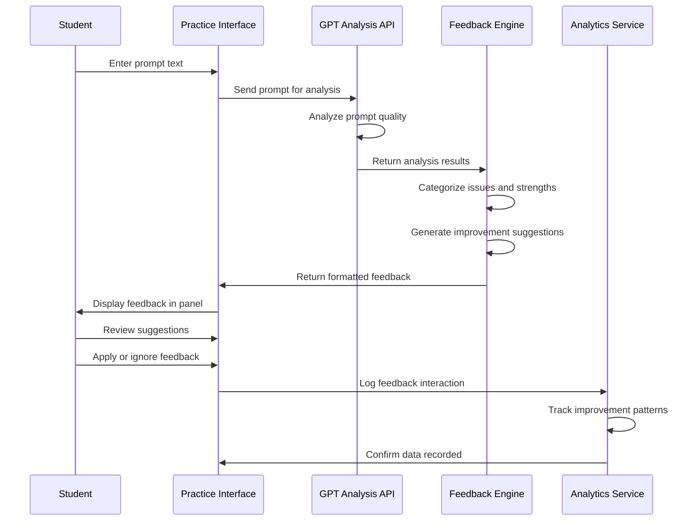

### AI Tool Integration Sequence
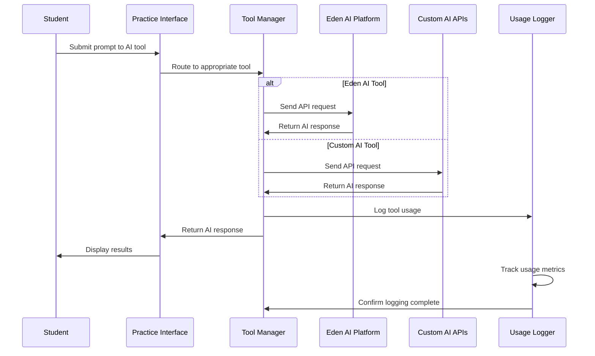

## State Diagrams

### Practice Session States
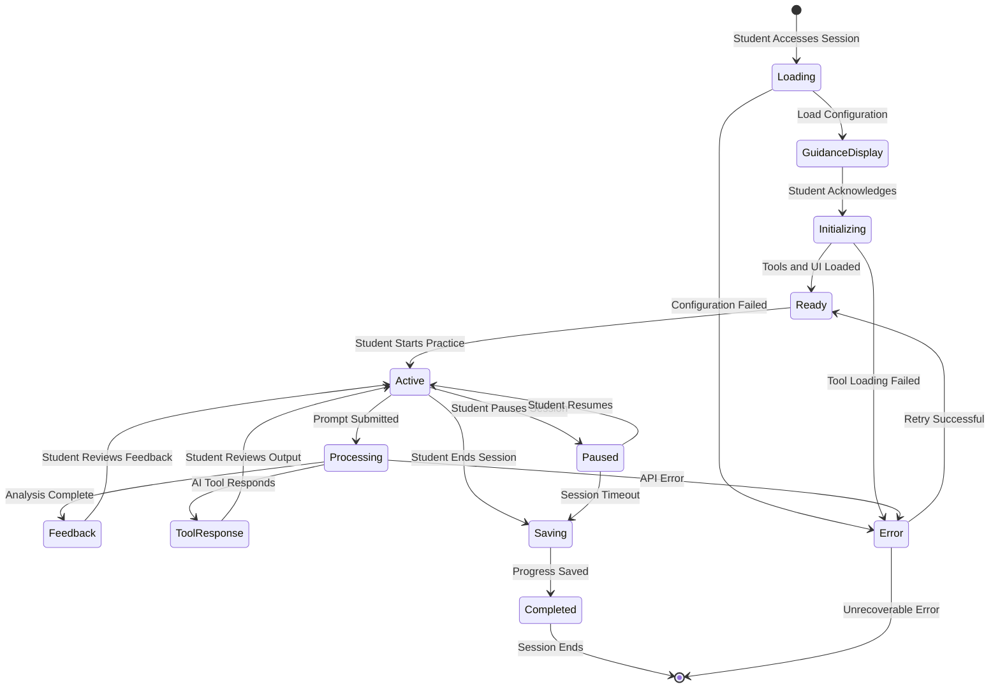

### AI Tool Connection States
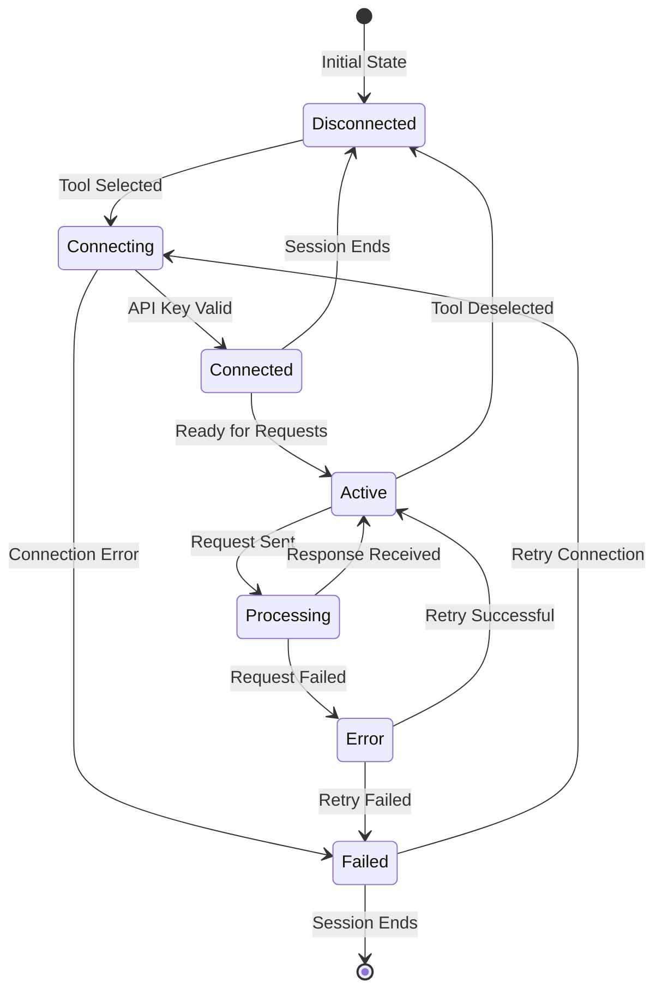

### Prompt Quality Assessment States
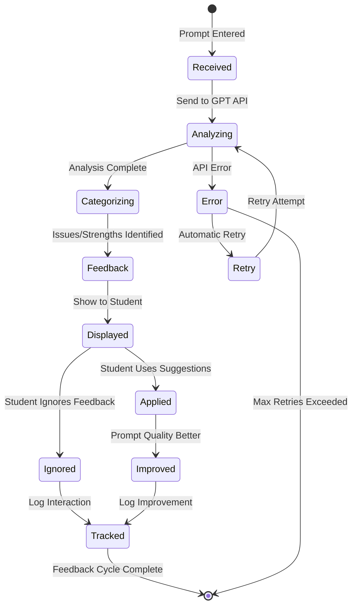

## Activity Diagrams

### Daily Practice Session Management
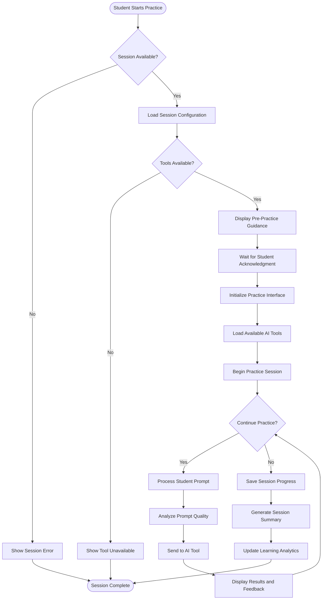

### Prompt Improvement Workflow
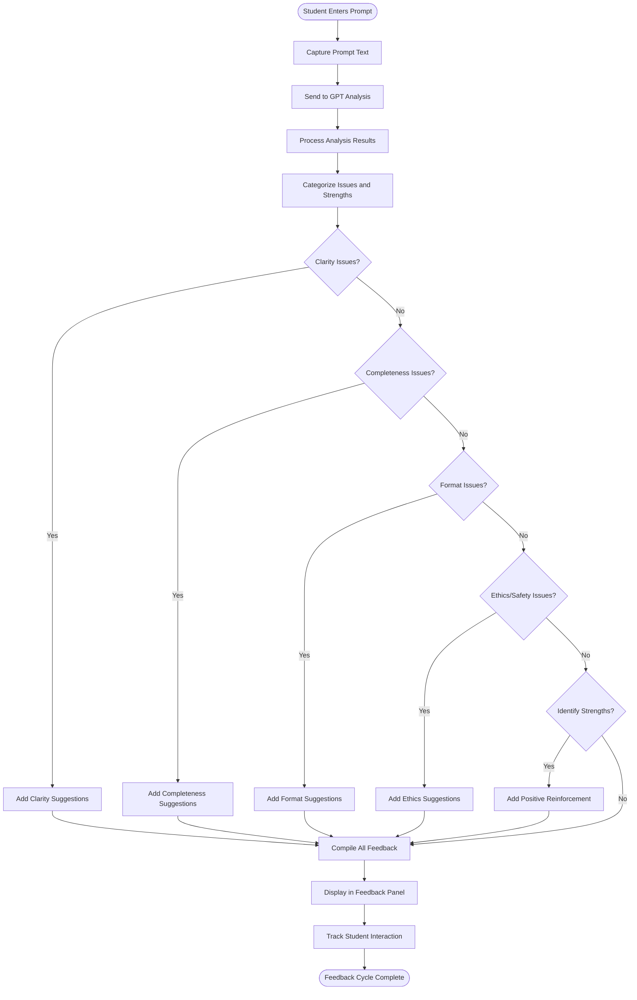

## Use Case Diagrams

### Student Practice Tool Use Cases
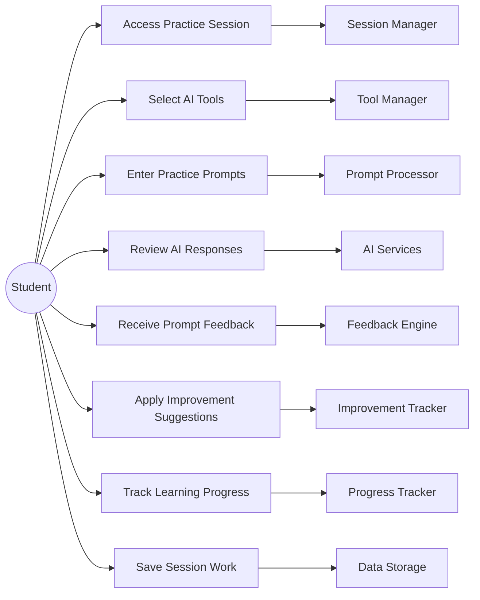

### AI Tool Integration Use Cases
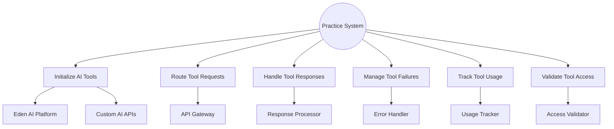

## Component Interaction Diagrams

### Practice Tool Architecture
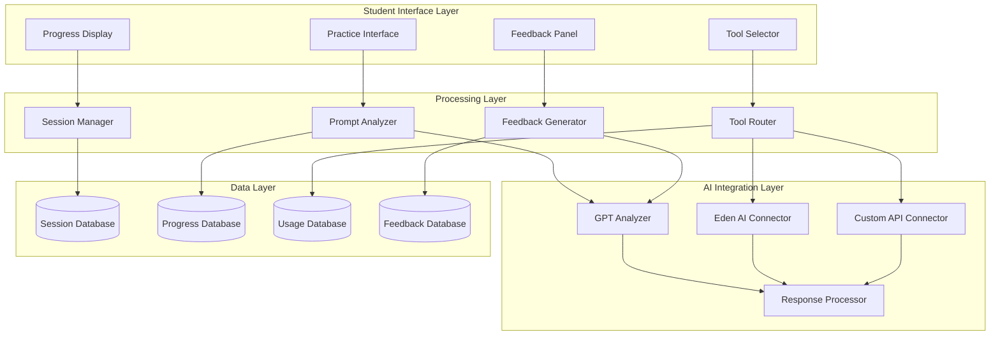

### Real-time Feedback System
```mermaid
graph LR
    subgraph "Input Processing"
        PromptCapture[Prompt Capture]
        InputValidator[Input Validator]
        ContextExtractor[Context Extractor]
    end
    
    subgraph "Analysis Engine"
        GPTAnalysis[GPT Analysis API]
        QualityAssessor[Quality Assessor]
        IssueIdentifier[Issue Identifier]
        StrengthFinder[Strength Finder]
    end
    
    subgraph "Feedback Generation"
        SuggestionGenerator[Suggestion Generator]
        FeedbackFormatter[Feedback Formatter]
        PriorityRanker[Priority Ranker]
    end
    
    subgraph "Delivery System"
        FeedbackDisplay[Feedback Display]
        InteractionTracker[Interaction Tracker]
        ImprovementMonitor[Improvement Monitor]
    end
    
    PromptCapture --> InputValidator
    InputValidator --> ContextExtractor
    ContextExtractor --> GPTAnalysis
    
    GPTAnalysis --> QualityAssessor
    QualityAssessor --> IssueIdentifier
    QualityAssessor --> StrengthFinder
    
    IssueIdentifier --> SuggestionGenerator
    StrengthFinder --> SuggestionGenerator
    SuggestionGenerator --> FeedbackFormatter
    FeedbackFormatter --> PriorityRanker
    
    PriorityRanker --> FeedbackDisplay
    FeedbackDisplay --> InteractionTracker
    InteractionTracker --> ImprovementMonitor
```