# User Management Flows and Diagrams

## User Flow Diagrams

### Student Management Flow
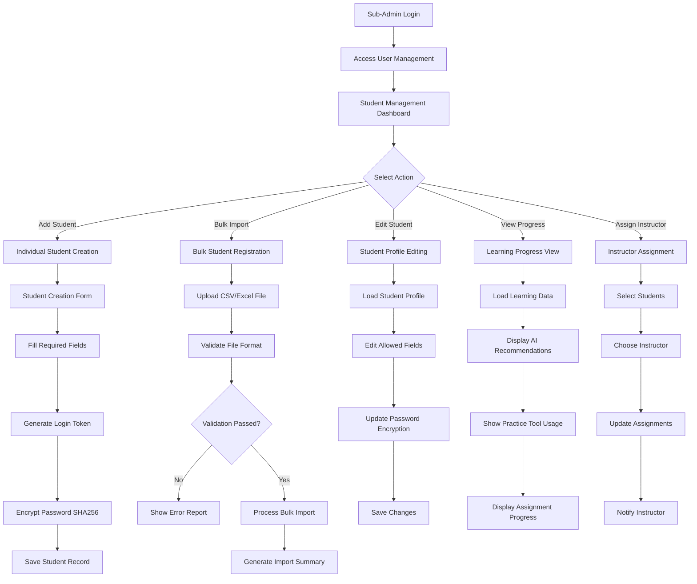

### Instructor Management Flow
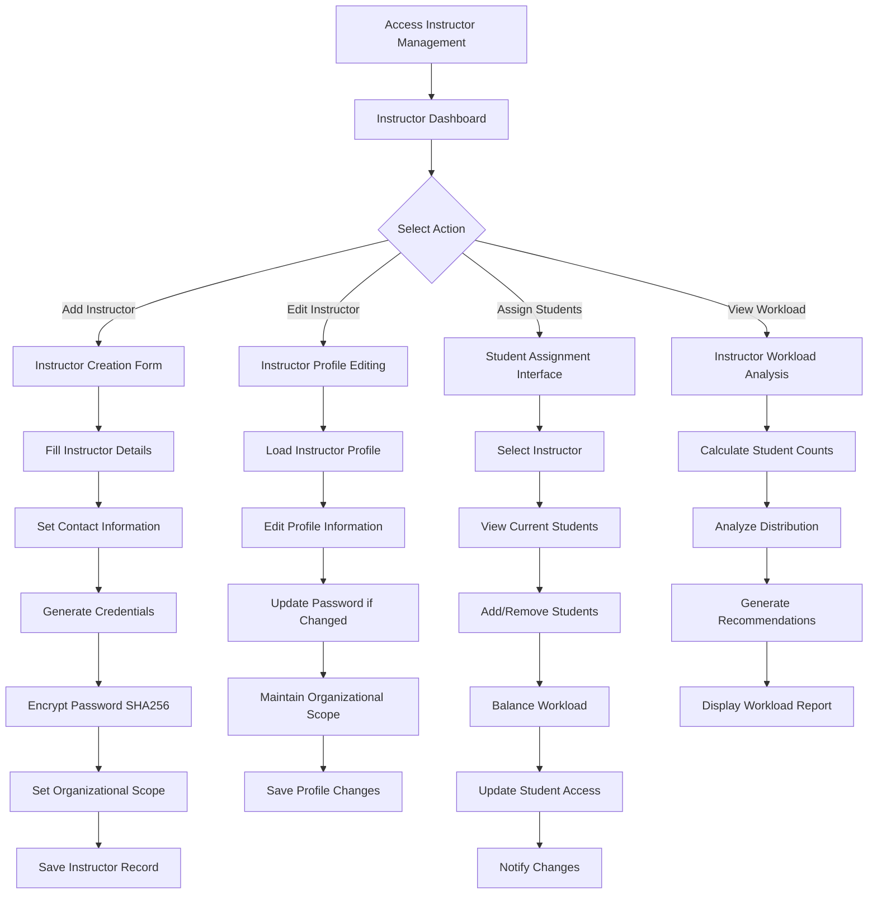

### Bulk Student Import Flow
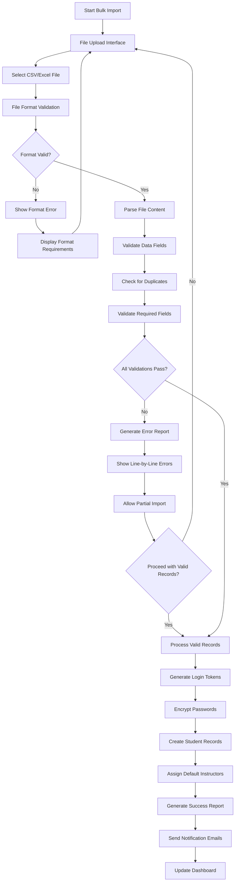

## Sequence Diagrams

### Student Creation and Authentication Setup
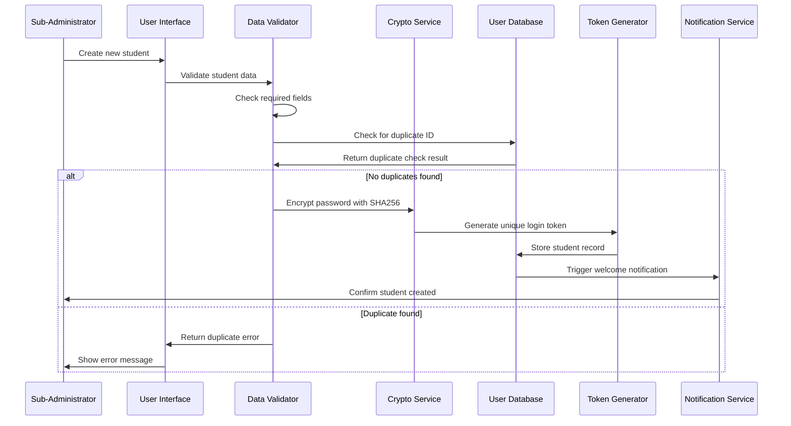

### Bulk Import Processing Sequence
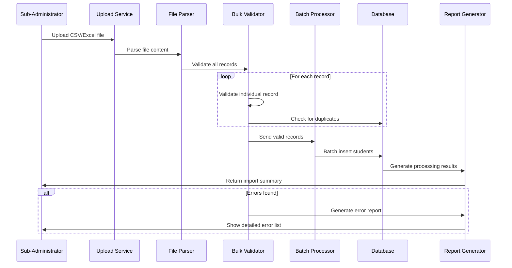

### Instructor-Student Assignment Sequence
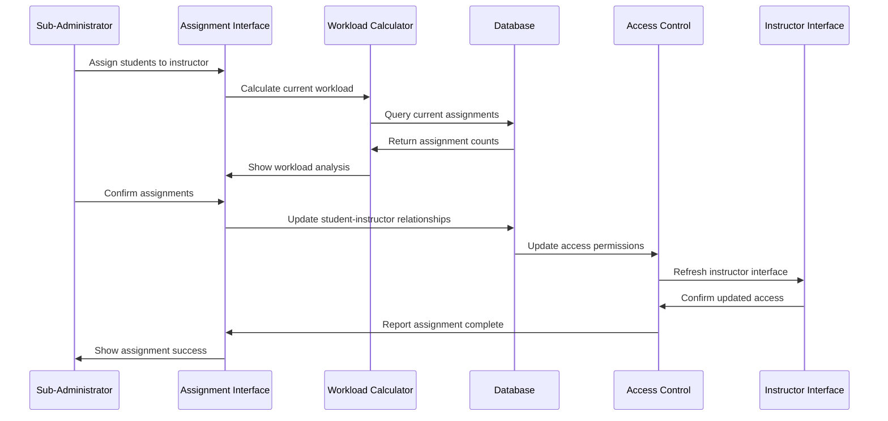

## State Diagrams

### Student Account States
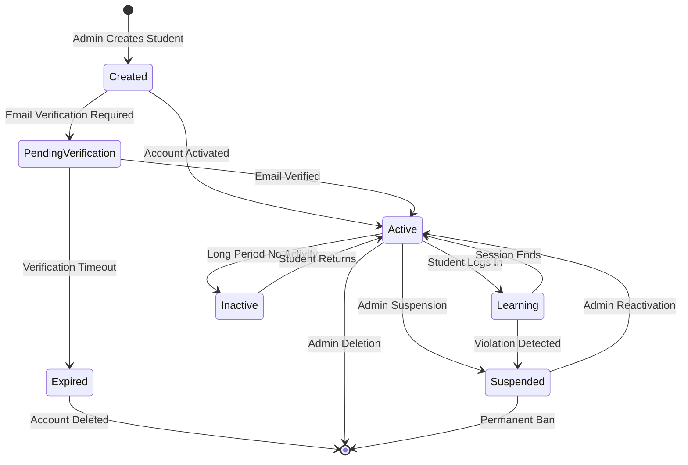

### Instructor Account States
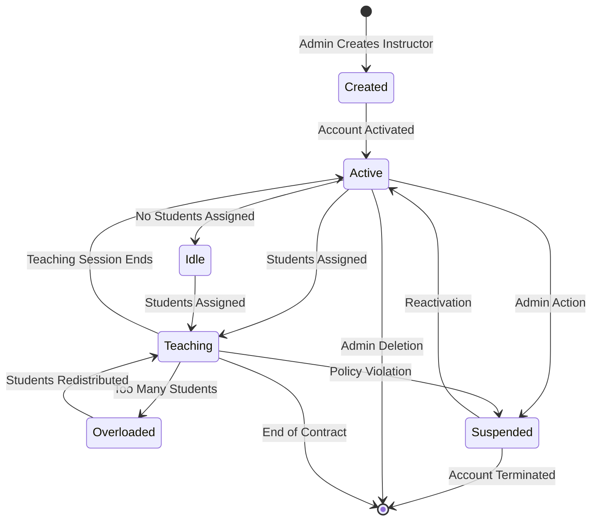

### Bulk Import Process States
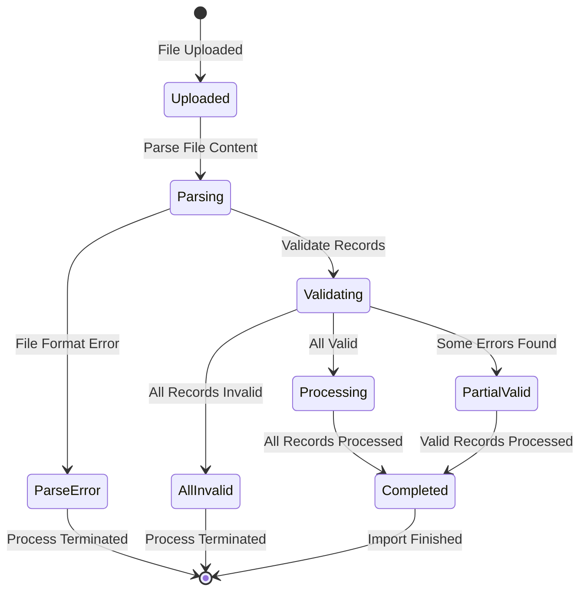

## Activity Diagrams

### Daily User Management Workflow
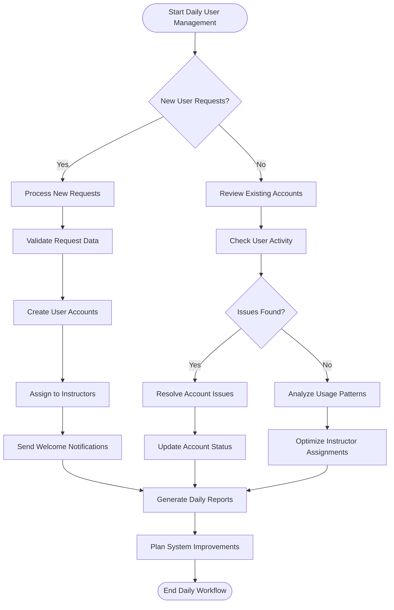

### Student Onboarding Process
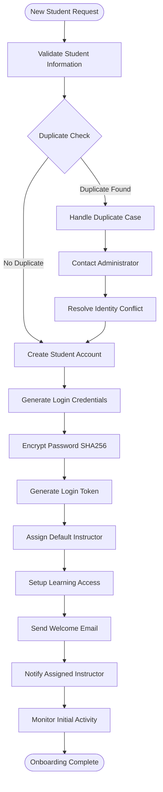

## Use Case Diagrams

### Sub-Administrator User Management Use Cases
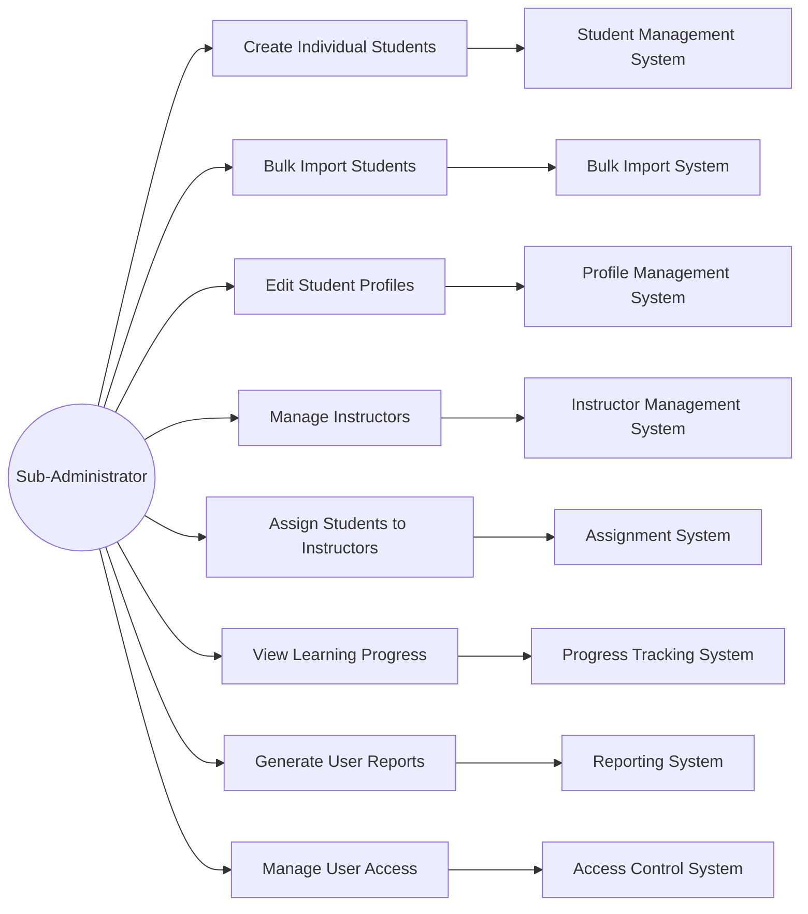

### Instructor Limited Access Use Cases
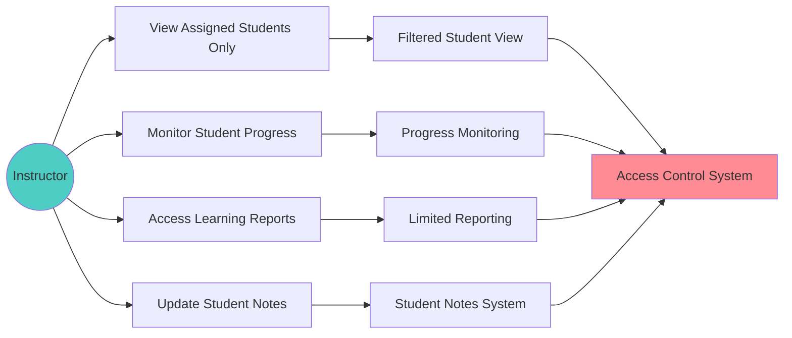

## Component Interaction Diagrams

### User Management Architecture
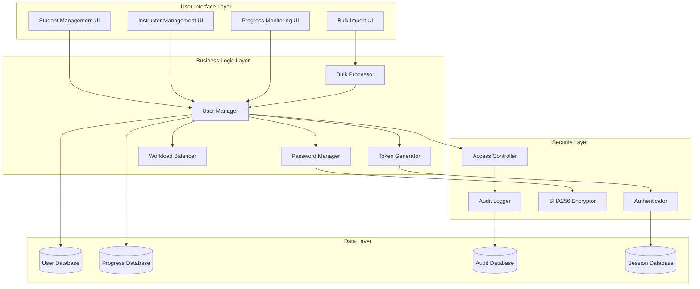

### Multi-Tenant User Isolation
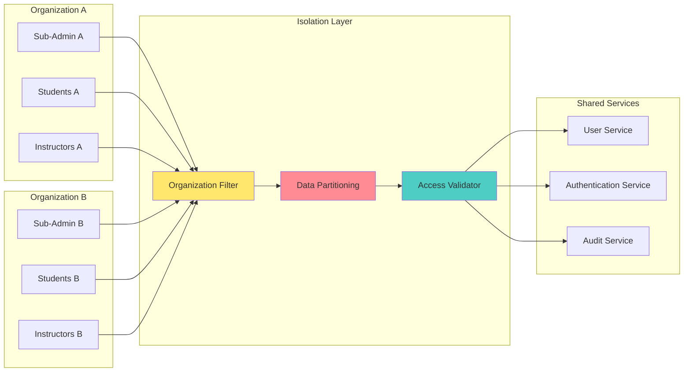