# AI API Master Control Flows and Diagrams

## User Flow Diagrams

### AI Tool Master Control Flow
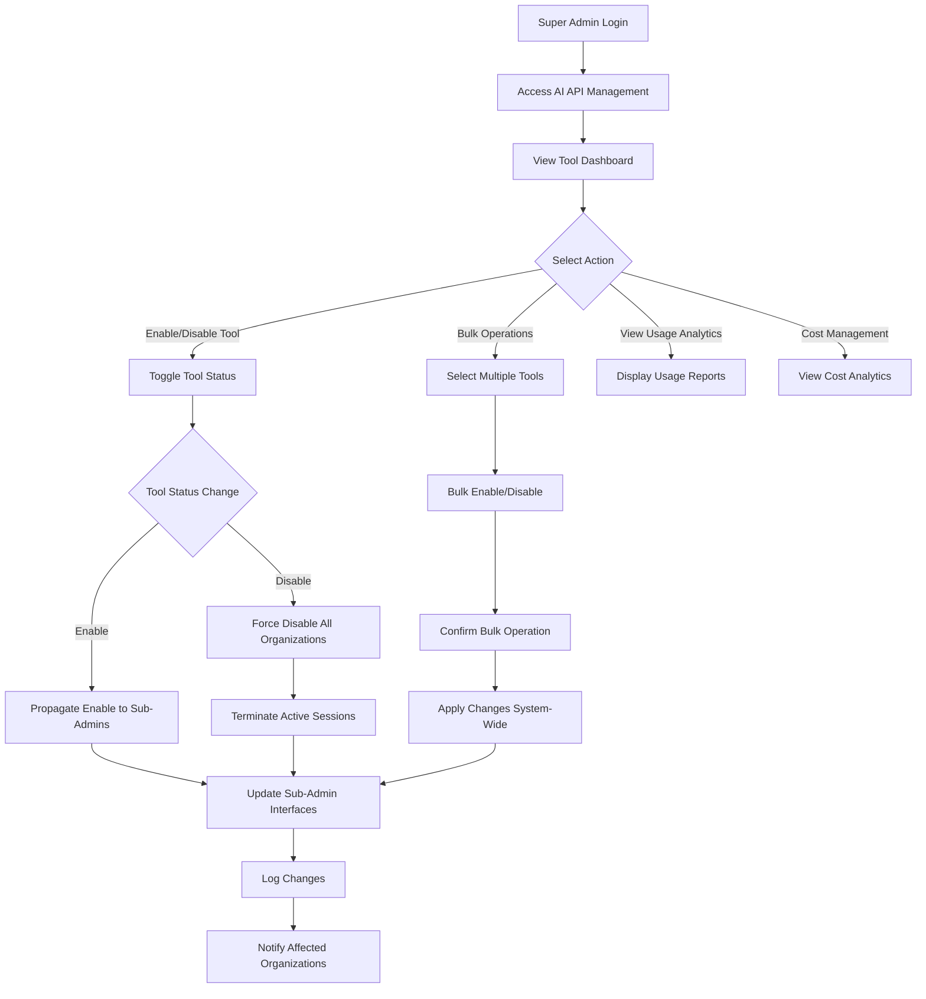

### Sub-Administrator Tool Access Flow
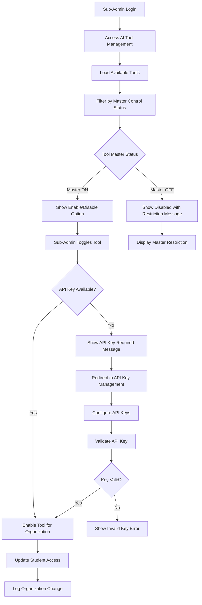

### Emergency Tool Disable Flow
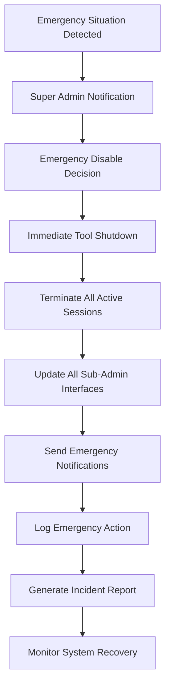

## Sequence Diagrams

### Tool Status Propagation Sequence
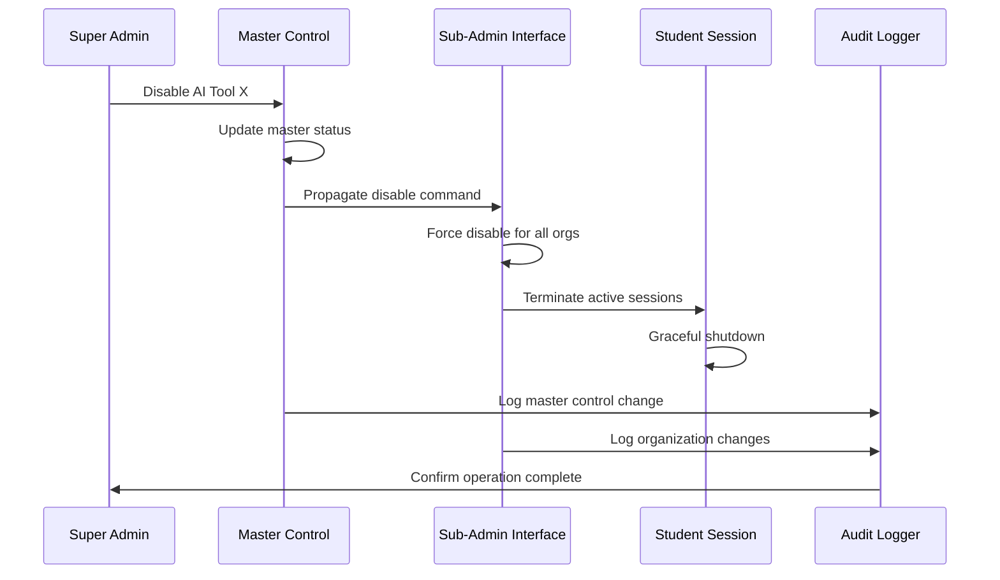

### Cost Monitoring and Alerts Sequence
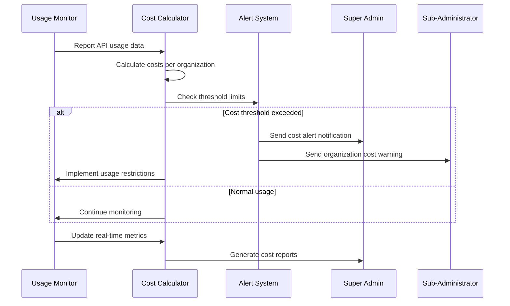

### API Key Management Sequence
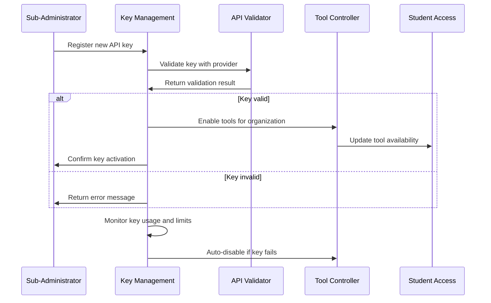

## State Diagrams

### AI Tool Control States
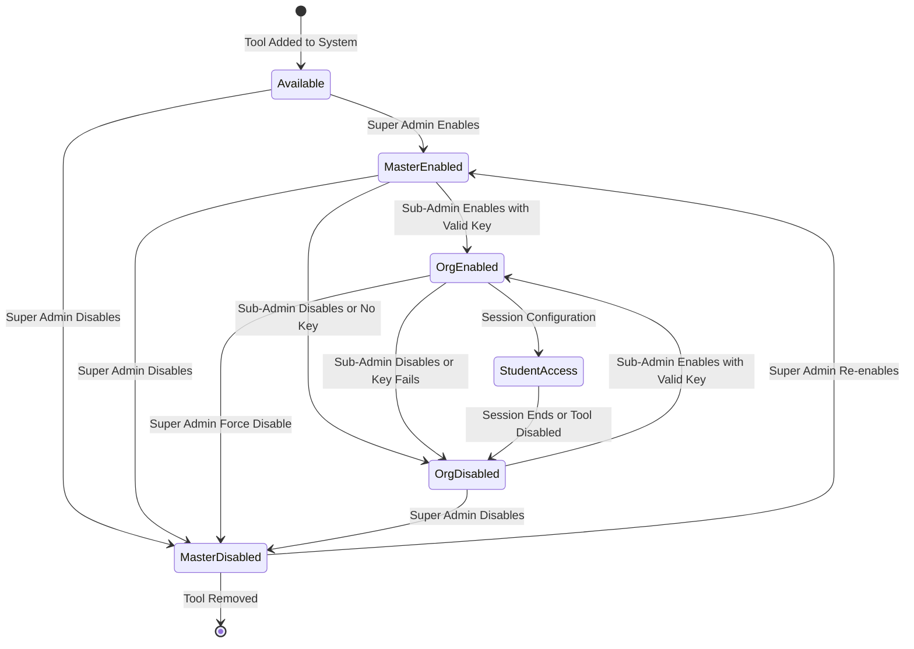

### Cost Management States
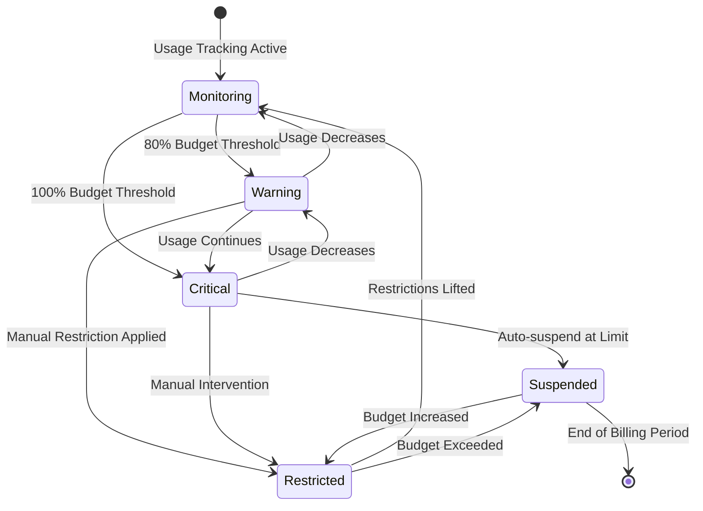

## Activity Diagrams

### Daily AI Tool Management Workflow
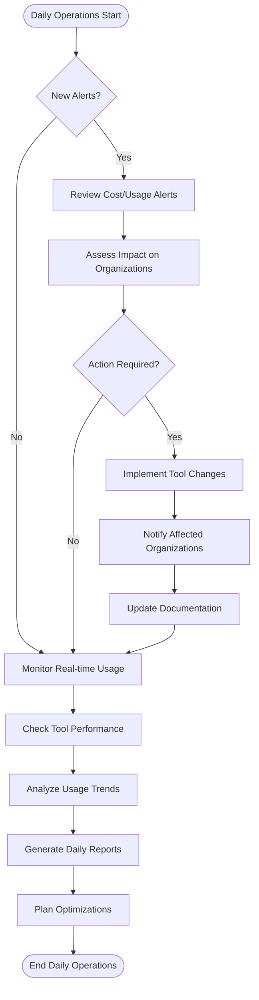

### Tool Addition Workflow
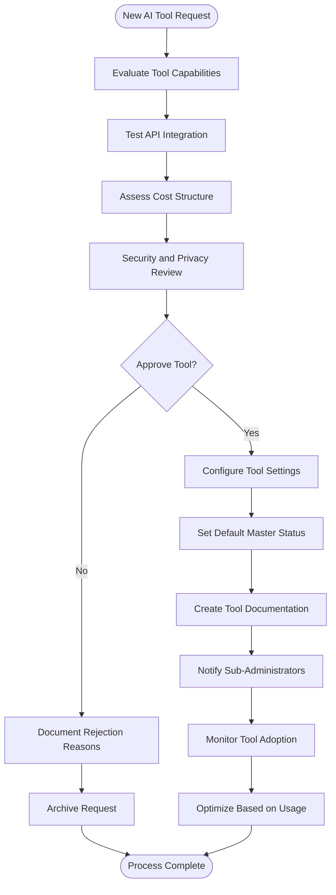

## Use Case Diagrams

### Super Administrator AI Control Use Cases
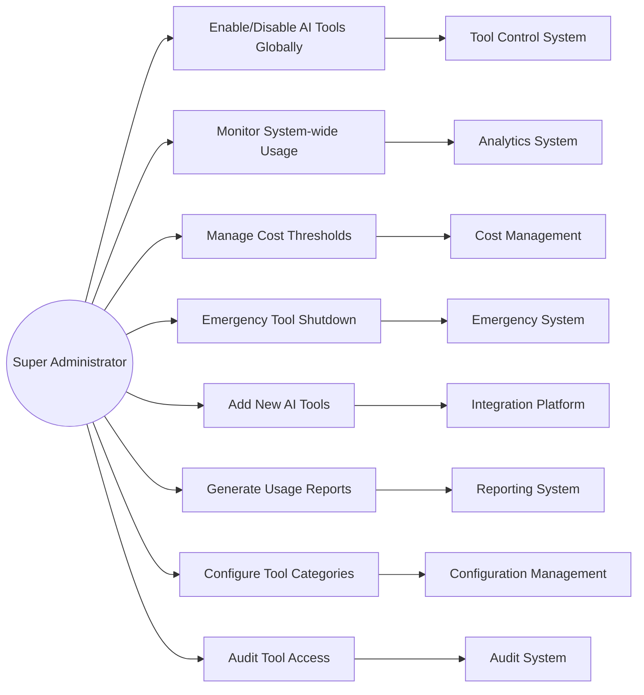

### Sub-Administrator Tool Management Use Cases
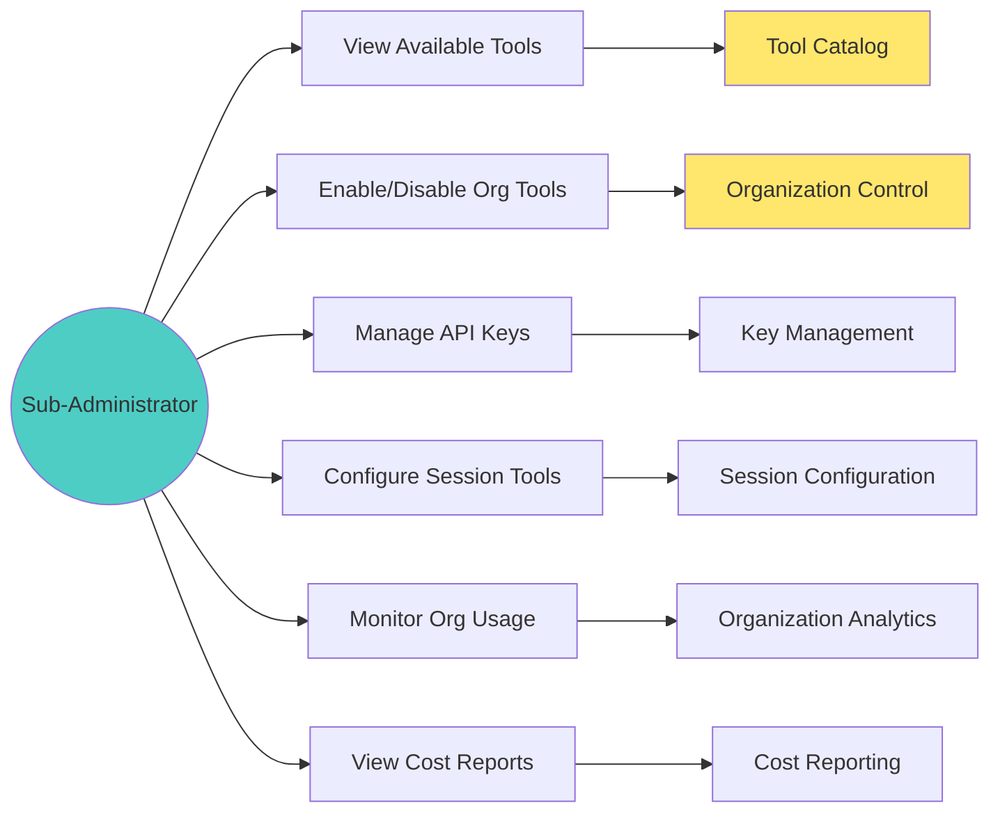

## Component Interaction Diagrams

### AI Tool Control Architecture
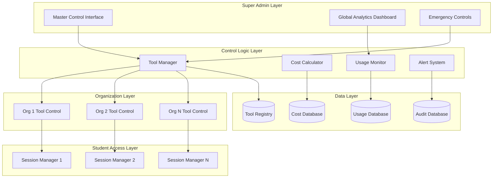

### Real-time Synchronization Flow
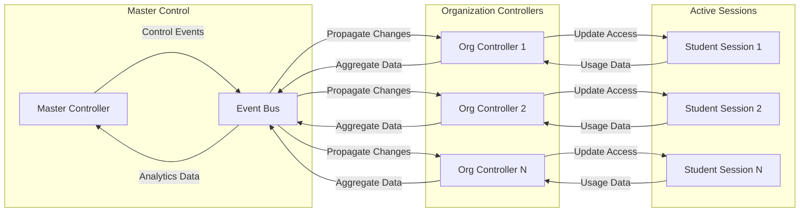