# Super Administrator Global Data Management Flows and Diagrams

## User Flow Diagrams

### Global Data Management Access Flow
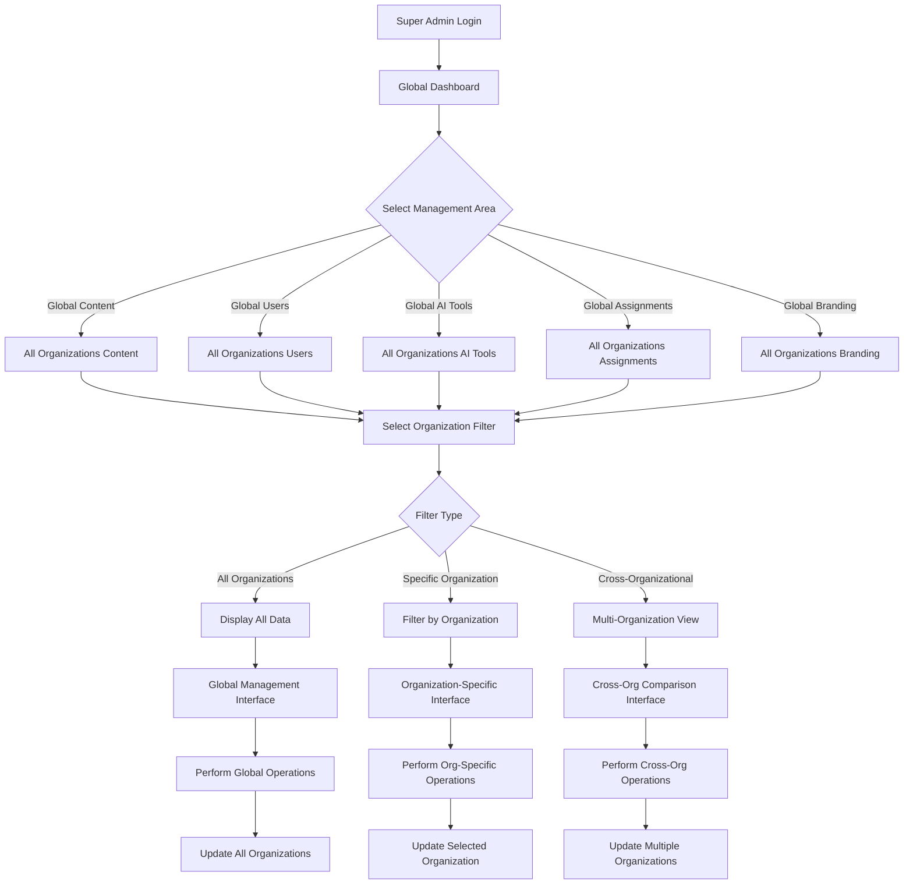
```mermaid
flowchart TD
    A[Super Admin Login] --> B[Global Dashboard]
    B --> C{Select Management Area}
    
    C -->|Global Content| D[All Organizations Content]
    C -->|Global Users| E[All Organizations Users]
    C -->|Global AI Tools| F[All Organizations AI Tools]
    C -->|Global Assignments| G[All Organizations Assignments]
    C -->|Global Branding| H[All Organizations Branding]
    
    D --> I[Select Organization Filter]
    E --> I
    F --> I
    G --> I
    H --> I
    
    I --> J{Filter Type}
    J -->|All Organizations| K[Display All Data]
    J -->|Specific Organization| L[Filter by Organization]
    J -->|Cross-Organizational| M[Multi-Organization View]
    
    K --> N[Global Management Interface]
    L --> O[Organization-Specific Interface]
    M --> P[Cross-Org Comparison Interface]
    
    N --> Q[Perform Global Operations]
    O --> R[Perform Org-Specific Operations]
    P --> S[Perform Cross-Org Operations]
    
    Q --> T[Update All Organizations]
    R --> U[Update Selected Organization]
    S --> V[Update Multiple Organizations]
```

### Cross-Organizational Data Transfer Flow
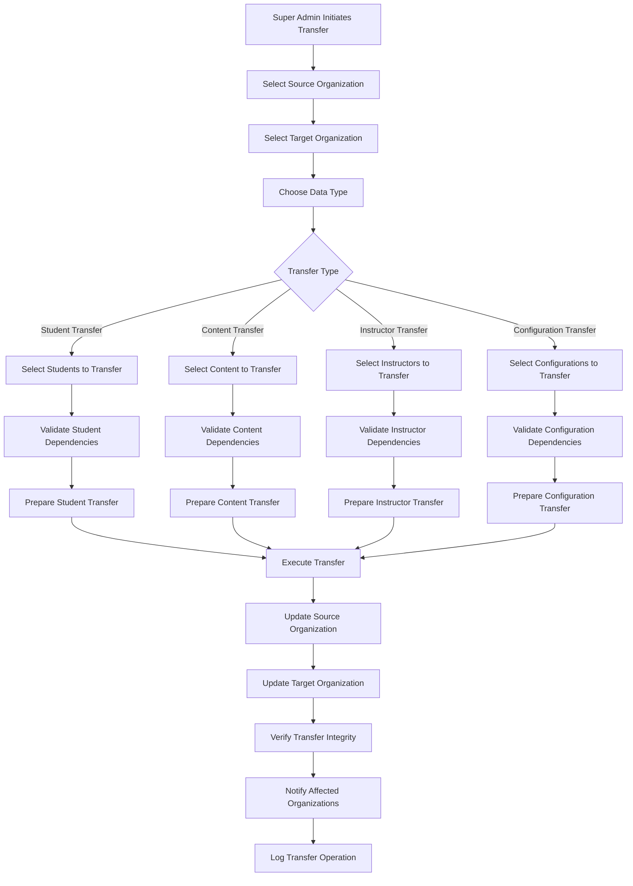
```mermaid
flowchart TD
    A[Super Admin Initiates Transfer] --> B[Select Source Organization]
    B --> C[Select Target Organization]
    C --> D[Choose Data Type]
    D --> E{Transfer Type}
    
    E -->|Student Transfer| F[Select Students to Transfer]
    E -->|Content Transfer| G[Select Content to Transfer]
    E -->|Instructor Transfer| H[Select Instructors to Transfer]
    E -->|Configuration Transfer| I[Select Configurations to Transfer]
    
    F --> J[Validate Student Dependencies]
    G --> K[Validate Content Dependencies]
    H --> L[Validate Instructor Dependencies]
    I --> M[Validate Configuration Dependencies]
    
    J --> N[Prepare Student Transfer]
    K --> O[Prepare Content Transfer]
    L --> P[Prepare Instructor Transfer]
    M --> Q[Prepare Configuration Transfer]
    
    N --> R[Execute Transfer]
    O --> R
    P --> R
    Q --> R
    
    R --> S[Update Source Organization]
    S --> T[Update Target Organization]
    T --> U[Verify Transfer Integrity]
    U --> V[Notify Affected Organizations]
    V --> W[Log Transfer Operation]
```

### Global Analytics and Reporting Flow
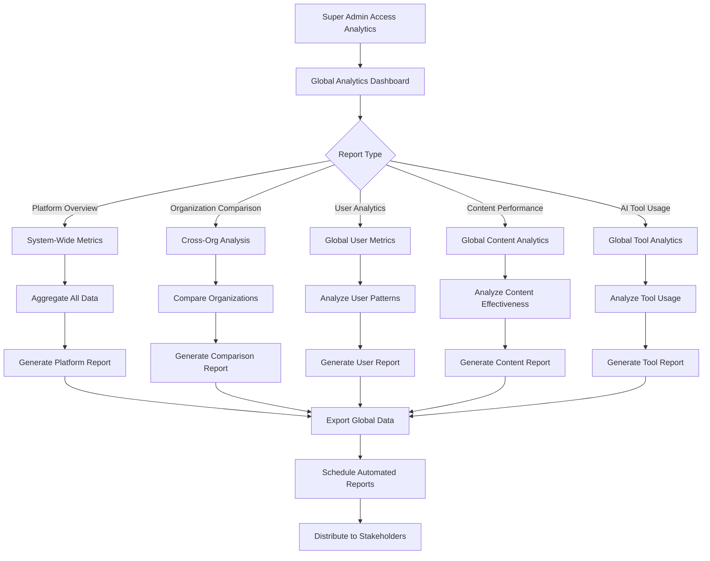
```mermaid
flowchart TD
    A[Super Admin Access Analytics] --> B[Global Analytics Dashboard]
    B --> C{Report Type}
    
    C -->|Platform Overview| D[System-Wide Metrics]
    C -->|Organization Comparison| E[Cross-Org Analysis]
    C -->|User Analytics| F[Global User Metrics]
    C -->|Content Performance| G[Global Content Analytics]
    C -->|AI Tool Usage| H[Global Tool Analytics]
    
    D --> I[Aggregate All Data]
    E --> J[Compare Organizations]
    F --> K[Analyze User Patterns]
    G --> L[Analyze Content Effectiveness]
    H --> M[Analyze Tool Usage]
    
    I --> N[Generate Platform Report]
    J --> O[Generate Comparison Report]
    K --> P[Generate User Report]
    L --> Q[Generate Content Report]
    M --> R[Generate Tool Report]
    
    N --> S[Export Global Data]
    O --> S
    P --> S
    Q --> S
    R --> S
    
    S --> T[Schedule Automated Reports]
    T --> U[Distribute to Stakeholders]
```

## Sequence Diagrams

### Global Data Access Sequence
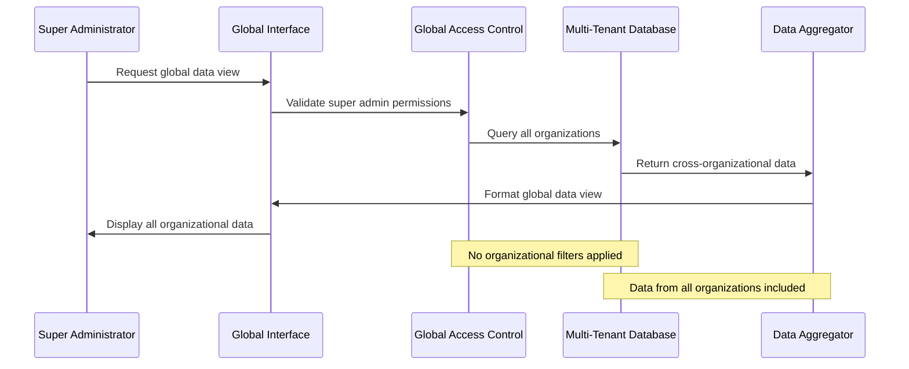
```mermaid
sequenceDiagram
    participant SA as Super Administrator
    participant UI as Global Interface
    participant Access as Global Access Control
    participant DB as Multi-Tenant Database
    participant Aggregator as Data Aggregator
    
    SA->>UI: Request global data view
    UI->>Access: Validate super admin permissions
    Access->>DB: Query all organizations
    DB->>Aggregator: Return cross-organizational data
    Aggregator->>UI: Format global data view
    UI->>SA: Display all organizational data
    
    Note over Access,DB: No organizational filters applied
    Note over DB,Aggregator: Data from all organizations included
```

### Cross-Organizational Operation Sequence
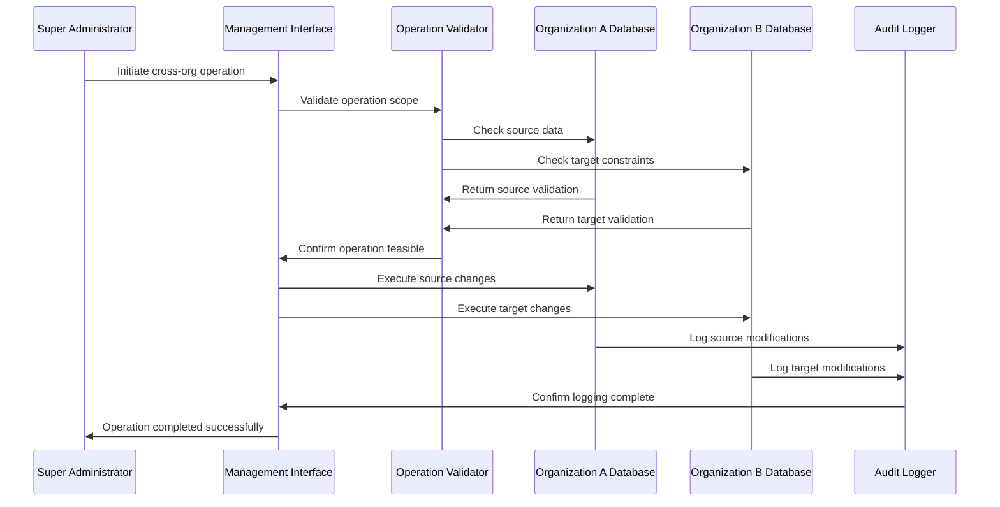
```mermaid
sequenceDiagram
    participant SA as Super Administrator
    participant UI as Management Interface
    participant Validator as Operation Validator
    participant OrgA as Organization A Database
    participant OrgB as Organization B Database
    participant Logger as Audit Logger
    
    SA->>UI: Initiate cross-org operation
    UI->>Validator: Validate operation scope
    Validator->>OrgA: Check source data
    Validator->>OrgB: Check target constraints
    
    OrgA->>Validator: Return source validation
    OrgB->>Validator: Return target validation
    Validator->>UI: Confirm operation feasible
    
    UI->>OrgA: Execute source changes
    UI->>OrgB: Execute target changes
    OrgA->>Logger: Log source modifications
    OrgB->>Logger: Log target modifications
    
    Logger->>UI: Confirm logging complete
    UI->>SA: Operation completed successfully
```

### Global User Management Sequence
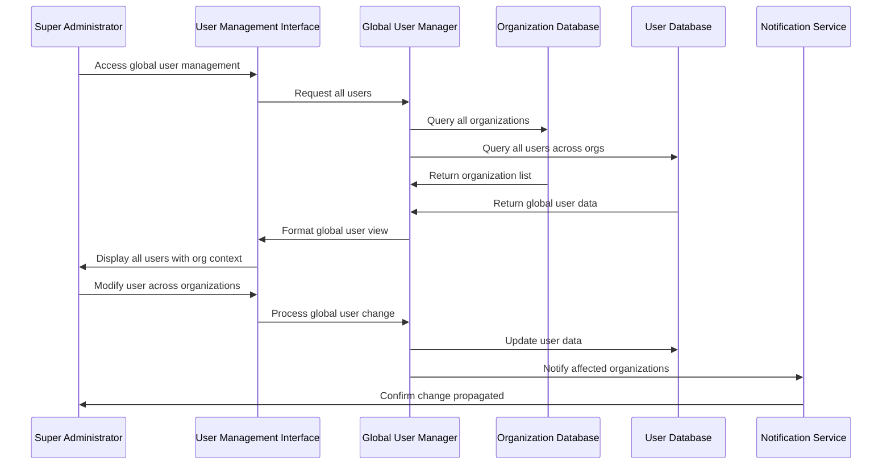
```mermaid
sequenceDiagram
    participant SA as Super Administrator
    participant UI as User Management Interface
    participant UserMgr as Global User Manager
    participant OrgDB as Organization Database
    participant UserDB as User Database
    participant Notifier as Notification Service
    
    SA->>UI: Access global user management
    UI->>UserMgr: Request all users
    UserMgr->>OrgDB: Query all organizations
    UserMgr->>UserDB: Query all users across orgs
    
    OrgDB->>UserMgr: Return organization list
    UserDB->>UserMgr: Return global user data
    UserMgr->>UI: Format global user view
    UI->>SA: Display all users with org context
    
    SA->>UI: Modify user across organizations
    UI->>UserMgr: Process global user change
    UserMgr->>UserDB: Update user data
    UserMgr->>Notifier: Notify affected organizations
    Notifier->>SA: Confirm change propagated
```

## State Diagrams

### Super Admin Data Access States
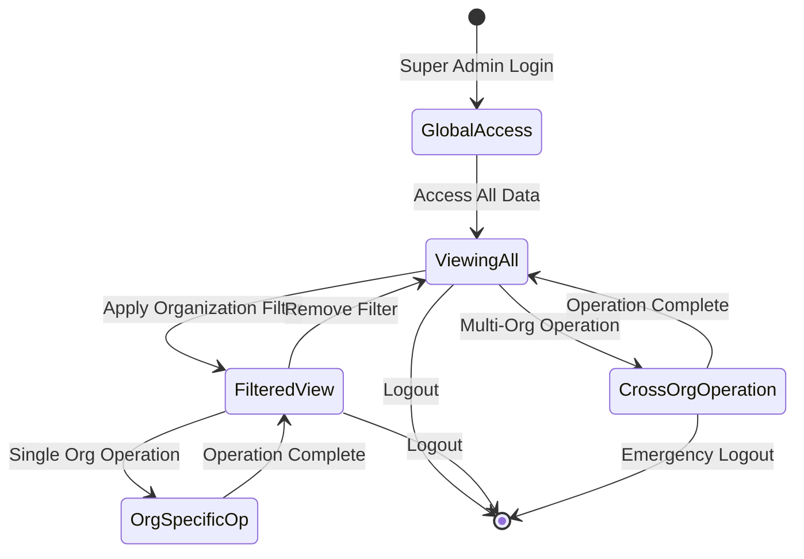
```mermaid
stateDiagram-v2
    [*] --> GlobalAccess: Super Admin Login
    GlobalAccess --> ViewingAll: Access All Data
    ViewingAll --> FilteredView: Apply Organization Filter
    FilteredView --> ViewingAll: Remove Filter
    
    ViewingAll --> CrossOrgOperation: Multi-Org Operation
    CrossOrgOperation --> ViewingAll: Operation Complete
    
    FilteredView --> OrgSpecificOp: Single Org Operation
    OrgSpecificOp --> FilteredView: Operation Complete
    
    ViewingAll --> [*]: Logout
    FilteredView --> [*]: Logout
    CrossOrgOperation --> [*]: Emergency Logout
```

### Global Operation States
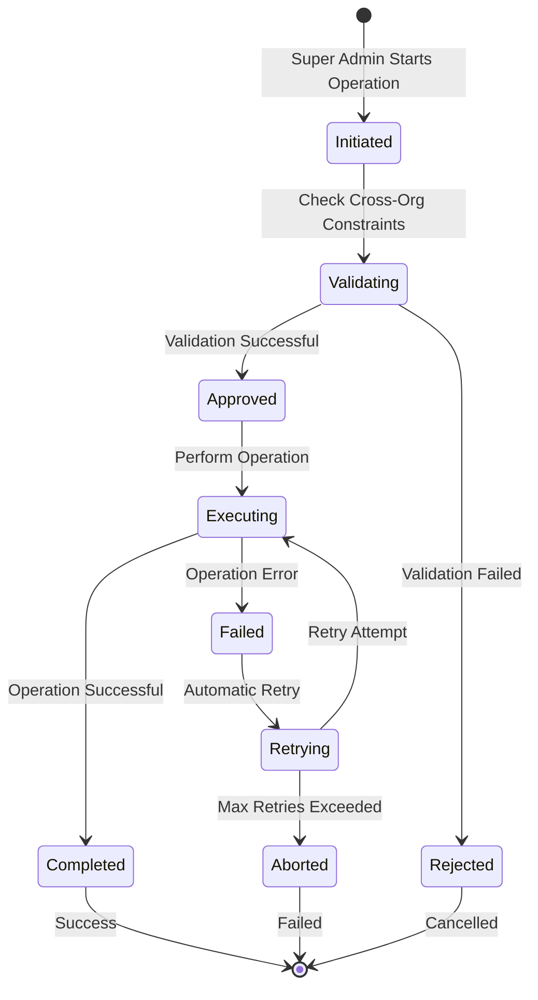
```mermaid
stateDiagram-v2
    [*] --> Initiated: Super Admin Starts Operation
    Initiated --> Validating: Check Cross-Org Constraints
    Validating --> Approved: Validation Successful
    Validating --> Rejected: Validation Failed
    
    Approved --> Executing: Perform Operation
    Executing --> Completed: Operation Successful
    Executing --> Failed: Operation Error
    
    Failed --> Retrying: Automatic Retry
    Retrying --> Executing: Retry Attempt
    Retrying --> Aborted: Max Retries Exceeded
    
    Completed --> [*]: Success
    Rejected --> [*]: Cancelled
    Aborted --> [*]: Failed
```

## Activity Diagrams

### Daily Global Management Workflow
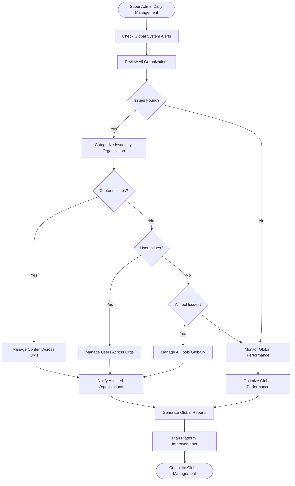
```mermaid
flowchart TD
    Start([Super Admin Daily Management]) --> CheckAlerts[Check Global System Alerts]
    CheckAlerts --> ReviewOrganizations[Review All Organizations]
    ReviewOrganizations --> IdentifyIssues{Issues Found?}
    
    IdentifyIssues -->|Yes| CategorizeIssues[Categorize Issues by Organization]
    IdentifyIssues -->|No| MonitorPerformance[Monitor Global Performance]
    
    CategorizeIssues --> ContentIssues{Content Issues?}
    ContentIssues -->|Yes| ManageGlobalContent[Manage Content Across Orgs]
    ContentIssues -->|No| UserIssues{User Issues?}
    
    UserIssues -->|Yes| ManageGlobalUsers[Manage Users Across Orgs]
    UserIssues -->|No| ToolIssues{AI Tool Issues?}
    
    ToolIssues -->|Yes| ManageGlobalTools[Manage AI Tools Globally]
    ToolIssues -->|No| MonitorPerformance
    
    ManageGlobalContent --> NotifyOrganizations[Notify Affected Organizations]
    ManageGlobalUsers --> NotifyOrganizations
    ManageGlobalTools --> NotifyOrganizations
    
    MonitorPerformance --> OptimizeGlobally[Optimize Global Performance]
    OptimizeGlobally --> GenerateGlobalReports[Generate Global Reports]
    NotifyOrganizations --> GenerateGlobalReports
    
    GenerateGlobalReports --> PlanImprovements[Plan Platform Improvements]
    PlanImprovements --> End([Complete Global Management])
```

### Cross-Organizational Data Migration Workflow
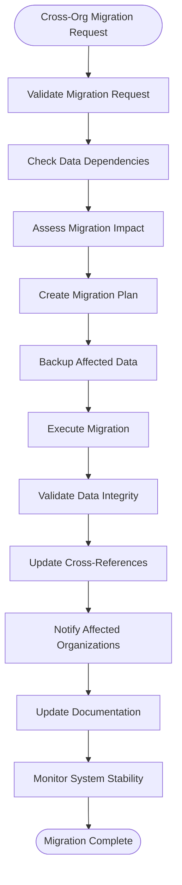
```mermaid
flowchart TD
    MigrationRequest([Cross-Org Migration Request]) --> ValidateRequest[Validate Migration Request]
    ValidateRequest --> CheckDependencies[Check Data Dependencies]
    CheckDependencies --> AssessImpact[Assess Migration Impact]
    AssessImpact --> CreateMigrationPlan[Create Migration Plan]
    
    CreateMigrationPlan --> BackupData[Backup Affected Data]
    BackupData --> ExecuteMigration[Execute Migration]
    ExecuteMigration --> ValidateIntegrity[Validate Data Integrity]
    ValidateIntegrity --> UpdateReferences[Update Cross-References]
    
    UpdateReferences --> NotifyOrganizations[Notify Affected Organizations]
    NotifyOrganizations --> UpdateDocumentation[Update Documentation]
    UpdateDocumentation --> MonitorStability[Monitor System Stability]
    MonitorStability --> Complete([Migration Complete])
```

## Use Case Diagrams

### Super Administrator Global Management Use Cases
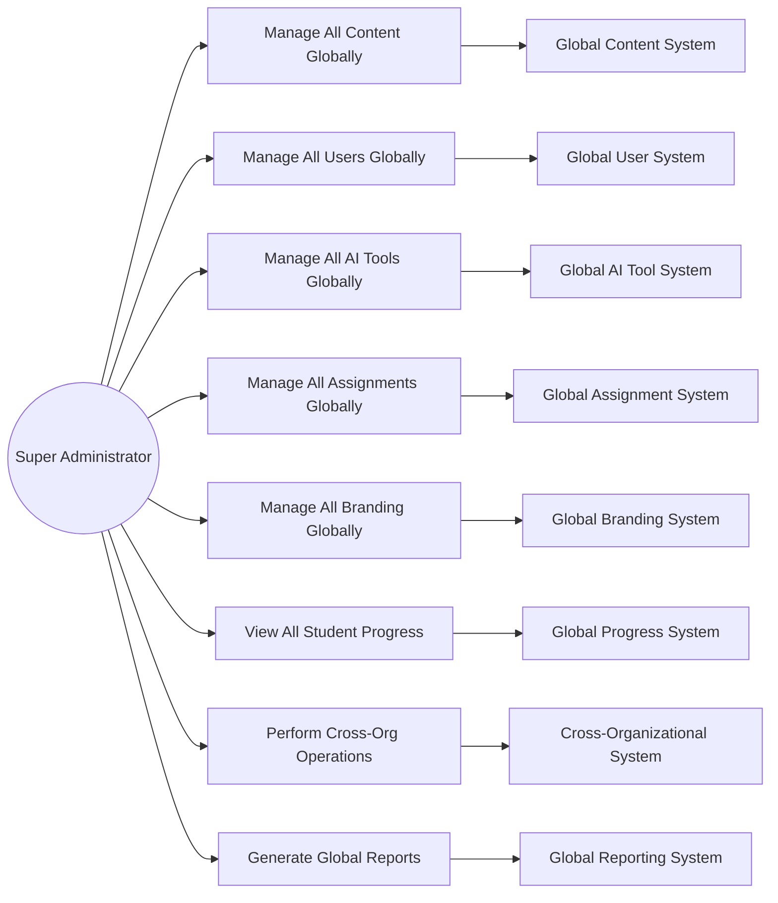
```mermaid
graph LR
    SuperAdmin((Super Administrator))
    
    SuperAdmin --> UC1[Manage All Content Globally]
    SuperAdmin --> UC2[Manage All Users Globally]
    SuperAdmin --> UC3[Manage All AI Tools Globally]
    SuperAdmin --> UC4[Manage All Assignments Globally]
    SuperAdmin --> UC5[Manage All Branding Globally]
    SuperAdmin --> UC6[View All Student Progress]
    SuperAdmin --> UC7[Perform Cross-Org Operations]
    SuperAdmin --> UC8[Generate Global Reports]
    
    UC1 --> GlobalContentSystem[Global Content System]
    UC2 --> GlobalUserSystem[Global User System]
    UC3 --> GlobalToolSystem[Global AI Tool System]
    UC4 --> GlobalAssignmentSystem[Global Assignment System]
    UC5 --> GlobalBrandingSystem[Global Branding System]
    UC6 --> GlobalProgressSystem[Global Progress System]
    UC7 --> CrossOrgSystem[Cross-Organizational System]
    UC8 --> GlobalReportSystem[Global Reporting System]
```

### Global System Integration Use Cases
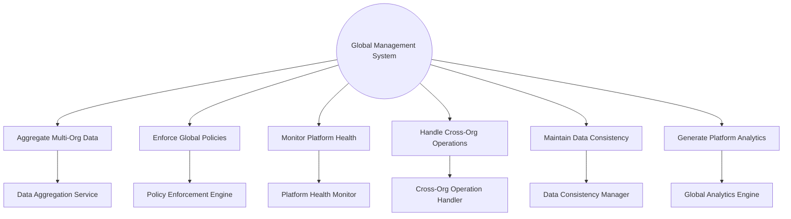
```mermaid
graph TB
    GlobalSystem((Global Management System))
    
    GlobalSystem --> UC1[Aggregate Multi-Org Data]
    GlobalSystem --> UC2[Enforce Global Policies]
    GlobalSystem --> UC3[Monitor Platform Health]
    GlobalSystem --> UC4[Handle Cross-Org Operations]
    GlobalSystem --> UC5[Maintain Data Consistency]
    GlobalSystem --> UC6[Generate Platform Analytics]
    
    UC1 --> DataAggregator[Data Aggregation Service]
    UC2 --> PolicyEngine[Policy Enforcement Engine]
    UC3 --> HealthMonitor[Platform Health Monitor]
    UC4 --> CrossOrgHandler[Cross-Org Operation Handler]
    UC5 --> ConsistencyManager[Data Consistency Manager]
    UC6 --> AnalyticsEngine[Global Analytics Engine]
```

## Component Interaction Diagrams

### Global Data Management Architecture
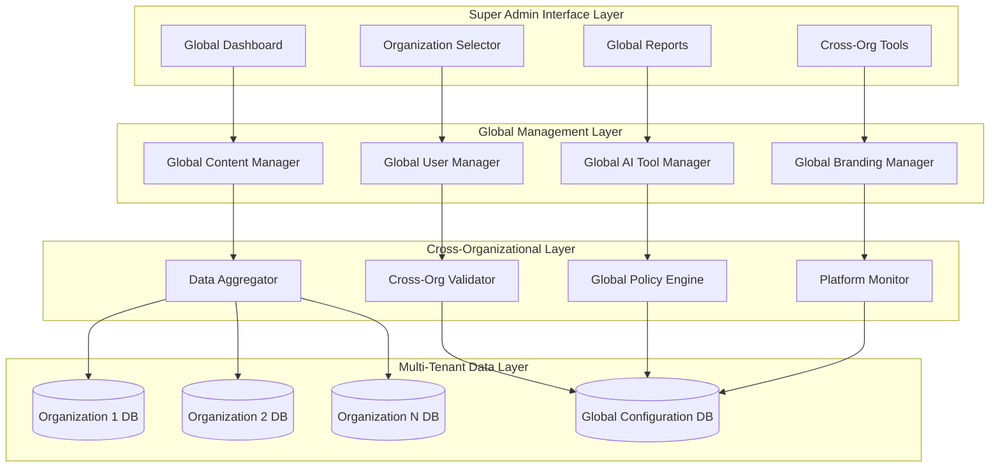
```mermaid
graph TB
    subgraph "Super Admin Interface Layer"
        GlobalDashboard[Global Dashboard]
        OrgSelector[Organization Selector]
        GlobalReports[Global Reports]
        CrossOrgTools[Cross-Org Tools]
    end
    
    subgraph "Global Management Layer"
        GlobalContentMgr[Global Content Manager]
        GlobalUserMgr[Global User Manager]
        GlobalToolMgr[Global AI Tool Manager]
        GlobalBrandingMgr[Global Branding Manager]
    end
    
    subgraph "Cross-Organizational Layer"
        DataAggregator[Data Aggregator]
        CrossOrgValidator[Cross-Org Validator]
        GlobalPolicyEngine[Global Policy Engine]
        PlatformMonitor[Platform Monitor]
    end
    
    subgraph "Multi-Tenant Data Layer"
        Org1DB[(Organization 1 DB)]
        Org2DB[(Organization 2 DB)]
        OrgNDB[(Organization N DB)]
        GlobalDB[(Global Configuration DB)]
    end
    
    GlobalDashboard --> GlobalContentMgr
    OrgSelector --> GlobalUserMgr
    GlobalReports --> GlobalToolMgr
    CrossOrgTools --> GlobalBrandingMgr
    
    GlobalContentMgr --> DataAggregator
    GlobalUserMgr --> CrossOrgValidator
    GlobalToolMgr --> GlobalPolicyEngine
    GlobalBrandingMgr --> PlatformMonitor
    
    DataAggregator --> Org1DB
    DataAggregator --> Org2DB
    DataAggregator --> OrgNDB
    CrossOrgValidator --> GlobalDB
    GlobalPolicyEngine --> GlobalDB
    PlatformMonitor --> GlobalDB
```

### Real-time Global Synchronization
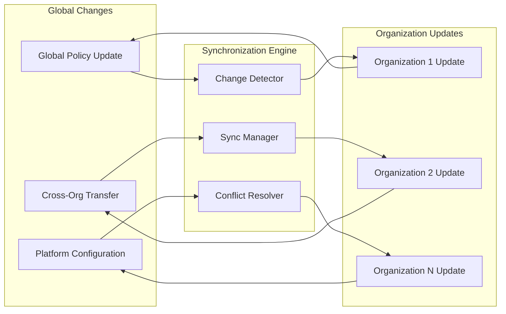
```mermaid
graph LR
    subgraph "Global Changes"
        GlobalPolicyUpdate[Global Policy Update]
        CrossOrgTransfer[Cross-Org Transfer]
        PlatformConfiguration[Platform Configuration]
    end
    
    subgraph "Synchronization Engine"
        ChangeDetector[Change Detector]
        SyncManager[Sync Manager]
        ConflictResolver[Conflict Resolver]
    end
    
    subgraph "Organization Updates"
        Org1Update[Organization 1 Update]
        Org2Update[Organization 2 Update]
        OrgNUpdate[Organization N Update]
    end
    
    GlobalPolicyUpdate --> ChangeDetector
    CrossOrgTransfer --> SyncManager
    PlatformConfiguration --> ConflictResolver
    
    ChangeDetector --> Org1Update
    SyncManager --> Org2Update
    ConflictResolver --> OrgNUpdate
    
    Org1Update --> GlobalPolicyUpdate
    Org2Update --> CrossOrgTransfer
    OrgNUpdate --> PlatformConfiguration
```
## 
Comprehensive Data Management Workflows

### Complete Data CRUD Operations Flow
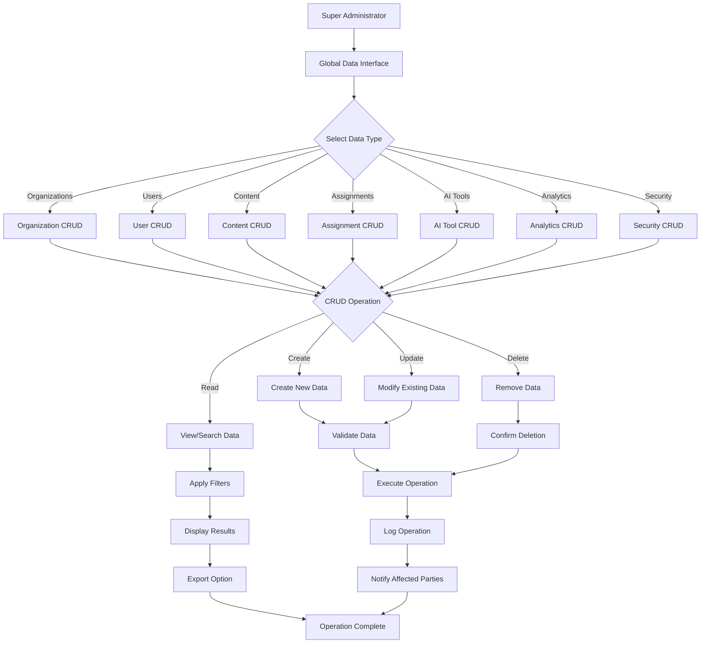
```mermaid
flowchart TD
    SA[Super Administrator] --> GDI[Global Data Interface]
    GDI --> DT{Select Data Type}
    
    DT -->|Organizations| OrgCRUD[Organization CRUD]
    DT -->|Users| UserCRUD[User CRUD]
    DT -->|Content| ContentCRUD[Content CRUD]
    DT -->|Assignments| AssignmentCRUD[Assignment CRUD]
    DT -->|AI Tools| ToolCRUD[AI Tool CRUD]
    DT -->|Analytics| AnalyticsCRUD[Analytics CRUD]
    DT -->|Security| SecurityCRUD[Security CRUD]
    
    OrgCRUD --> CRUD{CRUD Operation}
    UserCRUD --> CRUD
    ContentCRUD --> CRUD
    AssignmentCRUD --> CRUD
    ToolCRUD --> CRUD
    AnalyticsCRUD --> CRUD
    SecurityCRUD --> CRUD
    
    CRUD -->|Create| CreateFlow[Create New Data]
    CRUD -->|Read| ReadFlow[View/Search Data]
    CRUD -->|Update| UpdateFlow[Modify Existing Data]
    CRUD -->|Delete| DeleteFlow[Remove Data]
    
    CreateFlow --> Validate[Validate Data]
    ReadFlow --> Filter[Apply Filters]
    UpdateFlow --> Validate
    DeleteFlow --> ConfirmDelete[Confirm Deletion]
    
    Validate --> Execute[Execute Operation]
    Filter --> Display[Display Results]
    ConfirmDelete --> Execute
    
    Execute --> Audit[Log Operation]
    Display --> Export[Export Option]
    
    Audit --> Notify[Notify Affected Parties]
    Export --> Complete[Operation Complete]
    Notify --> Complete
```

### Global Database Management Flow
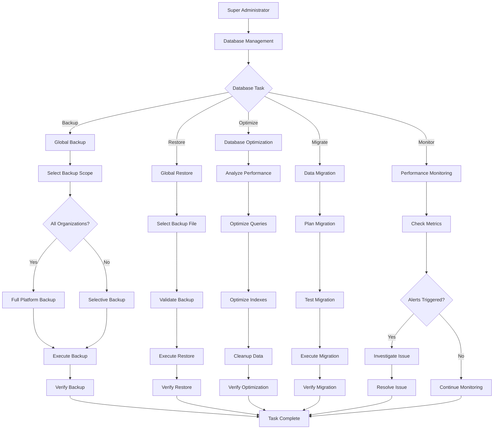
```mermaid
flowchart TD
    SA[Super Administrator] --> DBM[Database Management]
    DBM --> DBT{Database Task}
    
    DBT -->|Backup| BackupFlow[Global Backup]
    DBT -->|Restore| RestoreFlow[Global Restore]
    DBT -->|Optimize| OptimizeFlow[Database Optimization]
    DBT -->|Migrate| MigrateFlow[Data Migration]
    DBT -->|Monitor| MonitorFlow[Performance Monitoring]
    
    BackupFlow --> SelectScope[Select Backup Scope]
    RestoreFlow --> SelectBackup[Select Backup File]
    OptimizeFlow --> AnalyzePerf[Analyze Performance]
    MigrateFlow --> PlanMigration[Plan Migration]
    MonitorFlow --> CheckMetrics[Check Metrics]
    
    SelectScope --> AllOrgs{All Organizations?}
    AllOrgs -->|Yes| FullBackup[Full Platform Backup]
    AllOrgs -->|No| PartialBackup[Selective Backup]
    
    FullBackup --> ExecuteBackup[Execute Backup]
    PartialBackup --> ExecuteBackup
    
    SelectBackup --> ValidateBackup[Validate Backup]
    ValidateBackup --> ExecuteRestore[Execute Restore]
    
    AnalyzePerf --> OptimizeQueries[Optimize Queries]
    OptimizeQueries --> OptimizeIndexes[Optimize Indexes]
    OptimizeIndexes --> CleanupData[Cleanup Data]
    
    PlanMigration --> TestMigration[Test Migration]
    TestMigration --> ExecuteMigration[Execute Migration]
    
    CheckMetrics --> AlertCheck{Alerts Triggered?}
    AlertCheck -->|Yes| InvestigateIssue[Investigate Issue]
    AlertCheck -->|No| ContinueMonitoring[Continue Monitoring]
    
    ExecuteBackup --> VerifyBackup[Verify Backup]
    ExecuteRestore --> VerifyRestore[Verify Restore]
    CleanupData --> VerifyOptimization[Verify Optimization]
    ExecuteMigration --> VerifyMigration[Verify Migration]
    InvestigateIssue --> ResolveIssue[Resolve Issue]
    
    VerifyBackup --> Complete[Task Complete]
    VerifyRestore --> Complete
    VerifyOptimization --> Complete
    VerifyMigration --> Complete
    ResolveIssue --> Complete
    ContinueMonitoring --> Complete
```

### Global Security Management Flow
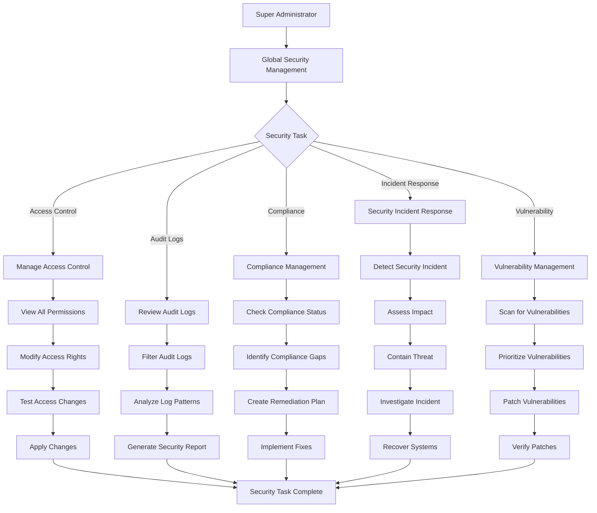
```mermaid
flowchart TD
    SA[Super Administrator] --> GSM[Global Security Management]
    GSM --> ST{Security Task}
    
    ST -->|Access Control| AccessFlow[Manage Access Control]
    ST -->|Audit Logs| AuditFlow[Review Audit Logs]
    ST -->|Compliance| ComplianceFlow[Compliance Management]
    ST -->|Incident Response| IncidentFlow[Security Incident Response]
    ST -->|Vulnerability| VulnFlow[Vulnerability Management]
    
    AccessFlow --> ViewPermissions[View All Permissions]
    ViewPermissions --> ModifyAccess[Modify Access Rights]
    ModifyAccess --> TestAccess[Test Access Changes]
    TestAccess --> ApplyChanges[Apply Changes]
    
    AuditFlow --> FilterLogs[Filter Audit Logs]
    FilterLogs --> AnalyzeLogs[Analyze Log Patterns]
    AnalyzeLogs --> GenerateReport[Generate Security Report]
    
    ComplianceFlow --> CheckCompliance[Check Compliance Status]
    CheckCompliance --> IdentifyGaps[Identify Compliance Gaps]
    IdentifyGaps --> CreatePlan[Create Remediation Plan]
    CreatePlan --> ImplementFixes[Implement Fixes]
    
    IncidentFlow --> DetectIncident[Detect Security Incident]
    DetectIncident --> AssessImpact[Assess Impact]
    AssessImpact --> ContainThreat[Contain Threat]
    ContainThreat --> InvestigateIncident[Investigate Incident]
    InvestigateIncident --> RecoverSystems[Recover Systems]
    
    VulnFlow --> ScanVulnerabilities[Scan for Vulnerabilities]
    ScanVulnerabilities --> PrioritizeVulns[Prioritize Vulnerabilities]
    PrioritizeVulns --> PatchVulns[Patch Vulnerabilities]
    PatchVulns --> VerifyPatches[Verify Patches]
    
    ApplyChanges --> SecurityComplete[Security Task Complete]
    GenerateReport --> SecurityComplete
    ImplementFixes --> SecurityComplete
    RecoverSystems --> SecurityComplete
    VerifyPatches --> SecurityComplete
```

### Global Analytics and Reporting Management Flow
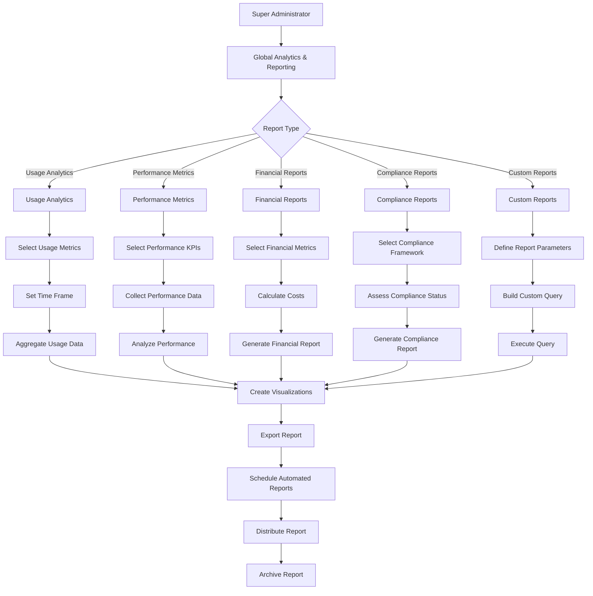
```mermaid
flowchart TD
    SA[Super Administrator] --> GAR[Global Analytics & Reporting]
    GAR --> RT{Report Type}
    
    RT -->|Usage Analytics| UsageFlow[Usage Analytics]
    RT -->|Performance Metrics| PerfFlow[Performance Metrics]
    RT -->|Financial Reports| FinFlow[Financial Reports]
    RT -->|Compliance Reports| CompFlow[Compliance Reports]
    RT -->|Custom Reports| CustomFlow[Custom Reports]
    
    UsageFlow --> SelectMetrics[Select Usage Metrics]
    SelectMetrics --> SetTimeframe[Set Time Frame]
    SetTimeframe --> AggregateData[Aggregate Usage Data]
    
    PerfFlow --> SelectKPIs[Select Performance KPIs]
    SelectKPIs --> CollectMetrics[Collect Performance Data]
    CollectMetrics --> AnalyzePerformance[Analyze Performance]
    
    FinFlow --> SelectFinMetrics[Select Financial Metrics]
    SelectFinMetrics --> CalculateCosts[Calculate Costs]
    CalculateCosts --> GenerateFinReport[Generate Financial Report]
    
    CompFlow --> SelectCompliance[Select Compliance Framework]
    SelectCompliance --> AssessCompliance[Assess Compliance Status]
    AssessCompliance --> GenerateCompReport[Generate Compliance Report]
    
    CustomFlow --> DefineParameters[Define Report Parameters]
    DefineParameters --> BuildQuery[Build Custom Query]
    BuildQuery --> ExecuteQuery[Execute Query]
    
    AggregateData --> VisualizeData[Create Visualizations]
    AnalyzePerformance --> VisualizeData
    GenerateFinReport --> VisualizeData
    GenerateCompReport --> VisualizeData
    ExecuteQuery --> VisualizeData
    
    VisualizeData --> ExportReport[Export Report]
    ExportReport --> ScheduleReport[Schedule Automated Reports]
    ScheduleReport --> DistributeReport[Distribute Report]
    DistributeReport --> ArchiveReport[Archive Report]
```

### Cross-Organizational Bulk Operations Flow
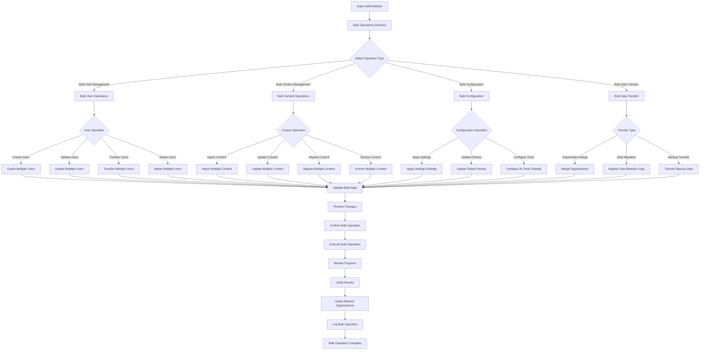
```mermaid
flowchart TD
    SA[Super Administrator] --> BulkOps[Bulk Operations Interface]
    BulkOps --> SelectOperation{Select Operation Type}
    
    SelectOperation -->|Bulk User Management| BulkUsers[Bulk User Operations]
    SelectOperation -->|Bulk Content Management| BulkContent[Bulk Content Operations]
    SelectOperation -->|Bulk Configuration| BulkConfig[Bulk Configuration]
    SelectOperation -->|Bulk Data Transfer| BulkTransfer[Bulk Data Transfer]
    
    BulkUsers --> UserOpType{User Operation}
    UserOpType -->|Create Users| CreateBulkUsers[Create Multiple Users]
    UserOpType -->|Update Users| UpdateBulkUsers[Update Multiple Users]
    UserOpType -->|Transfer Users| TransferBulkUsers[Transfer Multiple Users]
    UserOpType -->|Delete Users| DeleteBulkUsers[Delete Multiple Users]
    
    BulkContent --> ContentOpType{Content Operation}
    ContentOpType -->|Import Content| ImportContent[Import Multiple Content]
    ContentOpType -->|Update Content| UpdateContent[Update Multiple Content]
    ContentOpType -->|Migrate Content| MigrateContent[Migrate Multiple Content]
    ContentOpType -->|Archive Content| ArchiveContent[Archive Multiple Content]
    
    BulkConfig --> ConfigOpType{Configuration Operation}
    ConfigOpType -->|Apply Settings| ApplySettings[Apply Settings Globally]
    ConfigOpType -->|Update Policies| UpdatePolicies[Update Global Policies]
    ConfigOpType -->|Configure Tools| ConfigureTools[Configure AI Tools Globally]
    
    BulkTransfer --> TransferType{Transfer Type}
    TransferType -->|Organization Merge| MergeOrgs[Merge Organizations]
    TransferType -->|Data Migration| MigrateData[Migrate Data Between Orgs]
    TransferType -->|Backup Transfer| TransferBackup[Transfer Backup Data]
    
    CreateBulkUsers --> ValidateBulkData[Validate Bulk Data]
    UpdateBulkUsers --> ValidateBulkData
    TransferBulkUsers --> ValidateBulkData
    DeleteBulkUsers --> ValidateBulkData
    ImportContent --> ValidateBulkData
    UpdateContent --> ValidateBulkData
    MigrateContent --> ValidateBulkData
    ArchiveContent --> ValidateBulkData
    ApplySettings --> ValidateBulkData
    UpdatePolicies --> ValidateBulkData
    ConfigureTools --> ValidateBulkData
    MergeOrgs --> ValidateBulkData
    MigrateData --> ValidateBulkData
    TransferBackup --> ValidateBulkData
    
    ValidateBulkData --> PreviewChanges[Preview Changes]
    PreviewChanges --> ConfirmBulkOp[Confirm Bulk Operation]
    ConfirmBulkOp --> ExecuteBulkOp[Execute Bulk Operation]
    ExecuteBulkOp --> MonitorProgress[Monitor Progress]
    MonitorProgress --> VerifyResults[Verify Results]
    VerifyResults --> NotifyAffected[Notify Affected Organizations]
    NotifyAffected --> LogBulkOperation[Log Bulk Operation]
    LogBulkOperation --> BulkComplete[Bulk Operation Complete]
```

### Global System Health Monitoring Flow
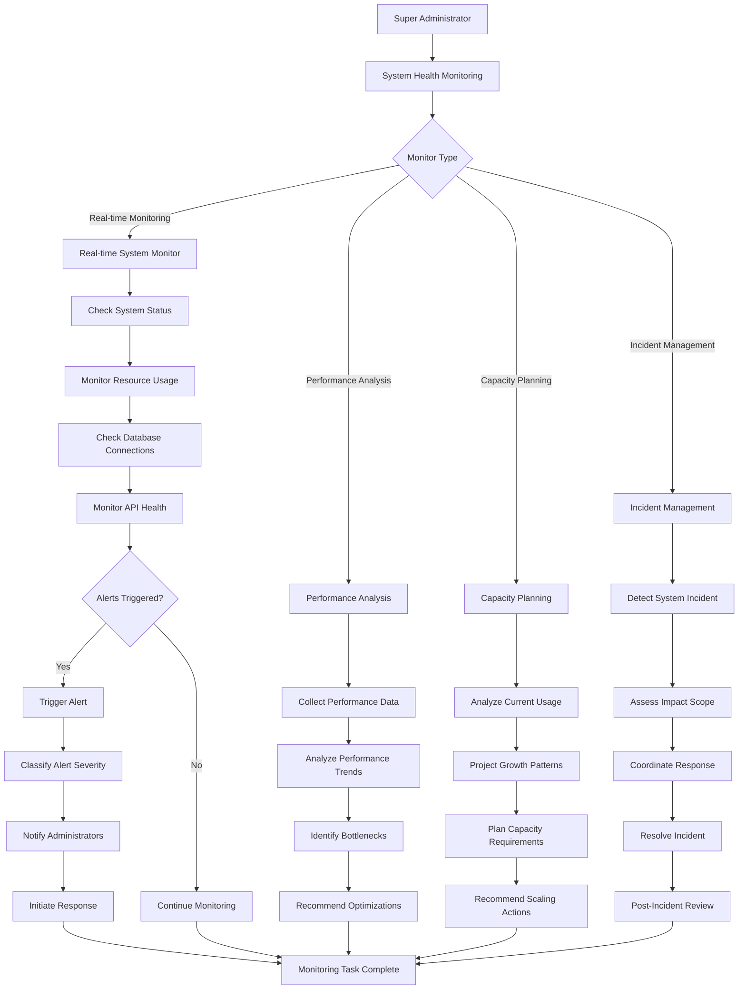
```mermaid
flowchart TD
    SA[Super Administrator] --> SHM[System Health Monitoring]
    SHM --> MonitorType{Monitor Type}
    
    MonitorType -->|Real-time Monitoring| RealTimeFlow[Real-time System Monitor]
    MonitorType -->|Performance Analysis| PerfAnalysis[Performance Analysis]
    MonitorType -->|Capacity Planning| CapacityFlow[Capacity Planning]
    MonitorType -->|Incident Management| IncidentMgmt[Incident Management]
    
    RealTimeFlow --> CheckSystemStatus[Check System Status]
    CheckSystemStatus --> MonitorResources[Monitor Resource Usage]
    MonitorResources --> CheckConnections[Check Database Connections]
    CheckConnections --> MonitorAPIHealth[Monitor API Health]
    MonitorAPIHealth --> AlertCheck{Alerts Triggered?}
    
    AlertCheck -->|Yes| TriggerAlert[Trigger Alert]
    AlertCheck -->|No| ContinueMonitoring[Continue Monitoring]
    
    TriggerAlert --> ClassifyAlert[Classify Alert Severity]
    ClassifyAlert --> NotifyAdmins[Notify Administrators]
    NotifyAdmins --> InitiateResponse[Initiate Response]
    
    PerfAnalysis --> CollectPerfData[Collect Performance Data]
    CollectPerfData --> AnalyzeTrends[Analyze Performance Trends]
    AnalyzeTrends --> IdentifyBottlenecks[Identify Bottlenecks]
    IdentifyBottlenecks --> RecommendOptimizations[Recommend Optimizations]
    
    CapacityFlow --> AnalyzeUsage[Analyze Current Usage]
    AnalyzeUsage --> ProjectGrowth[Project Growth Patterns]
    ProjectGrowth --> PlanCapacity[Plan Capacity Requirements]
    PlanCapacity --> RecommendScaling[Recommend Scaling Actions]
    
    IncidentMgmt --> DetectIncident[Detect System Incident]
    DetectIncident --> AssessImpact[Assess Impact Scope]
    AssessImpact --> CoordinateResponse[Coordinate Response]
    CoordinateResponse --> ResolveIncident[Resolve Incident]
    ResolveIncident --> PostIncidentReview[Post-Incident Review]
    
    InitiateResponse --> MonitoringComplete[Monitoring Task Complete]
    ContinueMonitoring --> MonitoringComplete
    RecommendOptimizations --> MonitoringComplete
    RecommendScaling --> MonitoringComplete
    PostIncidentReview --> MonitoringComplete
```

### Global Data Governance Flow
```mermaid
flowchart TD
    SA[Super Administrator] --> DG[Data Governance]
    DG --> GovernanceArea{Governance Area}
    
    GovernanceArea -->|Data Quality| DataQuality[Data Quality Management]
    GovernanceArea -->|Data Privacy| DataPrivacy[Data Privacy Management]
    GovernanceArea -->|Data Retention| DataRetention[Data Retention Management]
    GovernanceArea -->|Data Classification| DataClassification[Data Classification]
    
    DataQuality --> AssessQuality[Assess Data Quality]
    AssessQuality --> IdentifyIssues[Identify Quality Issues]
    IdentifyIssues --> CreateCleanupPlan[Create Data Cleanup Plan]
    CreateCleanupPlan --> ExecuteCleanup[Execute Data Cleanup]
    ExecuteCleanup --> ValidateQuality[Validate Quality Improvements]
    
    DataPrivacy --> ReviewPrivacyPolicies[Review Privacy Policies]
    ReviewPrivacyPolicies --> AssessCompliance[Assess Privacy Compliance]
    AssessCompliance --> ImplementControls[Implement Privacy Controls]
    ImplementControls --> MonitorPrivacy[Monitor Privacy Compliance]
    
    DataRetention --> DefineRetentionPolicies[Define Retention Policies]
    DefineRetentionPolicies --> ImplementRetention[Implement Retention Rules]
    ImplementRetention --> ScheduleCleanup[Schedule Data Cleanup]
    ScheduleCleanup --> ExecuteRetention[Execute Retention Policies]
    ExecuteRetention --> AuditRetention[Audit Retention Compliance]
    
    DataClassification --> ClassifyData[Classify Data Types]
    ClassifyData --> ApplyLabels[Apply Security Labels]
    ApplyLabels --> SetAccessControls[Set Access Controls]
    SetAccessControls --> MonitorAccess[Monitor Data Access]
    
    ValidateQuality --> GovernanceComplete[Governance Task Complete]
    MonitorPrivacy --> GovernanceComplete
    AuditRetention --> GovernanceComplete
    MonitorAccess --> GovernanceComplete
```

## Advanced Integration Patterns

### Multi-Tenant Data Access Pattern
```mermaid
graph TB
    subgraph "Super Admin Layer"
        SAInterface[Super Admin Interface]
        GlobalAuth[Global Authentication]
        CrossOrgAuth[Cross-Org Authorization]
    end
    
    subgraph "Data Access Layer"
        GlobalDataRouter[Global Data Router]
        OrgDataFilter[Organization Data Filter]
        DataAggregator[Data Aggregator]
    end
    
    subgraph "Organization Databases"
        Org1[(Org 1 Database)]
        Org2[(Org 2 Database)]
        Org3[(Org 3 Database)]
        OrgN[(Org N Database)]
    end
    
    subgraph "Global Services"
        AuditService[Audit Service]
        NotificationService[Notification Service]
        BackupService[Backup Service]
    end
    
    SAInterface --> GlobalAuth
    GlobalAuth --> CrossOrgAuth
    CrossOrgAuth --> GlobalDataRouter
    
    GlobalDataRouter --> OrgDataFilter
    OrgDataFilter --> DataAggregator
    
    DataAggregator --> Org1
    DataAggregator --> Org2
    DataAggregator --> Org3
    DataAggregator --> OrgN
    
    GlobalDataRouter --> AuditService
    GlobalDataRouter --> NotificationService
    GlobalDataRouter --> BackupService
```

### Global Event Processing Pattern
```mermaid
graph LR
    subgraph "Event Sources"
        OrgEvents1[Org 1 Events]
        OrgEvents2[Org 2 Events]
        OrgEventsN[Org N Events]
        SystemEvents[System Events]
    end
    
    subgraph "Global Event Processing"
        EventBus[Global Event Bus]
        EventProcessor[Event Processor]
        EventRouter[Event Router]
    end
    
    subgraph "Super Admin Services"
        AlertManager[Alert Manager]
        ReportGenerator[Report Generator]
        ActionTrigger[Action Trigger]
    end
    
    OrgEvents1 --> EventBus
    OrgEvents2 --> EventBus
    OrgEventsN --> EventBus
    SystemEvents --> EventBus
    
    EventBus --> EventProcessor
    EventProcessor --> EventRouter
    
    EventRouter --> AlertManager
    EventRouter --> ReportGenerator
    EventRouter --> ActionTrigger
    
    AlertManager --> SuperAdminNotification[Super Admin Notification]
    ReportGenerator --> GlobalReports[Global Reports]
    ActionTrigger --> AutomatedActions[Automated Actions]
```