# AI Smart Learning Renewal - ERD Diagram (Simplified)

## Entity Relationship Diagram (Visual)

```mermaid
erDiagram
    USERS {
        bigint id PK
        varchar company_name "Company isolation"
        bigint sub_admin_id FK "Instructor belongs to sub-admin"
        varchar name
        varchar username UK
        varchar email
        varchar password_hash "SHA256"
        enum role "super_admin,sub_admin,instructor,student"
        varchar login_token "Required for students"
        date course_schedule "For students"
        bigint assigned_instructor_id FK
        varchar logo_url "Sub-admin logo"
        timestamp created_at
        timestamp updated_at
        boolean is_active
    }

    PRACTICE_SESSIONS {
        bigint id PK
        bigint sub_admin_id FK
        int session_number "1-40"
        varchar title
        varchar web_url "Different per sub-admin"
        text pre_practice_message "HTML content"
        timestamp created_at
        timestamp updated_at
        boolean is_active
    }

    ASSIGNMENTS {
        bigint id PK
        bigint sub_admin_id FK
        int assignment_number "1-10"
        varchar title
        text description
        varchar web_url
        timestamp created_at
        timestamp updated_at
        boolean is_active
    }

    AI_TOOLS_MASTER {
        bigint id PK
        varchar name
        varchar provider "eden_ai,openai,naver,kakao"
        varchar tool_type "chat,image_generation,translation"
        varchar api_endpoint
        text description
        boolean is_enabled_globally "Super admin control"
        timestamp created_at
        timestamp updated_at
    }

    SUB_ADMIN_AI_TOOLS {
        bigint id PK
        bigint sub_admin_id FK
        bigint ai_tool_id FK
        boolean is_enabled "Sub-admin control"
        varchar api_key_encrypted "Per sub-admin"
        timestamp created_at
        timestamp updated_at
    }

    SESSION_AI_TOOLS {
        bigint id PK
        bigint practice_session_id FK
        bigint ai_tool_id FK
        boolean is_enabled
        int display_order
    }

    ASSIGNMENT_AI_TOOLS {
        bigint id PK
        bigint assignment_id FK
        bigint ai_tool_id FK
        boolean is_enabled
        int display_order
    }

    RECOMMENDED_VIDEOS {
        bigint id PK
        bigint sub_admin_id FK
        int session_number "1-40"
        varchar title
        varchar video_url
        varchar thumbnail_url
        text script_content "For AI recommendations"
        text hashtags "For AI matching"
        int display_order
        timestamp created_at
        timestamp updated_at
        boolean is_active
    }

    FILE_UPLOADS {
        varchar id PK "UUID"
        bigint uploader_id FK
        varchar url
        varchar file_name
        varchar file_type
        int file_size
        varchar access_mode
        timestamp created_at
        timestamp updated_at
    }

    CONVERSATIONS {
        bigint id PK
        bigint student_id FK
        enum conversation_type "practice_session,assignment,video_recommendation"
        bigint session_id "practice_session_id or assignment_id"
        bigint ai_tool_id FK
        varchar title
        timestamp started_at
        timestamp last_message_at
        boolean is_active
    }

    CONVERSATION_MESSAGES {
        bigint id PK
        bigint conversation_id FK
        enum message_type "user_message,ai_response,system_message"
        text message_content
        text prompt_analysis "GPT API analysis"
        text improvement_suggestions "AI feedback"
        timestamp created_at
    }

    STUDENT_VIDEO_RECOMMENDATIONS {
        bigint id PK
        bigint student_id FK
        int session_number
        bigint recommended_video_id FK
        bigint conversation_id FK
        text recommendation_reason "AI explanation"
        boolean is_selected "Student selected"
        timestamp created_at
    }

    %% Primary Relationships
    USERS ||--o{ USERS : "sub-admin manages instructors"
    USERS ||--o{ USERS : "instructor teaches students"
    USERS ||--o{ PRACTICE_SESSIONS : "sub-admin creates"
    USERS ||--o{ ASSIGNMENTS : "sub-admin creates"
    USERS ||--o{ RECOMMENDED_VIDEOS : "sub-admin manages"
    USERS ||--o{ FILE_UPLOADS : "uploads"
    USERS ||--o{ CONVERSATIONS : "student participates"
    USERS ||--o{ STUDENT_VIDEO_RECOMMENDATIONS : "receives"
    USERS ||--o{ SUB_ADMIN_AI_TOOLS : "configures"

    %% AI Tool Relationships
    AI_TOOLS_MASTER ||--o{ SUB_ADMIN_AI_TOOLS : "configured by sub-admins"
    AI_TOOLS_MASTER ||--o{ SESSION_AI_TOOLS : "used in sessions"
    AI_TOOLS_MASTER ||--o{ ASSIGNMENT_AI_TOOLS : "used in assignments"
    AI_TOOLS_MASTER ||--o{ CONVERSATIONS : "powers conversations"

    %% Session and Assignment Relationships
    PRACTICE_SESSIONS ||--o{ SESSION_AI_TOOLS : "has tools"
    ASSIGNMENTS ||--o{ ASSIGNMENT_AI_TOOLS : "has tools"

    %% Conversation Relationships (Key for chat log access)
    CONVERSATIONS ||--o{ CONVERSATION_MESSAGES : "contains messages"
    CONVERSATIONS ||--o{ STUDENT_VIDEO_RECOMMENDATIONS : "generates recommendations"

    %% Video Recommendation Relationships
    RECOMMENDED_VIDEOS ||--o{ STUDENT_VIDEO_RECOMMENDATIONS : "recommended to students"
```



## Key Relationship Details

### Simplified Multi-Tenant Architecture

- **Company Isolation**: Users table contains `company_name` for data separation
- **No Organizations Table**: Simplified approach - company info stored in users
- **Logo Storage**: Sub-admin logo stored directly in users table as per docs.txt

### User Hierarchy & Access Control

- **Super Admin**: Access all data across all companies (no company filter)
- **Sub-Admin**: Restricted to their company's data via `company_name`
- **Instructor**: Can only view students in their company
- **Student**: Accesses learning content within their company

### Conversation-Based Chat Log System

- **One Conversation per Assignment/Session**: Easy to track complete chat history
- **Conversation Messages**: All chat messages linked to conversation
- **Super Admin Chat Access**: Can view all conversations across all companies
- **Assignment View (과제보기)**: Direct access to conversation for each assignment

### AI Tool Configuration Hierarchy

1. **AI_TOOLS_MASTER**: Global tool library (Super Admin control)
2. **SUB_ADMIN_AI_TOOLS**: Sub-admin level tool configuration with API keys
3. **SESSION_AI_TOOLS**: Session-specific tool availability
4. **ASSIGNMENT_AI_TOOLS**: Assignment-specific tool availability

### File Upload Integration

- **UUID Primary Key**: Matches your TypeORM entity pattern
- **Flexible File Management**: Supports various file types and access modes
- **User Tracking**: Links files to uploaders

## Data Access Patterns by Role

### Super Administrator Access (No Company Filter)

```sql
-- Access ALL conversations across all companies
SELECT c.*, u.name as student_name, u.company_name, at.name as ai_tool_name
FROM conversations c
JOIN users u ON c.student_id = u.id
JOIN ai_tools_master at ON c.ai_tool_id = at.id
WHERE u.role = 'student';

-- Get complete chat history for any assignment across all companies
SELECT cm.*, c.title, u.name as student_name, u.company_name
FROM conversation_messages cm
JOIN conversations c ON cm.conversation_id = c.id
JOIN users u ON c.student_id = u.id
WHERE c.conversation_type = 'assignment' AND c.session_id = ?;
```

### Sub-Administrator Access (Company Filter Required)

```sql
-- View only their company's student conversations
SELECT c.*, u.name as student_name
FROM conversations c
JOIN users u ON c.student_id = u.id
WHERE u.company_name = ? AND u.role = 'student';

-- Manage only their company's assignments
SELECT * FROM assignments a
JOIN users u ON a.sub_admin_id = u.id
WHERE u.company_name = ?;
```

### Student Learning View (학습보기) - AI Video Recommendations

```sql
-- Get AI-recommended videos based on chatbot conversation
SELECT rv.*, svr.recommendation_reason, c.title as conversation_title
FROM recommended_videos rv
JOIN student_video_recommendations svr ON rv.id = svr.recommended_video_id
LEFT JOIN conversations c ON svr.conversation_id = c.id
JOIN users sa ON rv.sub_admin_id = sa.id
JOIN users s ON s.company_name = sa.company_name
WHERE svr.student_id = ? AND rv.session_number = ?;
```

### Assignment View (과제보기) - Complete Conversation History

```sql
-- Get complete conversation for a specific assignment (easier chat log access)
SELECT
    c.id as conversation_id,
    c.title,
    c.started_at,
    cm.message_type,
    cm.message_content,
    cm.prompt_analysis,
    cm.improvement_suggestions,
    cm.created_at as message_time,
    at.name as ai_tool_name
FROM conversations c
JOIN conversation_messages cm ON c.id = cm.conversation_id
JOIN ai_tools_master at ON c.ai_tool_id = at.id
WHERE c.student_id = ?
    AND c.conversation_type = 'assignment'
    AND c.session_id = ?
ORDER BY cm.created_at;
```

### Instructor Access (Restricted to Assigned Students)

```sql
-- Instructor can only view their assigned students (same company)
SELECT s.* FROM users s
JOIN users i ON s.company_name = i.company_name
WHERE s.assigned_instructor_id = ? AND s.role = 'student' AND i.role = 'instructor';

-- Instructor can view conversations of their assigned students only
SELECT c.*, u.name as student_name
FROM conversations c
JOIN users u ON c.student_id = u.id
WHERE u.assigned_instructor_id = ? AND u.role = 'student';
```

## User Hierarchy & Access Control

- **Super Admin**: Access all data across all companies (no company filter)
- **Sub-Admin**: Restricted to their company's data via `company_name`, manages instructors via `sub_admin_id`
- **Instructor**: Belongs to sub-admin (`sub_admin_id`), can only view their assigned students in same company
- **Student**: Accesses learning content within their company, assigned to specific instructor

## Benefits of This Simplified Design

### 1. **Exact Compliance with docs.txt**

- ✅ Only features mentioned in docs.txt are included
- ✅ Logo stored in users table as specified
- ✅ Company isolation without complex organization structure
- ❌ Removed unauthorized tables (organizations, system_config, operation_logs)

### 2. **Conversation-Based Chat Logs**

- ✅ One conversation per student per assignment/session
- ✅ Easy to get complete chat history for each assignment
- ✅ Super admin can access all conversations across companies
- ✅ Supports AI prompt analysis and feedback per message

### 3. **File Upload Integration**

- ✅ Matches your TypeORM entity structure
- ✅ UUID primary key for better performance
- ✅ Flexible file type and access mode support

### 4. **Multi-Tenant Simplicity**

- ✅ Company isolation via `company_name` field
- ✅ No complex organization hierarchy
- ✅ Super admin bypasses company filters
- ✅ Sub-admin restricted to their company data

### 5. **AI Tool Management**

- ✅ Global tool library with super admin control
- ✅ Sub-admin API key management per company
- ✅ Session and assignment-specific tool configuration
- ✅ Support for 100+ AI tools from various providers

This simplified ERD provides a clean, maintainable foundation that exactly matches the docs.txt specifications while supporting the conversation-based chat log access you requested and integrating your file upload pattern.
