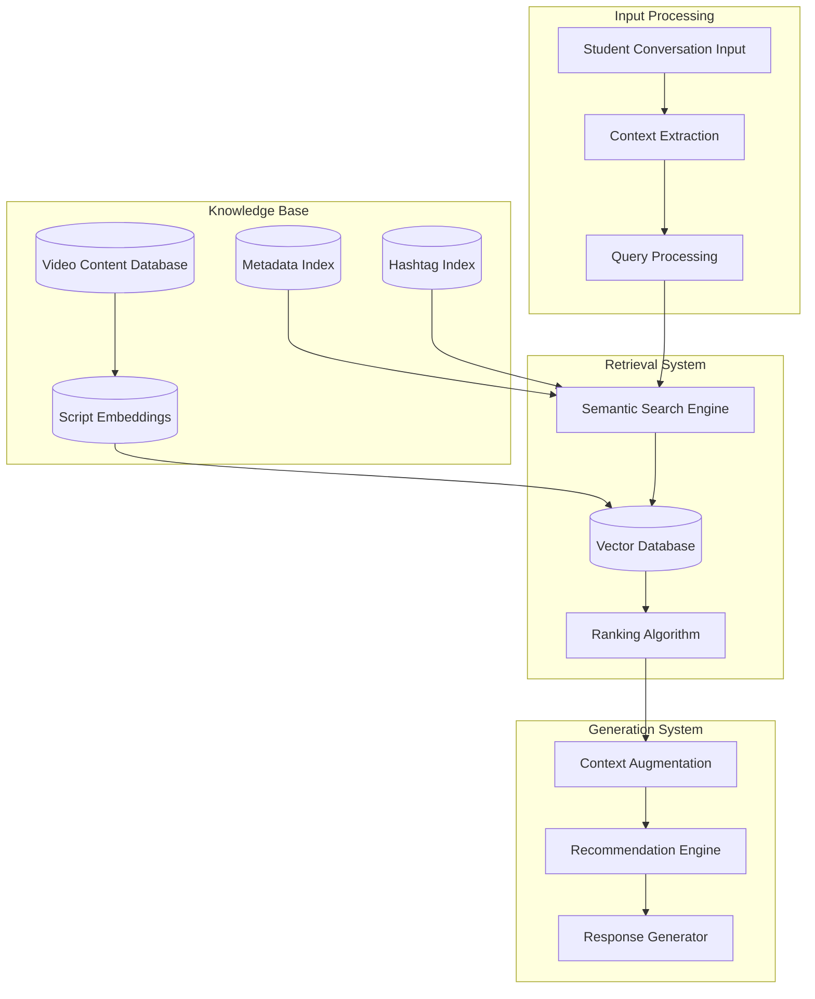

# RAG Methodology Implementation Guide

## Overview
Retrieval-Augmented Generation (RAG) methodology implementation for AI-powered video recommendations, enabling intelligent content matching based on student context, job experience, and learning objectives.

## RAG Architecture for Video Recommendations

### Core Components


## Implementation Phases

### Phase 1: Content Preprocessing and Embedding

#### Video Content Processing
1. **Script Content Extraction**
   - Extract and clean video script content from administrator uploads
   - Normalize text format and remove formatting artifacts
   - Segment content into meaningful chunks for embedding

2. **Metadata Processing**
   - Process video titles, descriptions, and categories
   - Extract and standardize hashtags for categorical search
   - Create structured metadata for filtering and ranking

3. **Embedding Generation**
   ```python
   # Pseudo-code for embedding generation
   def generate_embeddings(video_content):
       # Use sentence transformers or similar for semantic embeddings
       embeddings = embedding_model.encode(video_content.script)
       metadata_embeddings = embedding_model.encode(video_content.metadata)
       return {
           'content_embedding': embeddings,
           'metadata_embedding': metadata_embeddings,
           'video_id': video_content.id,
           'organization_id': video_content.org_id
       }
   ```

#### Vector Database Setup
1. **Vector Storage**
   - Store embeddings in vector database (e.g., Pinecone, Weaviate, or Chroma)
   - Implement organizational partitioning for data isolation
   - Create indexes for efficient similarity search

2. **Metadata Integration**
   - Store structured metadata alongside embeddings
   - Enable hybrid search combining semantic and metadata filtering
   - Implement organizational scope filtering

### Phase 2: Query Processing and Context Extraction

#### Student Input Analysis
1. **Conversation Context Extraction**
   ```python
   def extract_context(conversation_history):
       context = {
           'job_role': extract_job_role(conversation_history),
           'experience_level': determine_experience_level(conversation_history),
           'learning_goals': identify_learning_goals(conversation_history),
           'preferred_topics': extract_topics(conversation_history),
           'difficulty_preference': assess_difficulty_preference(conversation_history)
       }
       return context
   ```

2. **Query Formulation**
   - Convert student context into searchable queries
   - Generate multiple query variations for comprehensive search
   - Weight different aspects of context based on conversation confidence

#### Semantic Query Processing
1. **Query Embedding**
   - Generate embeddings for student queries using same model as content
   - Create context-aware query representations
   - Implement query expansion for better recall

2. **Multi-Modal Query Construction**
   ```python
   def construct_search_query(student_context):
       # Combine different aspects of student context
       semantic_query = generate_semantic_query(student_context)
       metadata_filters = create_metadata_filters(student_context)
       hashtag_queries = extract_relevant_hashtags(student_context)
       
       return {
           'semantic': semantic_query,
           'filters': metadata_filters,
           'hashtags': hashtag_queries,
           'weights': calculate_query_weights(student_context)
       }
   ```

### Phase 3: Retrieval and Ranking

#### Semantic Search Implementation
1. **Vector Similarity Search**
   - Perform cosine similarity search in vector space
   - Implement approximate nearest neighbor (ANN) for performance
   - Apply organizational filtering during search

2. **Hybrid Search Strategy**
   ```python
   def hybrid_search(query, organization_id, top_k=50):
       # Semantic search
       semantic_results = vector_db.search(
           query.semantic_embedding,
           filter={'organization_id': organization_id},
           top_k=top_k
       )
       
       # Metadata filtering
       filtered_results = apply_metadata_filters(
           semantic_results, 
           query.filters
       )
       
       # Hashtag matching
       hashtag_boosted = boost_hashtag_matches(
           filtered_results,
           query.hashtags
       )
       
       return hashtag_boosted
   ```

#### Ranking Algorithm
1. **Multi-Factor Scoring**
   - Semantic similarity score (0.4 weight)
   - Metadata relevance score (0.3 weight)
   - Hashtag match score (0.2 weight)
   - Content quality/popularity score (0.1 weight)

2. **Context-Aware Ranking**
   ```python
   def calculate_relevance_score(video, student_context, similarity_score):
       # Base semantic similarity
       score = similarity_score * 0.4
       
       # Job role relevance
       job_relevance = calculate_job_relevance(video.metadata, student_context.job_role)
       score += job_relevance * 0.3
       
       # Experience level matching
       difficulty_match = assess_difficulty_match(video.difficulty, student_context.experience)
       score += difficulty_match * 0.2
       
       # Content quality and engagement
       quality_score = video.engagement_metrics / max_engagement
       score += quality_score * 0.1
       
       return score
   ```

### Phase 4: Response Generation and Recommendation

#### Context Augmentation
1. **Retrieved Content Integration**
   - Combine retrieved video information with student context
   - Generate explanations for why videos are recommended
   - Create personalized recommendation rationale

2. **Recommendation Formatting**
   ```python
   def generate_recommendations(retrieved_videos, student_context):
       recommendations = []
       for video in retrieved_videos[:10]:  # Top 10 recommendations
           recommendation = {
               'video_id': video.id,
               'title': video.title,
               'description': video.description,
               'relevance_explanation': generate_explanation(video, student_context),
               'estimated_difficulty': video.difficulty_level,
               'duration': video.duration,
               'topics_covered': video.topics
           }
           recommendations.append(recommendation)
       return recommendations
   ```

#### Personalization and Learning
1. **Feedback Integration**
   - Track student selections and completion rates
   - Update recommendation models based on feedback
   - Implement collaborative filtering for similar students

2. **Continuous Learning**
   ```python
   def update_recommendation_model(student_feedback):
       # Update user preferences
       update_user_profile(student_feedback.student_id, student_feedback.selections)
       
       # Adjust content rankings
       adjust_content_scores(student_feedback.completed_videos, student_feedback.ratings)
       
       # Retrain recommendation weights
       if should_retrain():
           retrain_ranking_model(collected_feedback_data)
   ```

## Technical Implementation Details

### Vector Database Configuration
```yaml
vector_database:
  provider: "pinecone"  # or weaviate, chroma
  dimensions: 768  # sentence-transformer embedding size
  metric: "cosine"
  partitioning:
    - organization_id
    - content_type
  indexes:
    - name: "video_content"
      fields: ["embedding", "organization_id", "video_id"]
    - name: "metadata"
      fields: ["title", "description", "hashtags", "difficulty"]
```

### Embedding Model Selection
```python
# Recommended models for different languages and use cases
EMBEDDING_MODELS = {
    'multilingual': 'sentence-transformers/paraphrase-multilingual-MiniLM-L12-v2',
    'english_optimized': 'sentence-transformers/all-MiniLM-L6-v2',
    'domain_specific': 'custom_trained_model_for_education'
}

def select_embedding_model(content_language, domain):
    if domain == 'education' and content_language == 'korean':
        return load_custom_korean_education_model()
    elif content_language in ['korean', 'mixed']:
        return EMBEDDING_MODELS['multilingual']
    else:
        return EMBEDDING_MODELS['english_optimized']
```

### Performance Optimization

#### Caching Strategy
```python
class RAGCache:
    def __init__(self):
        self.embedding_cache = {}  # Cache for frequently accessed embeddings
        self.query_cache = {}      # Cache for similar queries
        self.result_cache = {}     # Cache for recommendation results
    
    def get_cached_recommendations(self, query_hash, organization_id):
        cache_key = f"{organization_id}:{query_hash}"
        return self.result_cache.get(cache_key)
    
    def cache_recommendations(self, query_hash, organization_id, results):
        cache_key = f"{organization_id}:{query_hash}"
        self.result_cache[cache_key] = results
        # Implement TTL and size limits
```

#### Batch Processing
```python
def batch_process_content_updates(video_updates):
    """Process multiple video updates efficiently"""
    # Batch embedding generation
    scripts = [video.script for video in video_updates]
    embeddings = embedding_model.encode(scripts, batch_size=32)
    
    # Batch vector database updates
    vector_updates = []
    for i, video in enumerate(video_updates):
        vector_updates.append({
            'id': video.id,
            'embedding': embeddings[i],
            'metadata': video.metadata,
            'organization_id': video.organization_id
        })
    
    vector_db.upsert_batch(vector_updates)
```

## Quality Assurance and Evaluation

### Recommendation Quality Metrics
1. **Relevance Metrics**
   - Click-through rate on recommended videos
   - Completion rate of recommended content
   - Student satisfaction ratings

2. **Diversity Metrics**
   - Topic diversity in recommendations
   - Difficulty level distribution
   - Content type variety

3. **Performance Metrics**
   - Query response time (target: <2 seconds)
   - Embedding generation time
   - Vector search latency

### A/B Testing Framework
```python
def ab_test_rag_configurations():
    """Test different RAG configurations for optimization"""
    configurations = [
        {'embedding_model': 'model_a', 'ranking_weights': [0.4, 0.3, 0.2, 0.1]},
        {'embedding_model': 'model_b', 'ranking_weights': [0.5, 0.2, 0.2, 0.1]},
        {'embedding_model': 'model_a', 'ranking_weights': [0.3, 0.4, 0.2, 0.1]}
    ]
    
    for config in configurations:
        test_group = select_test_users(sample_size=100)
        results = run_recommendation_test(test_group, config)
        evaluate_test_results(results, config)
```

## Deployment and Monitoring

### Production Deployment
1. **Infrastructure Requirements**
   - Vector database cluster with high availability
   - GPU instances for embedding generation
   - Redis cache for query and result caching
   - Load balancers for API endpoints

2. **Monitoring and Alerting**
   ```python
   def monitor_rag_performance():
       metrics = {
           'query_latency': measure_query_response_time(),
           'recommendation_quality': calculate_quality_score(),
           'system_load': get_system_resource_usage(),
           'error_rate': calculate_error_rate()
       }
       
       # Alert on performance degradation
       if metrics['query_latency'] > LATENCY_THRESHOLD:
           send_alert('High query latency detected')
       
       if metrics['recommendation_quality'] < QUALITY_THRESHOLD:
           send_alert('Recommendation quality degraded')
   ```

### Continuous Improvement
1. **Model Updates**
   - Regular retraining with new content and feedback
   - A/B testing of model improvements
   - Gradual rollout of updated models

2. **Content Quality Enhancement**
   - Automated content quality scoring
   - Identification of low-performing content
   - Recommendations for content improvement

## Success Metrics and KPIs
- **Recommendation Accuracy**: >85% student satisfaction with recommendations
- **Response Time**: <2 seconds for recommendation generation
- **Content Discovery**: 40% increase in diverse content consumption
- **Learning Outcomes**: Measurable improvement in learning effectiveness through personalized recommendations
- **System Performance**: 99.5% uptime for RAG recommendation system

## Dependencies and Integration Points
- Video content management system for content ingestion
- Student conversation system for context extraction
- Learning analytics platform for feedback collection
- Organizational data isolation for multi-tenant support
- Real-time notification system for recommendation delivery