# AI Video Recommendations Flows and Diagrams

## User Flow Diagrams

### Complete AI Video Recommendation Process (3-Step Flow)
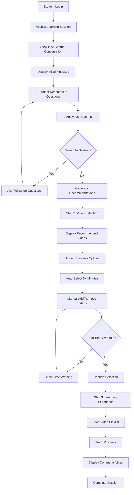

### AI Chatbot Conversation Flow (Step 1 Detail)
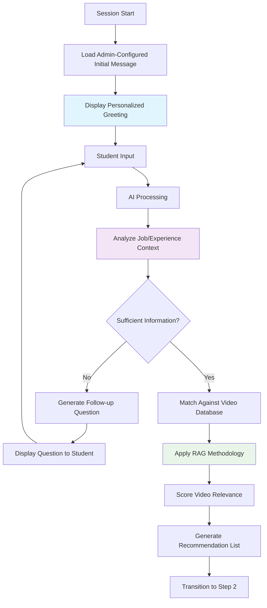

### Video Selection and Configuration Flow (Step 2 Detail)
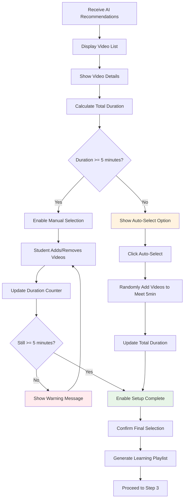

## Sequence Diagrams

### AI Recommendation Generation Sequence
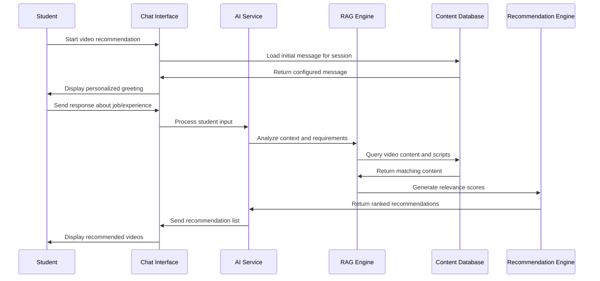

### Video Content Analysis for Recommendations
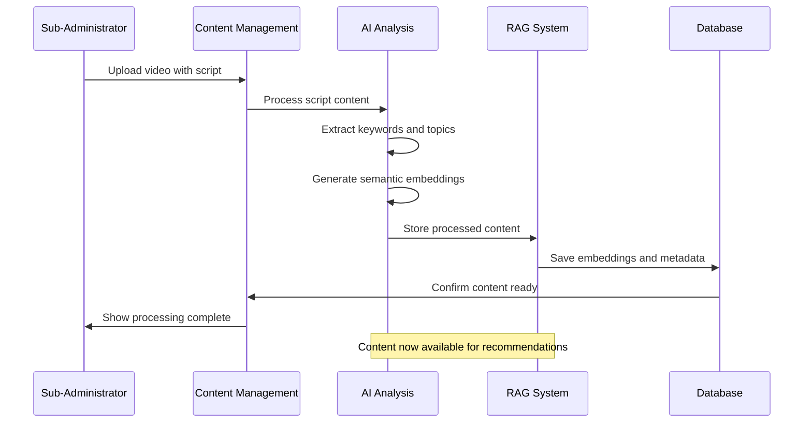

### Student Learning Progress Tracking
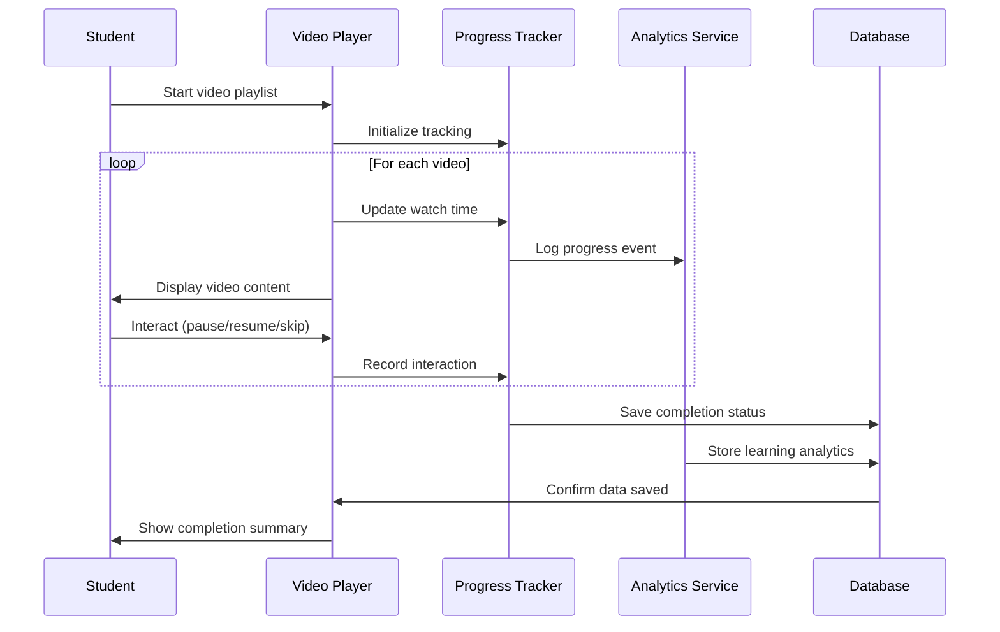

## State Diagrams

### AI Recommendation Session States
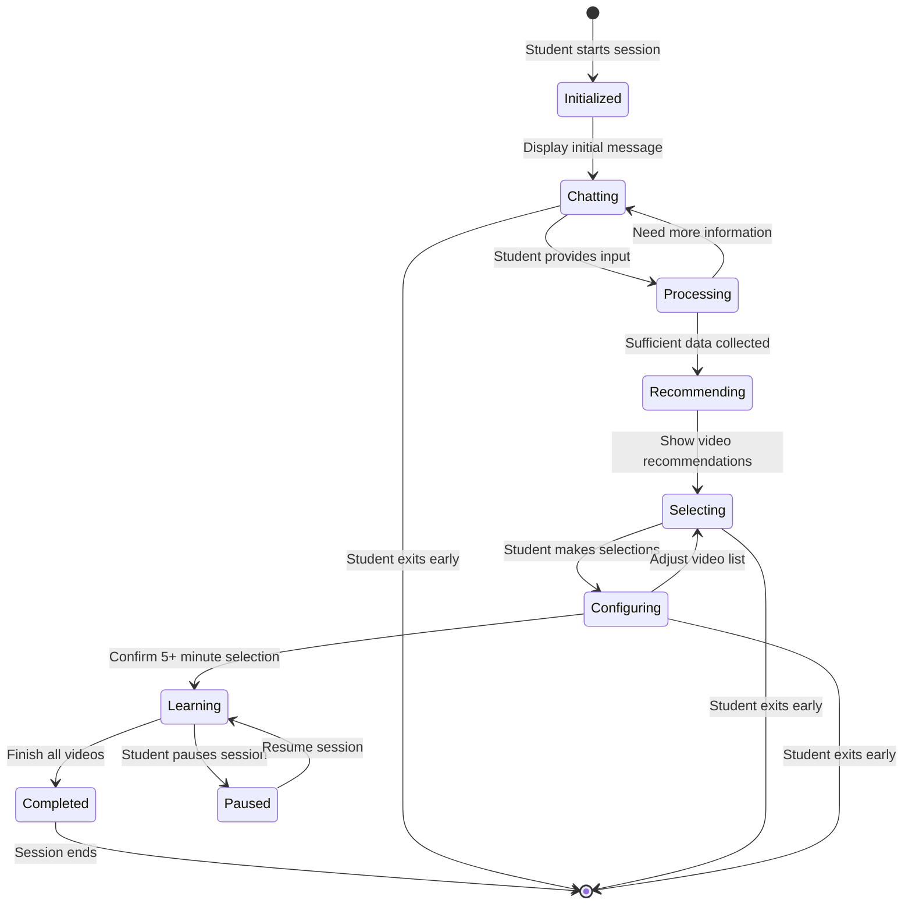

### Video Content Processing States
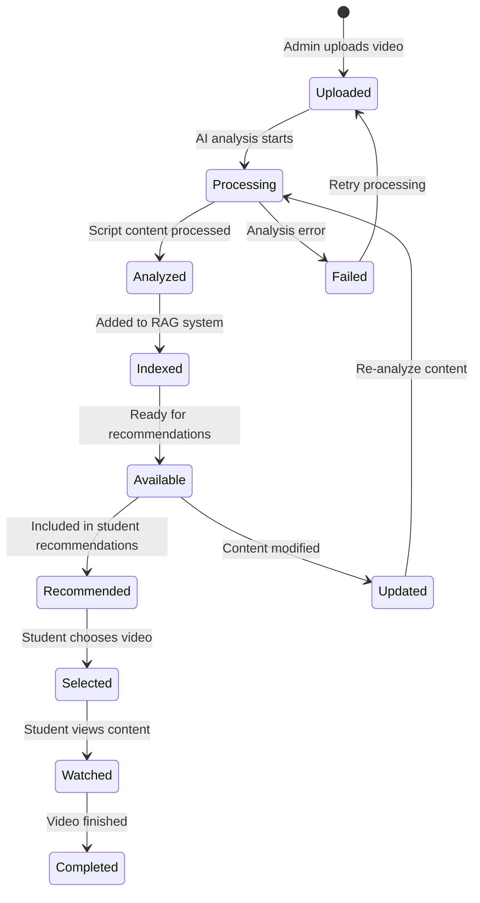

## Activity Diagrams

### Complete Learning Journey
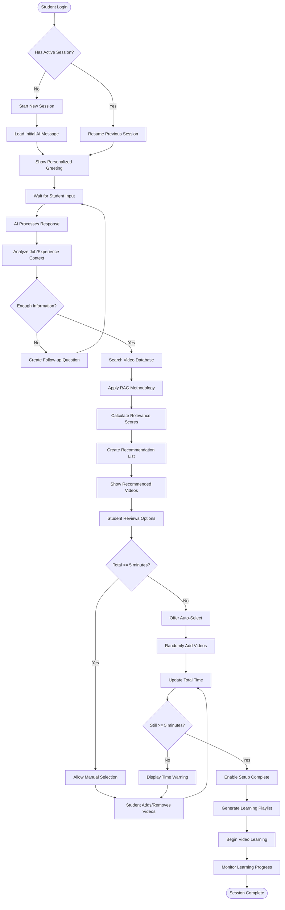

## Use Case Diagrams

### Student AI Recommendation Use Cases
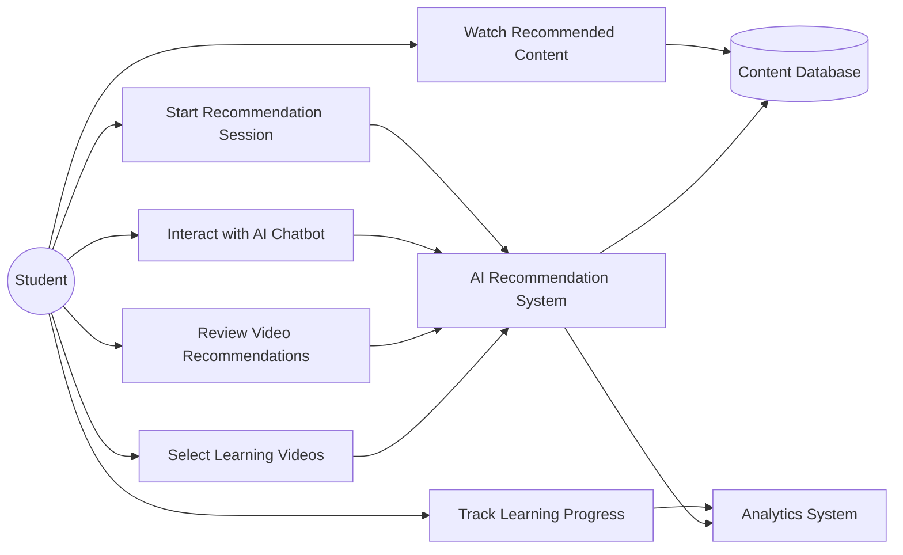

### AI System Internal Use Cases
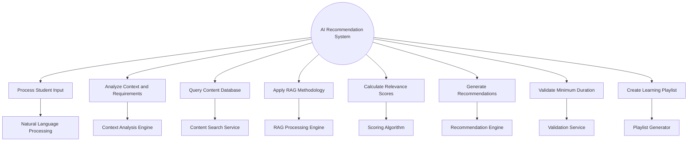

## Component Interaction Diagrams

### AI Recommendation Architecture
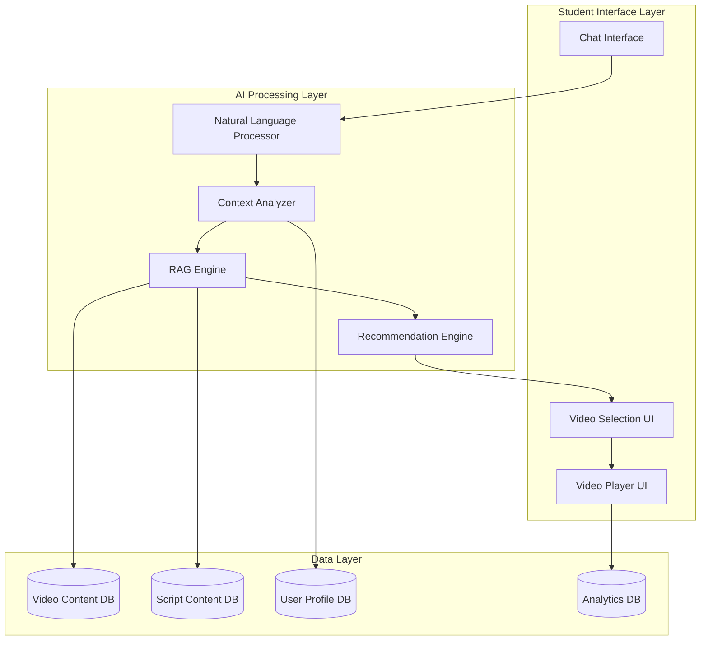