# AI Tool Configuration Flows and Diagrams

## User Flow Diagrams

### API Key Management Flow
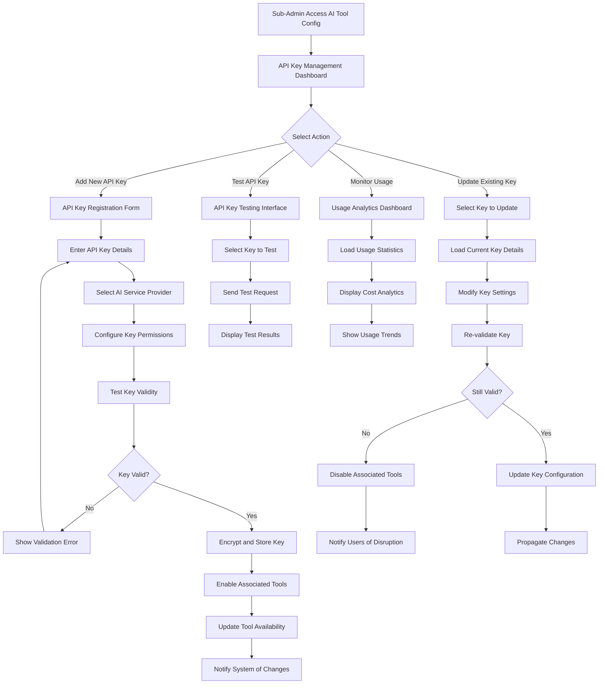

### Session-Specific Tool Configuration Flow
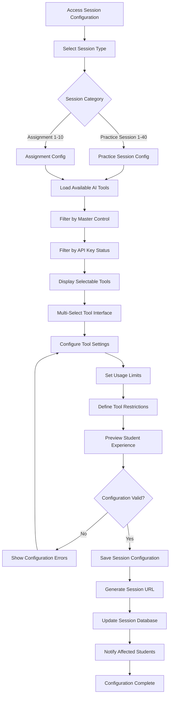

## Sequence Diagrams

### API Key Registration and Validation Sequence
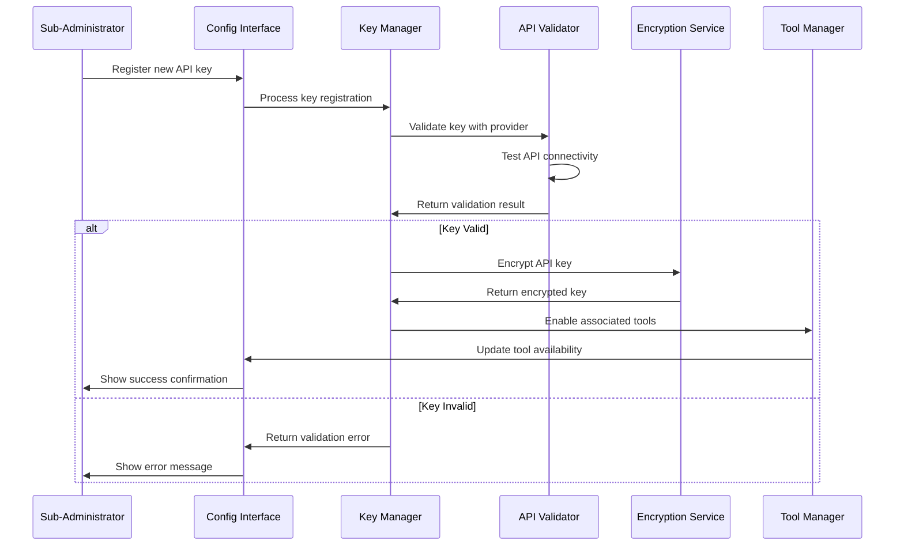

### Tool Configuration Propagation Sequence
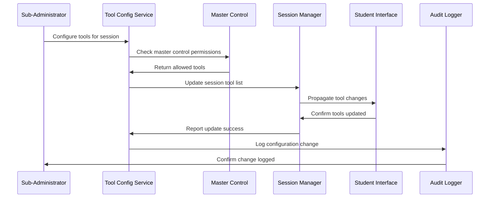

### Cost Monitoring and Alert Sequence
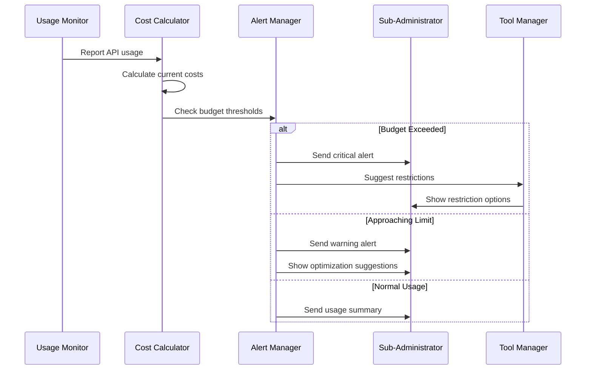

## State Diagrams

### API Key Lifecycle States
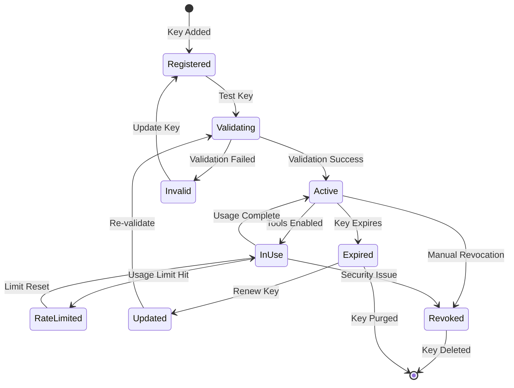

### Tool Configuration States
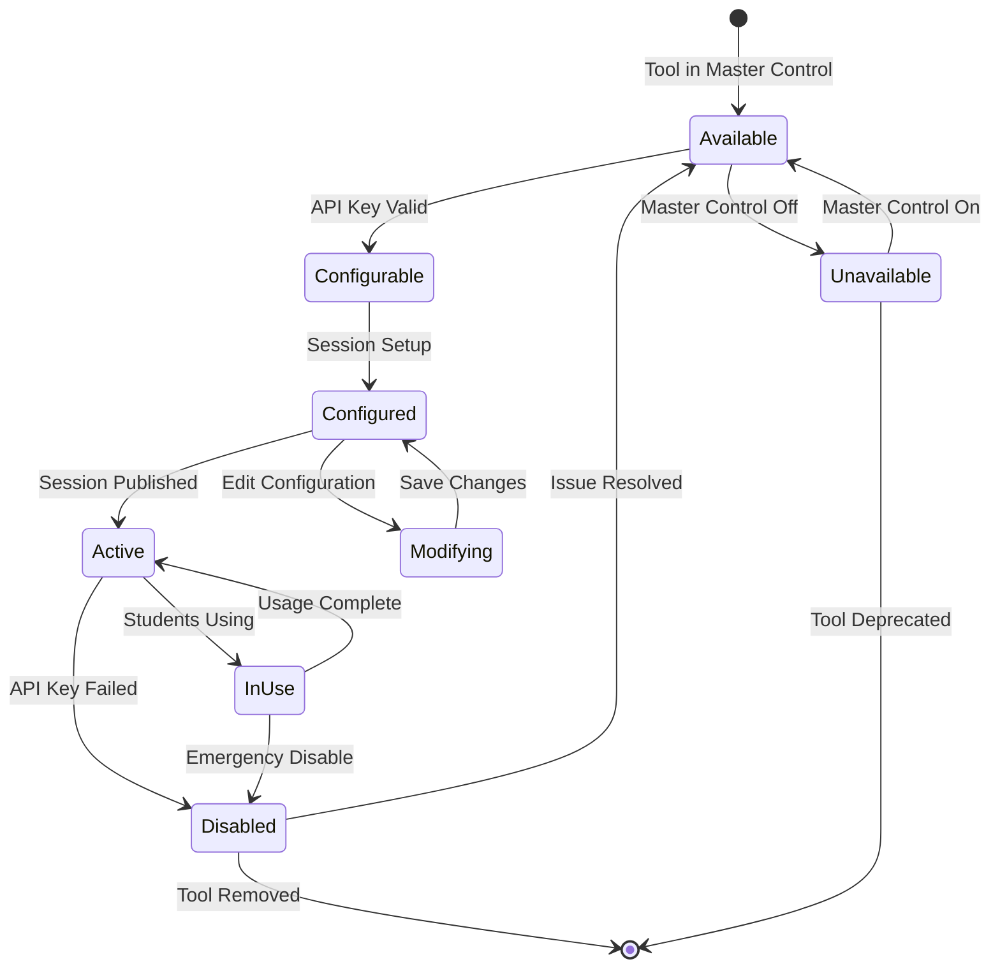

### Cost Management States
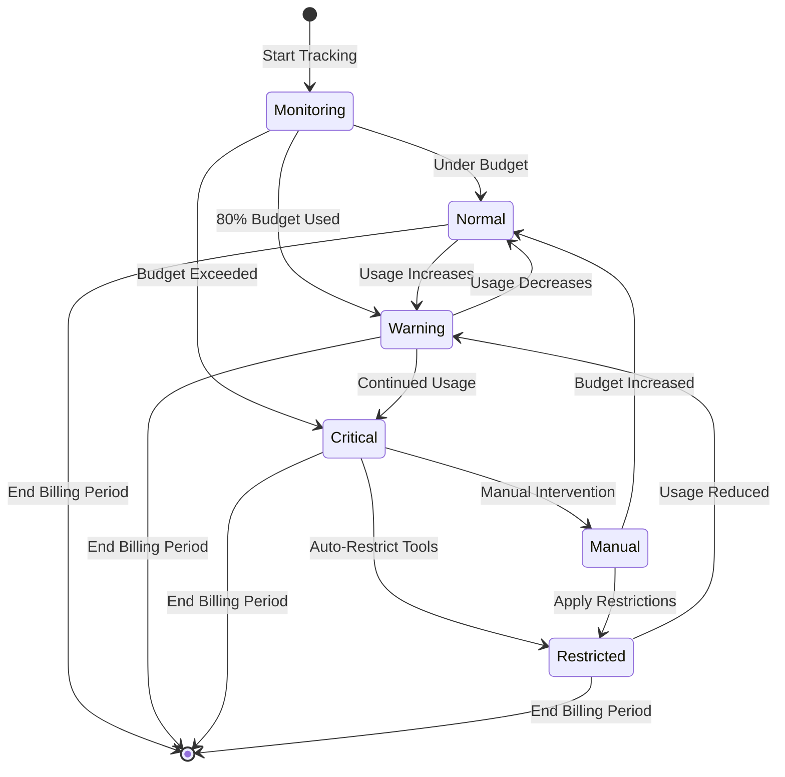

## Activity Diagrams

### Daily AI Tool Management Workflow
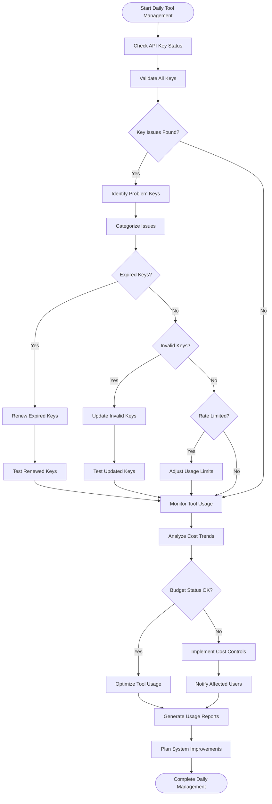

### Tool Configuration Optimization Workflow
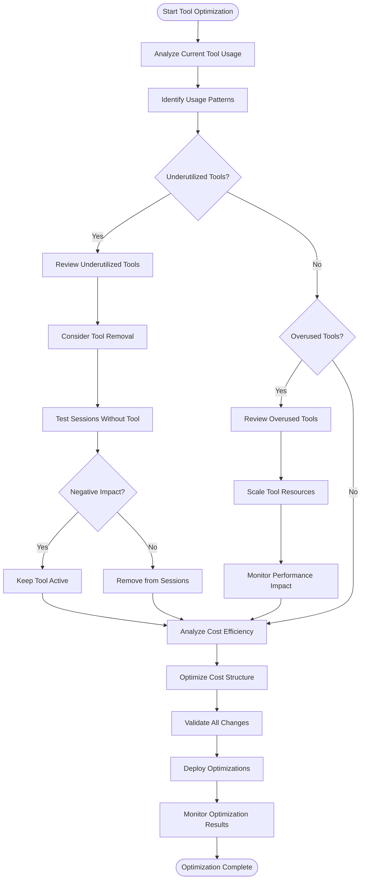

## Use Case Diagrams

### Sub-Administrator AI Tool Configuration Use Cases
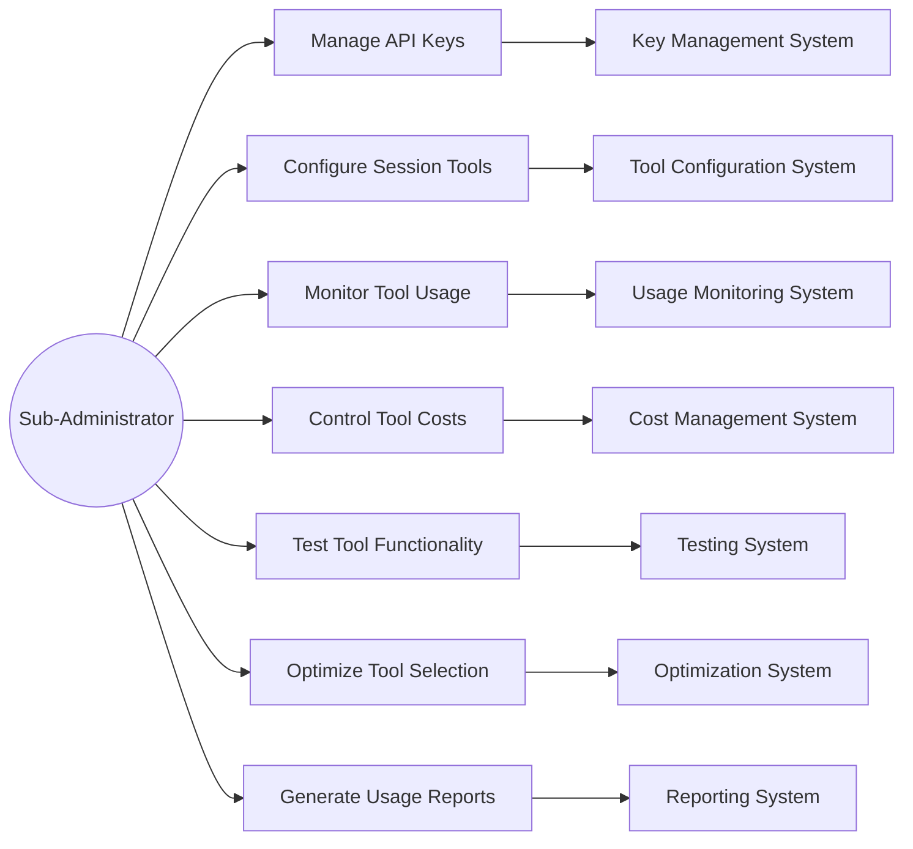

### AI Tool Integration Use Cases
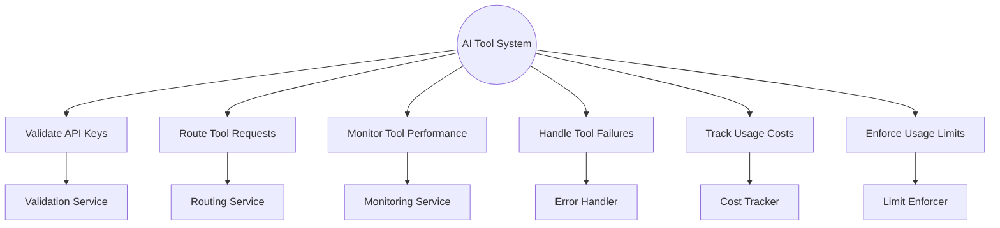

## Component Interaction Diagrams

### AI Tool Configuration Architecture
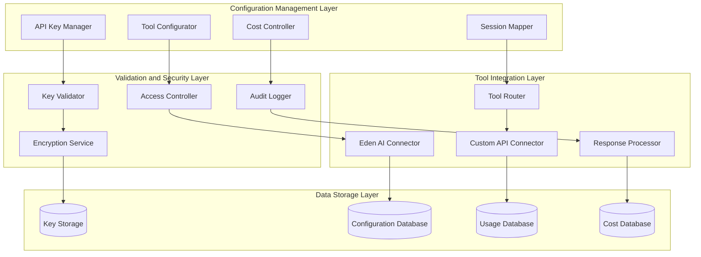

### Real-time Tool Management Flow
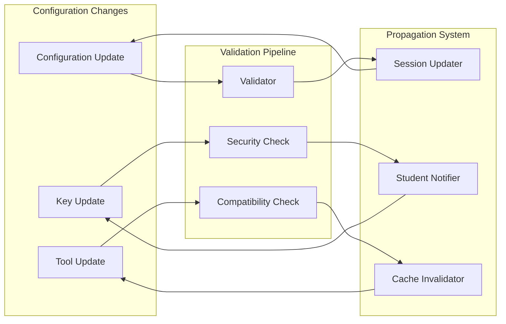

### Cost Management Integration
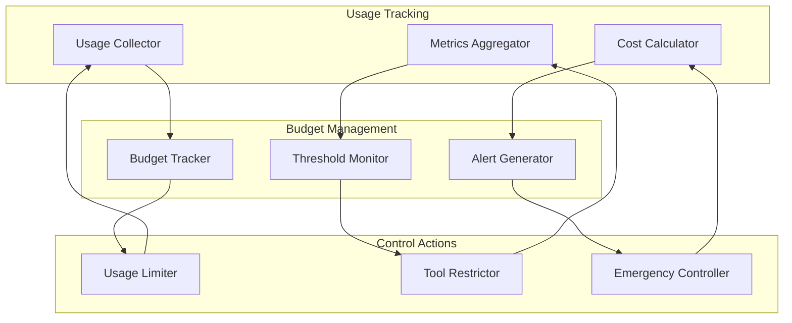