# Assignment Management Flows and Diagrams

## User Flow Diagrams

### Assignment Creation Flow (Slots 1-10)
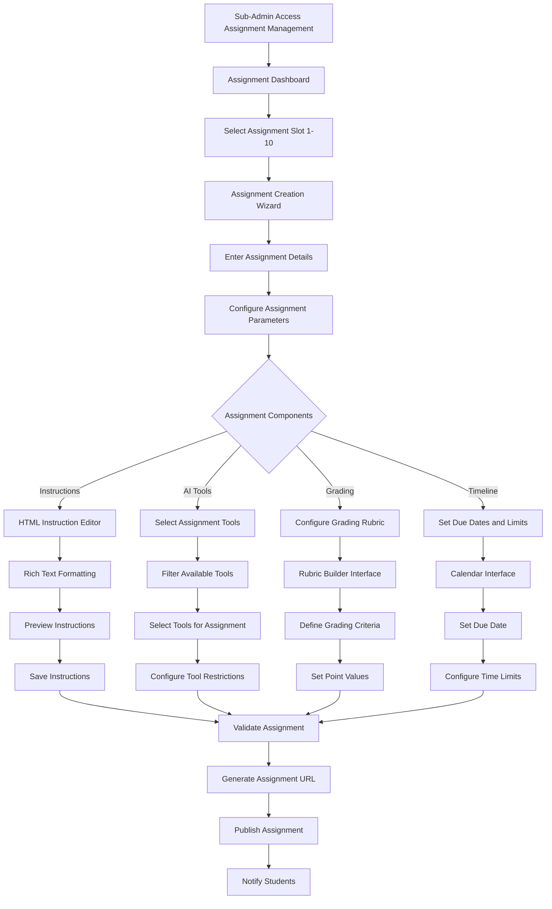

### Student Assignment Submission Flow
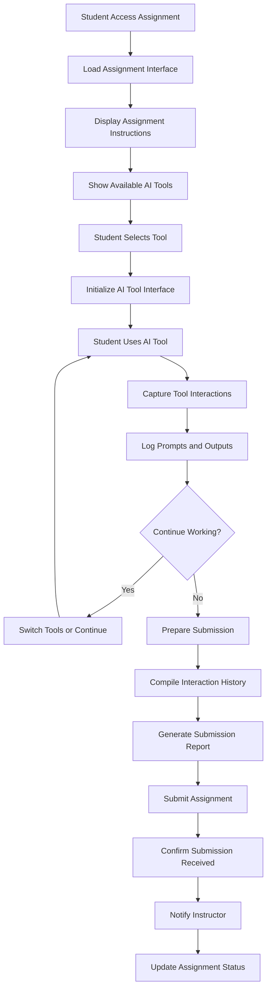

### Assignment Grading and Evaluation Flow
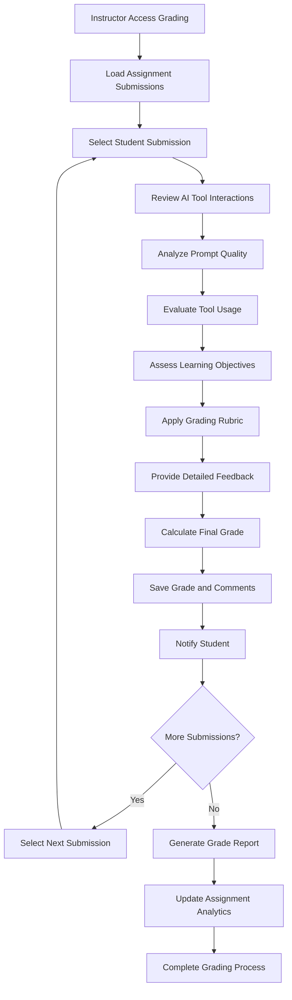

## Sequence Diagrams

### Assignment Creation and Configuration Sequence
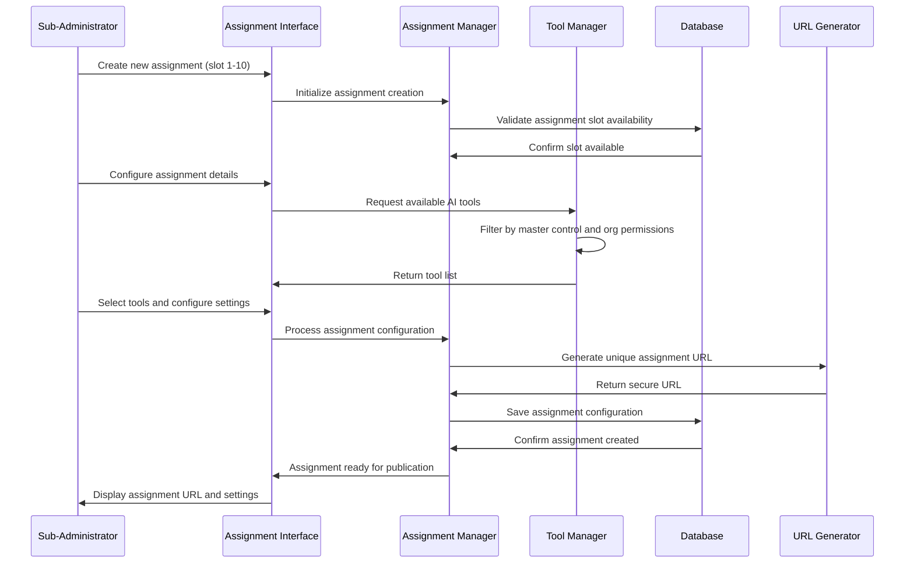

### Student Assignment Interaction Sequence
```mermaid
sequenceDiagram
    participant S as Student
    parameter UI as Assignment Interface
    participant AM as Assignment Manager
    participant TM as Tool Manager
    participant AI as AI Services
    participant Logger as Interaction Logger
    
    S->>UI: Access assignment URL
    UI->>AM: Load assignment configuration
    AM->>UI: Return assignment details and tools
    UI->>S: Display assignment instructions
    
    S->>UI: Select AI tool for use
    UI->>TM: Initialize selected tool
    TM->>AI: Connect to AI service
    AI->>TM: Tool ready for use
    TM->>UI: Tool interface loaded
    
    S->>UI: Submit prompt to AI tool
    UI->>AI: Process prompt request
    AI->>UI: Return AI response
    UI->>Logger: Log interaction (prompt + response)
    Logger->>UI: Confirm logging
    UI->>S: Display AI response
    
    Note over Logger: All interactions captured for grading
```

### Assignment Grading Sequence
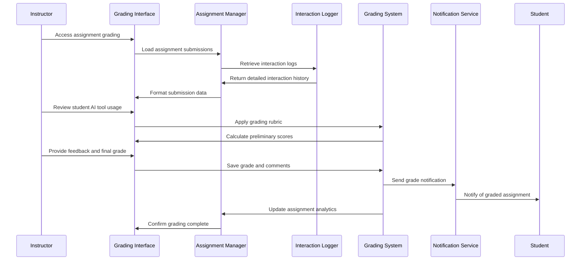

## State Diagrams

### Assignment Lifecycle States
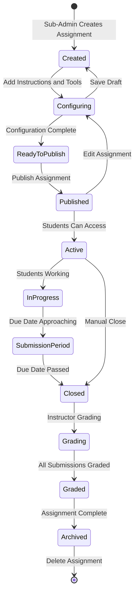

### Student Assignment Progress States
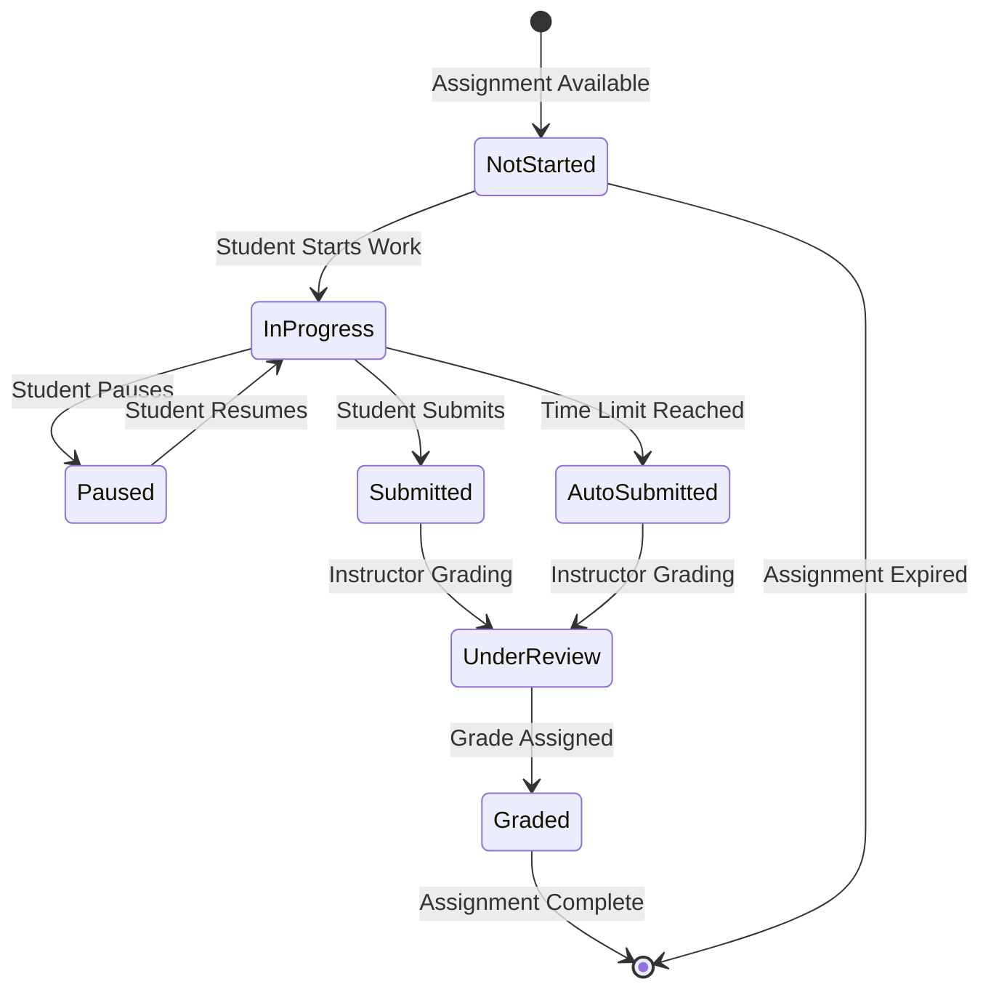

### AI Tool Usage States in Assignments
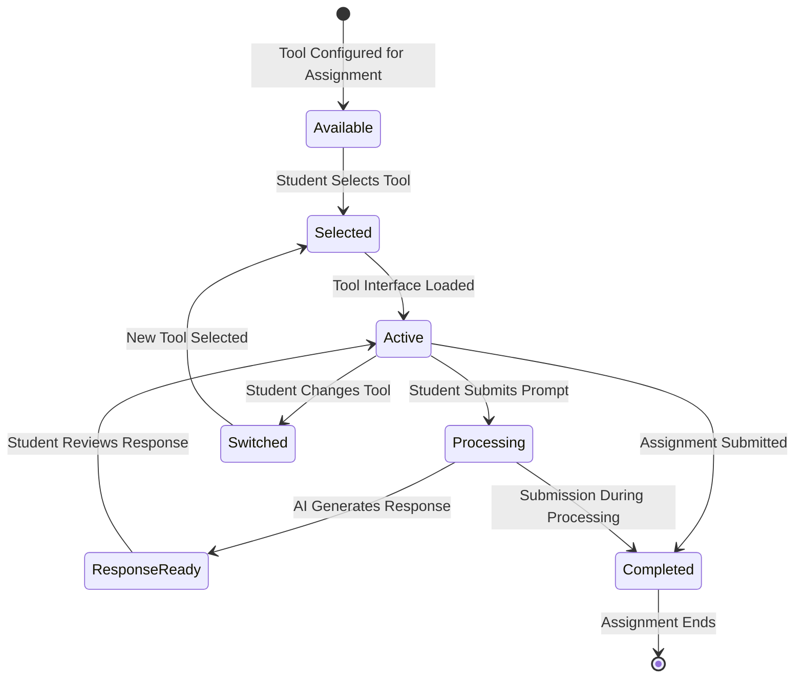

## Activity Diagrams

### Assignment Management Workflow
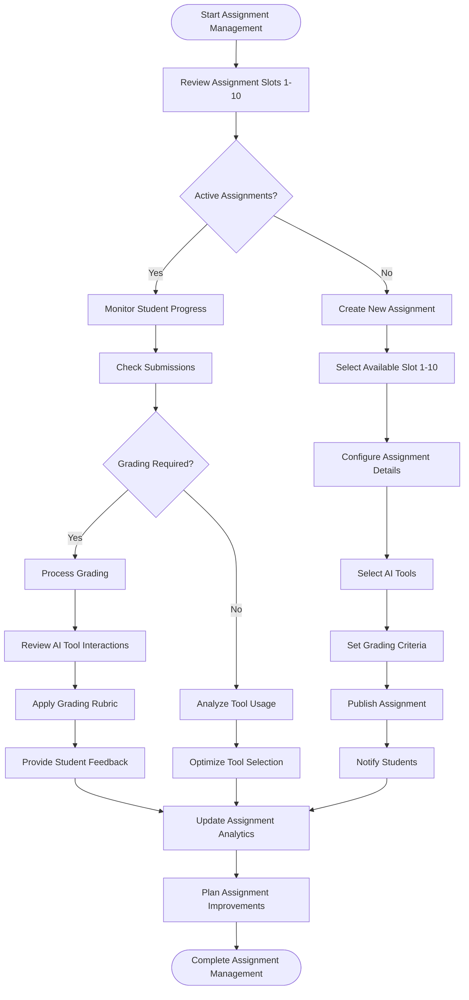

### Student Assignment Completion Workflow
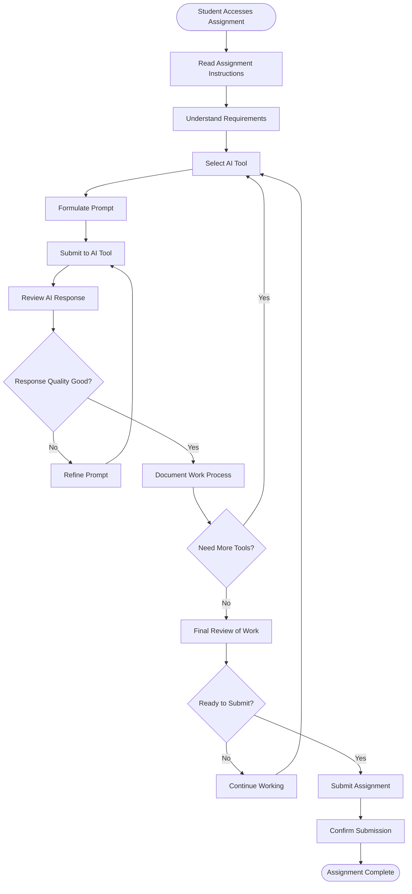

## Use Case Diagrams

### Sub-Administrator Assignment Management Use Cases
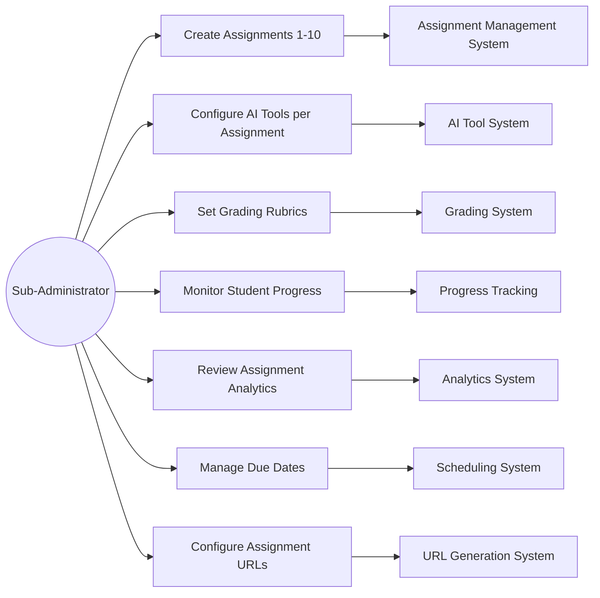

### Student Assignment Use Cases
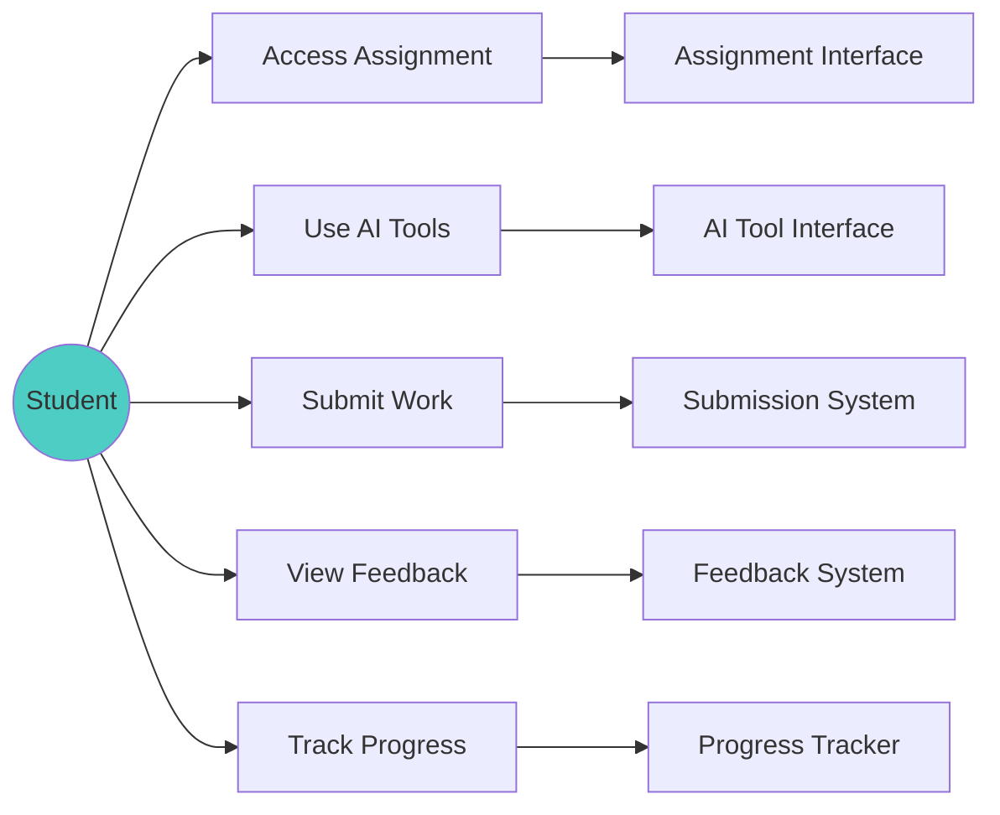

### Instructor Grading Use Cases
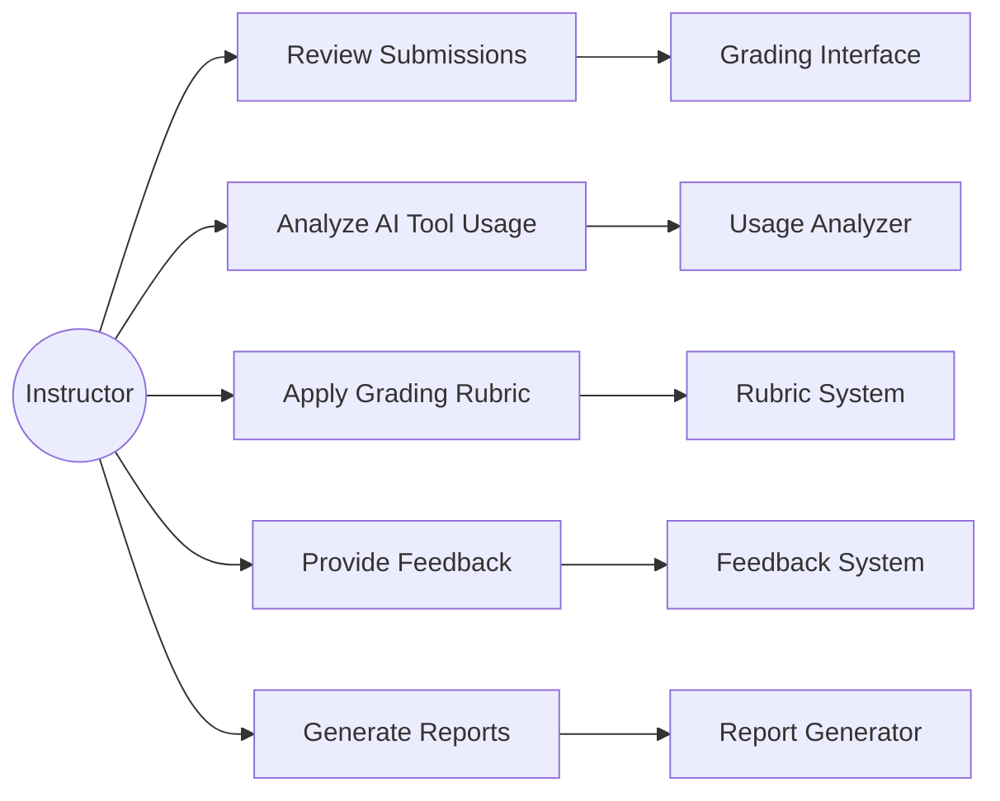

## Component Interaction Diagrams

### Assignment Management Architecture
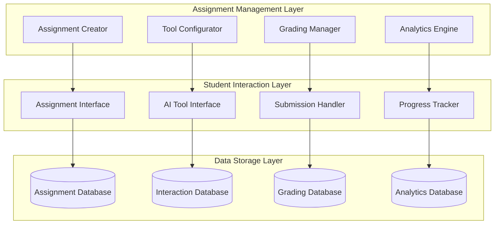

### AI Tool Integration in Assignments
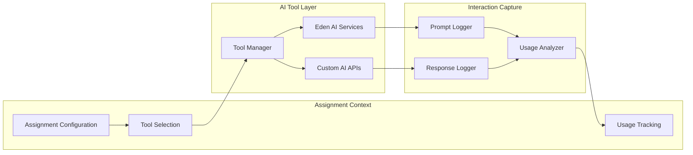