# Branding Customization Flows and Diagrams

## User Flow Diagrams

### Logo Upload and Management Flow
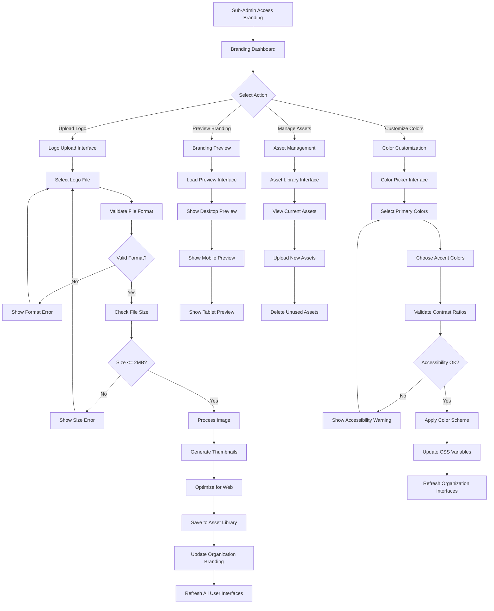

### Real-time Branding Update Flow
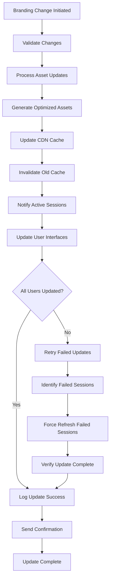

### Multi-Device Branding Consistency Flow
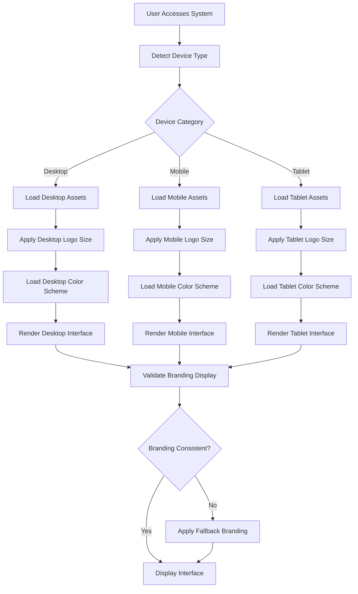

## Sequence Diagrams

### Logo Upload and Processing Sequence
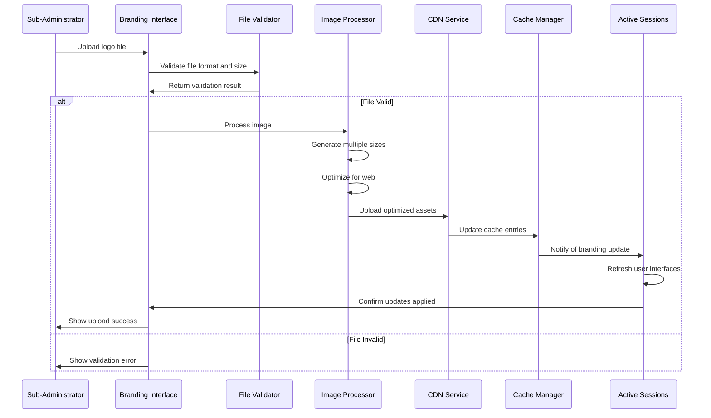

### Real-time Branding Propagation Sequence
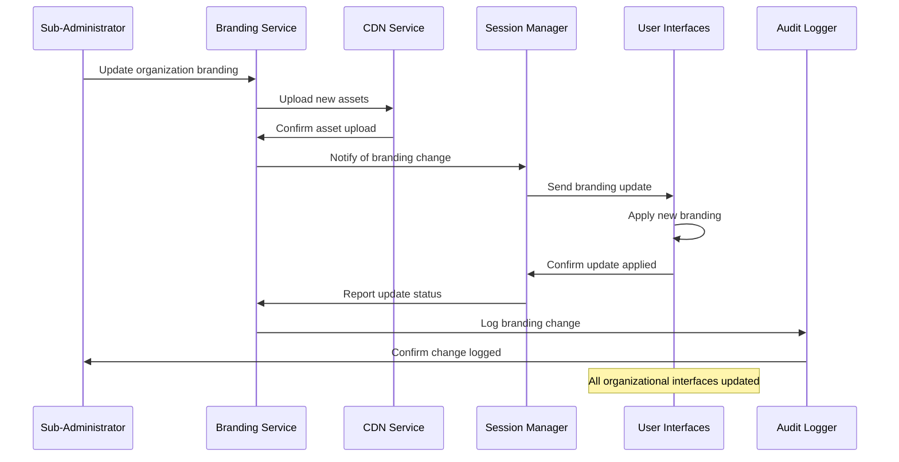

### Asset Management Sequence
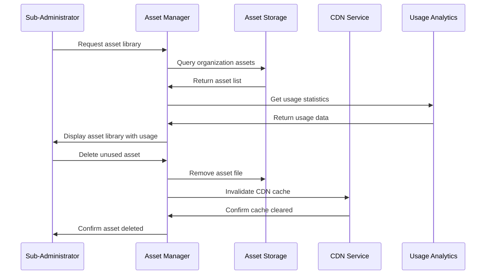

## State Diagrams

### Asset Lifecycle States
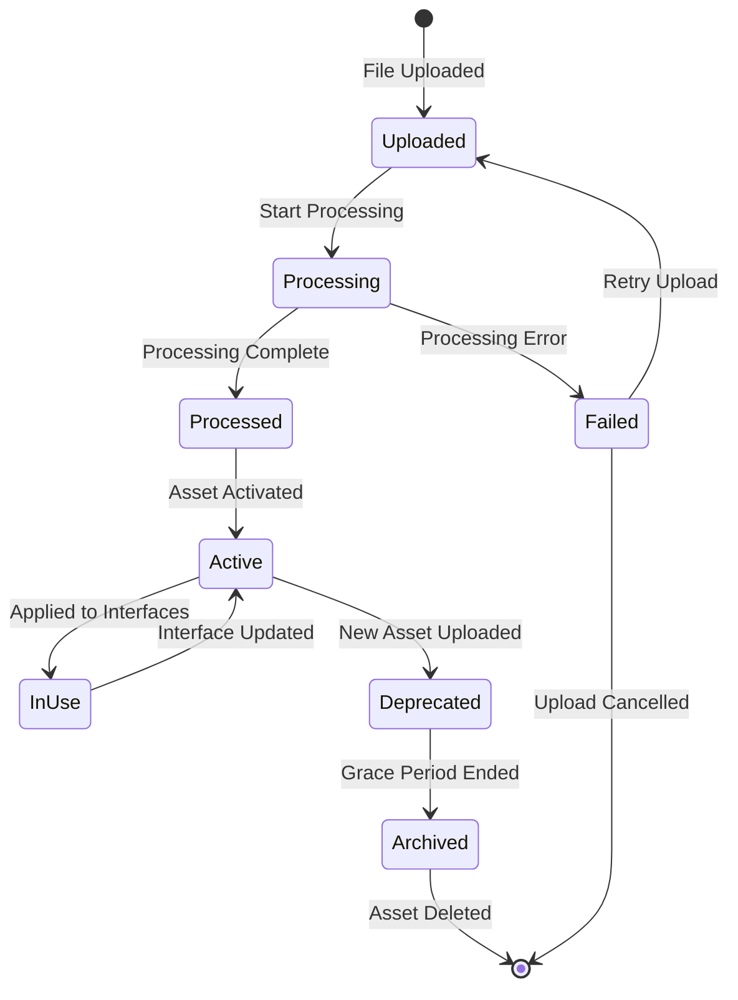

### Branding Update States
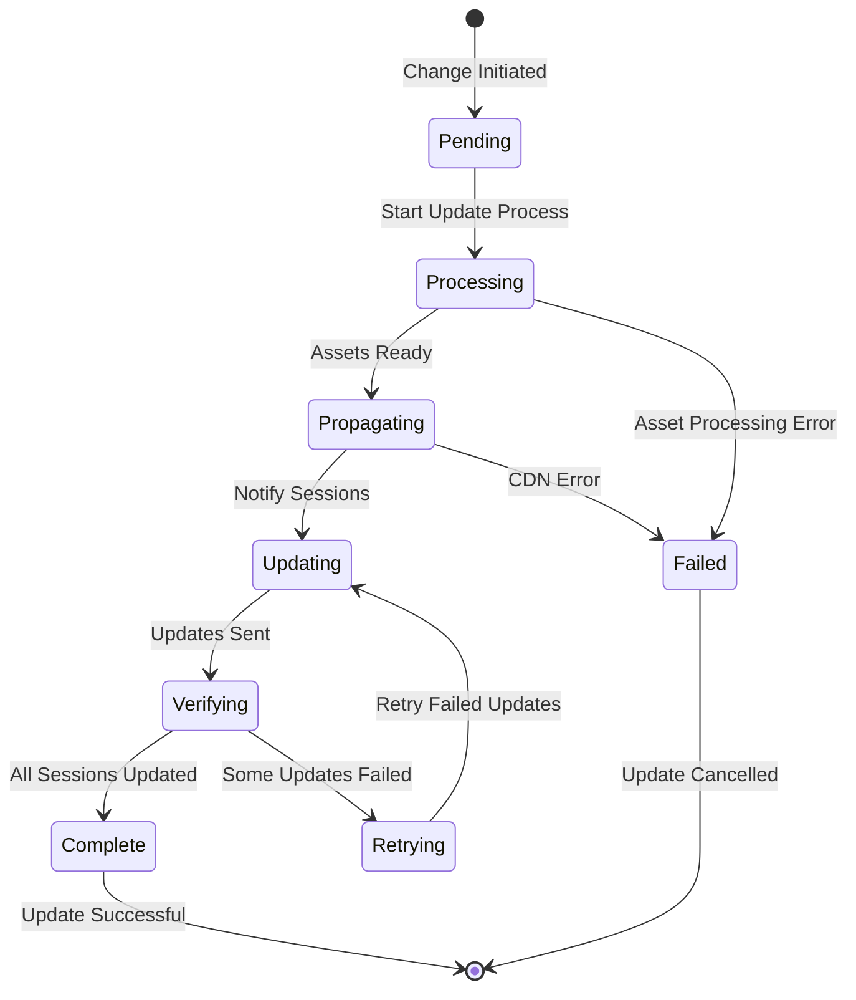

## Activity Diagrams

### Daily Branding Management Workflow
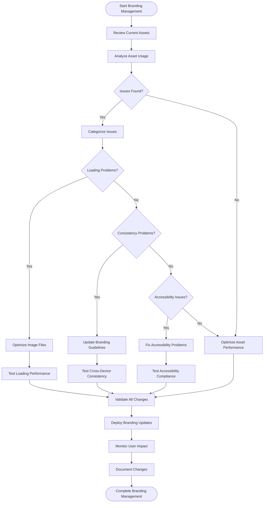

### Asset Upload and Optimization Workflow
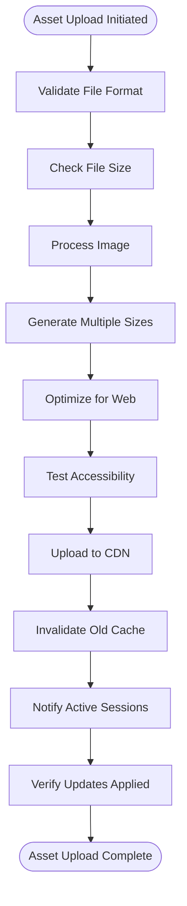

## Use Case Diagrams

### Sub-Administrator Branding Use Cases
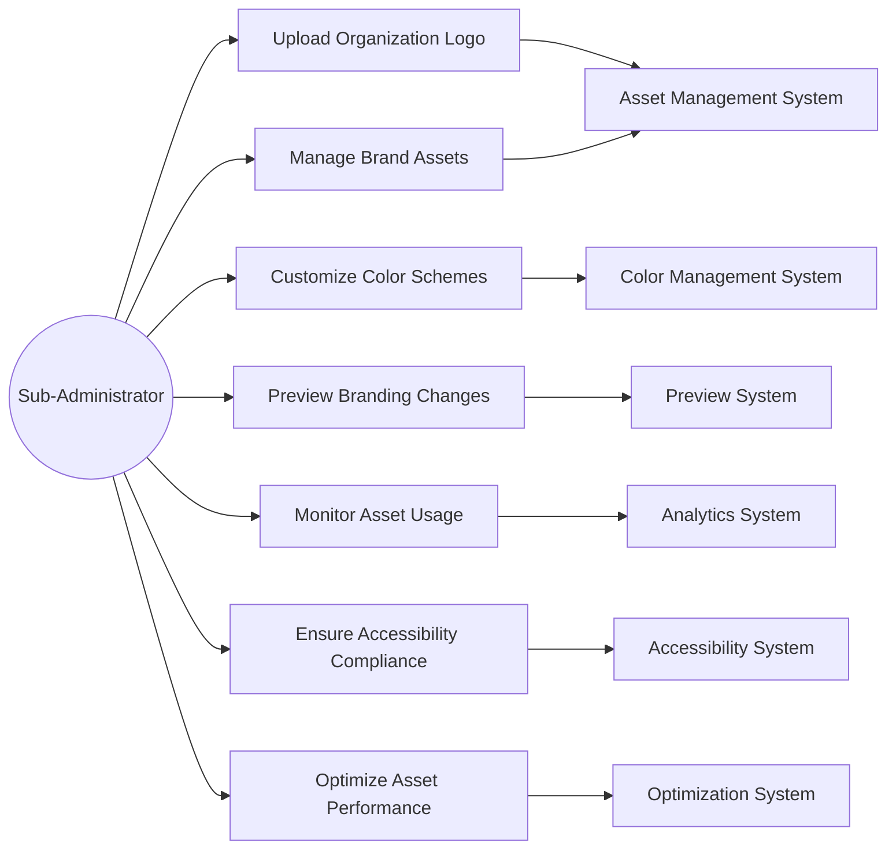

### System Branding Integration Use Cases
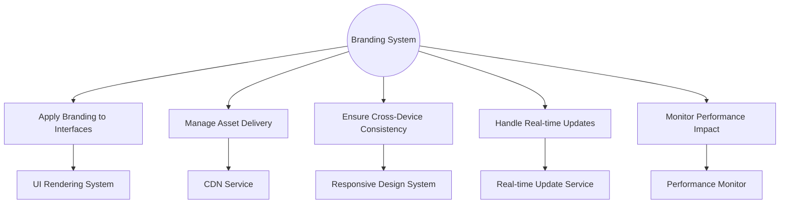

## Component Interaction Diagrams

### Branding System Architecture
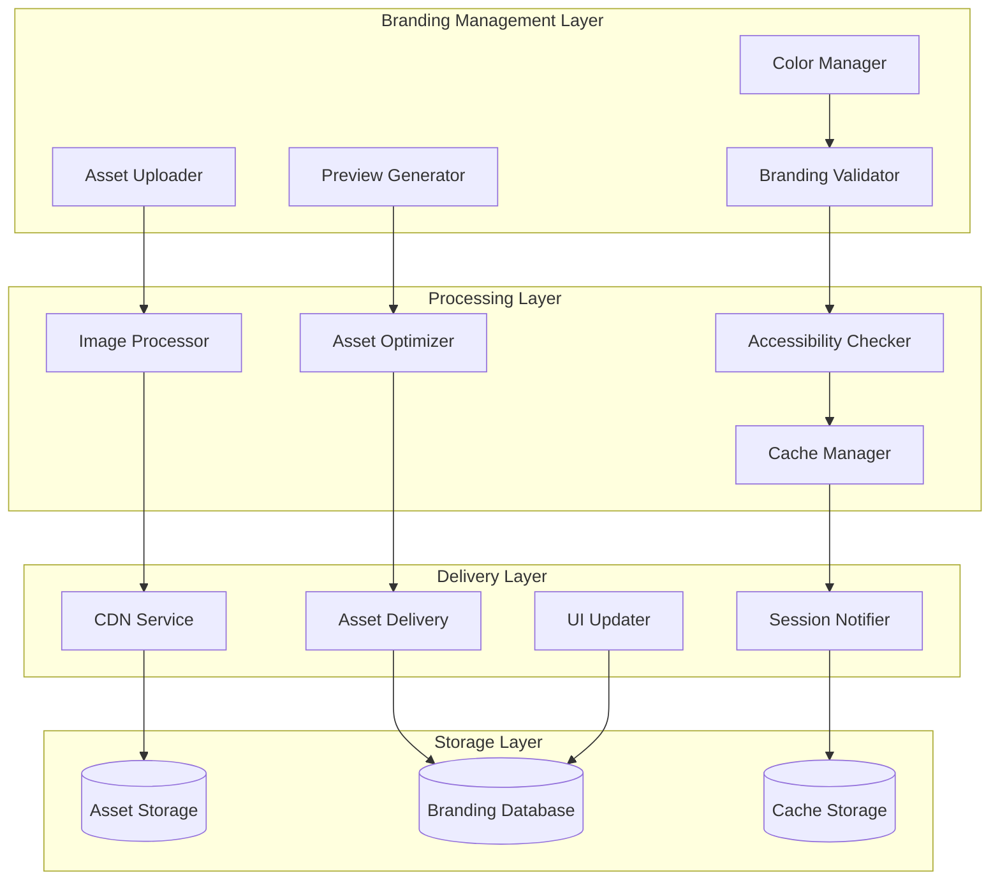

### Real-time Branding Update Flow
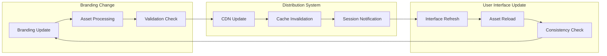

### Multi-Device Branding Consistency
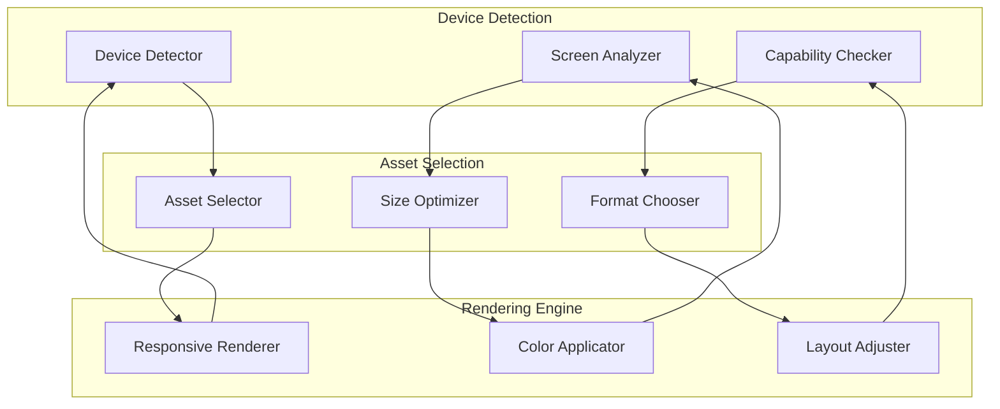