# Content Management Flows and Diagrams

## User Flow Diagrams

### Video Content Management Flow (Sessions 1-40)
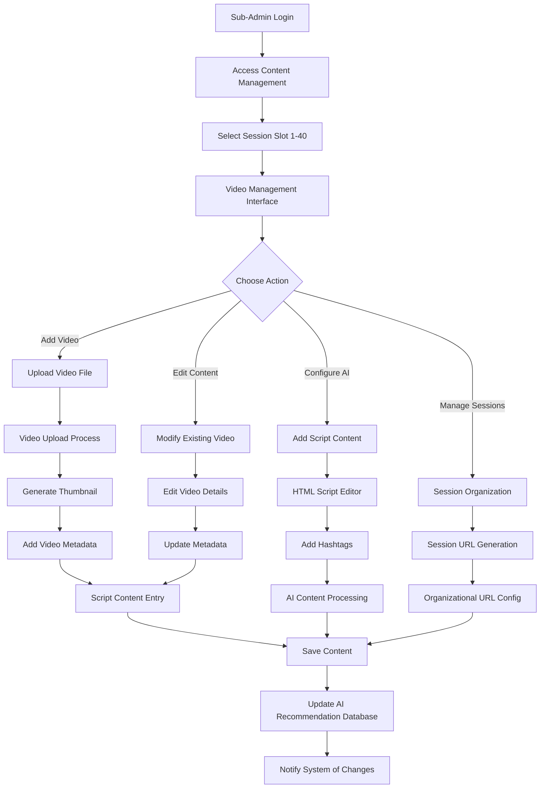

### Practice Session Configuration Flow (Sessions 1-40)
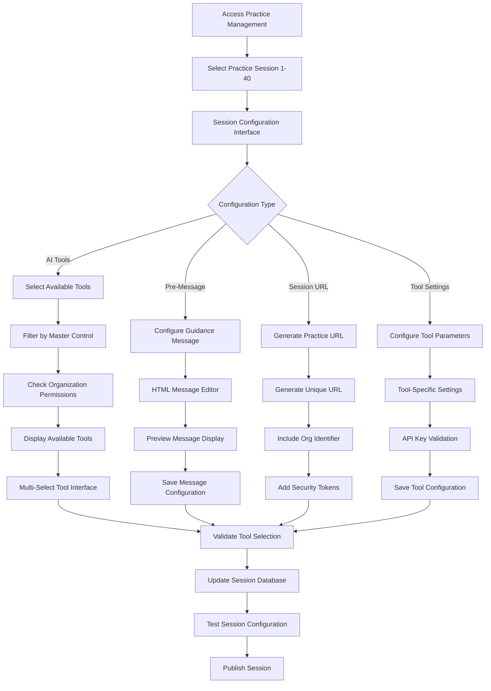

### Assignment Management Flow (Assignments 1-10)
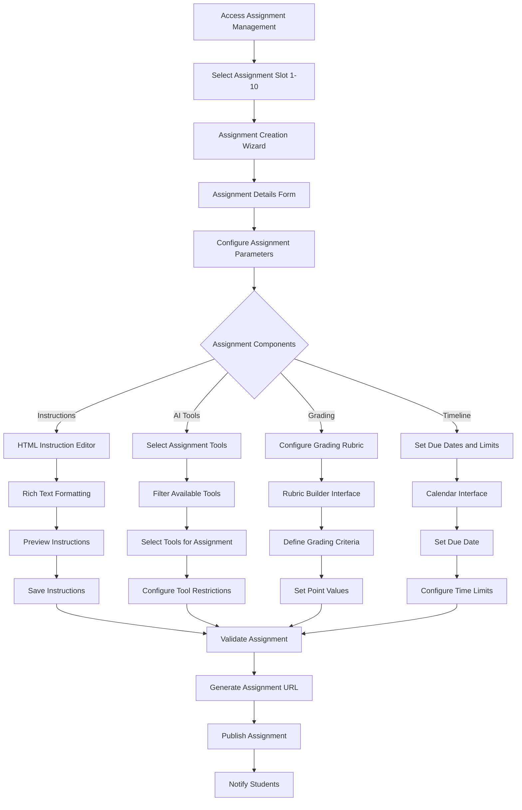

## Sequence Diagrams

### Video Upload and AI Processing Sequence
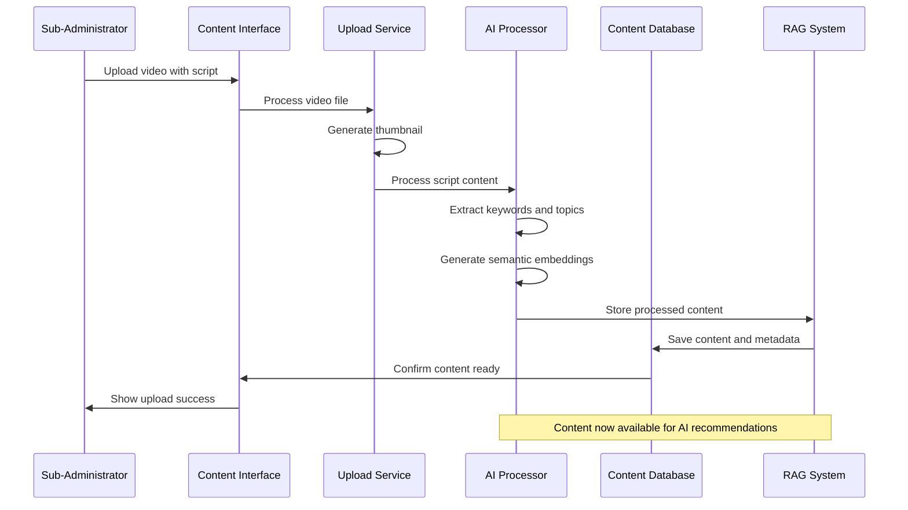

### Session URL Generation Sequence
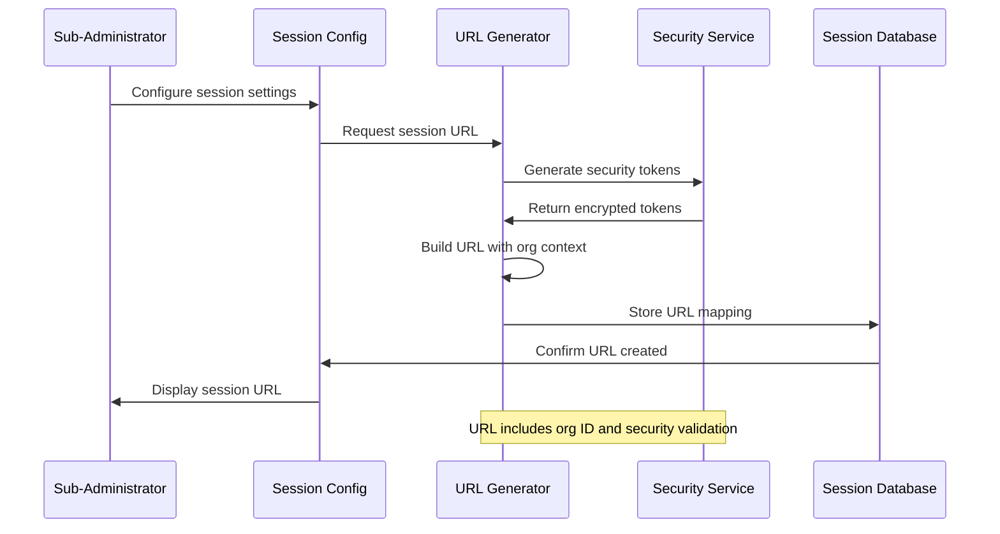

### AI Tool Configuration Propagation
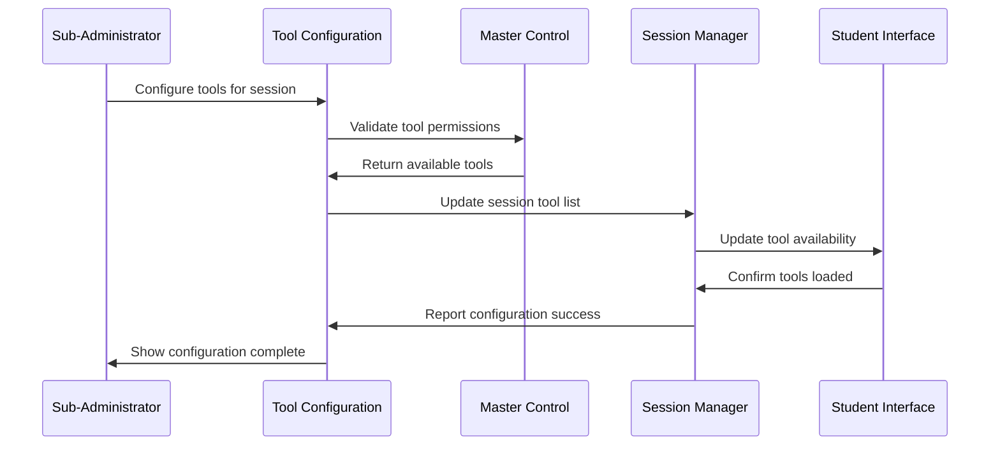

## State Diagrams

### Content Management States
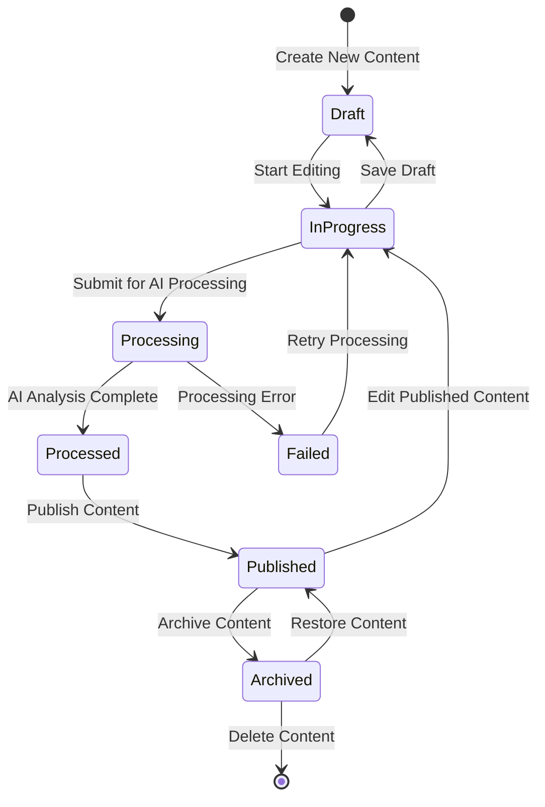

### Session Configuration States
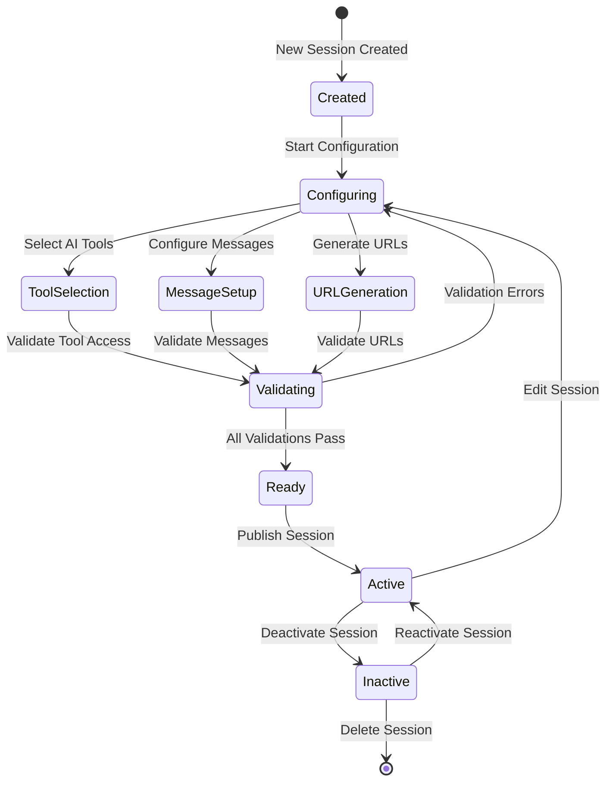

## Activity Diagrams

### Daily Content Management Workflow
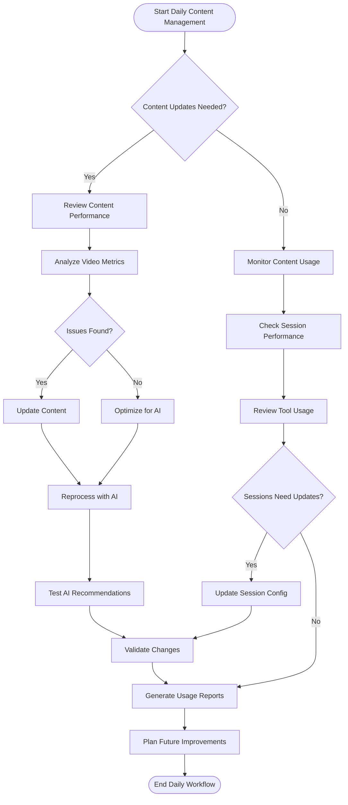

### Content Publishing Workflow
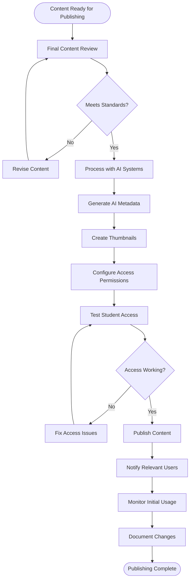

## Use Case Diagrams

### Sub-Administrator Content Management Use Cases
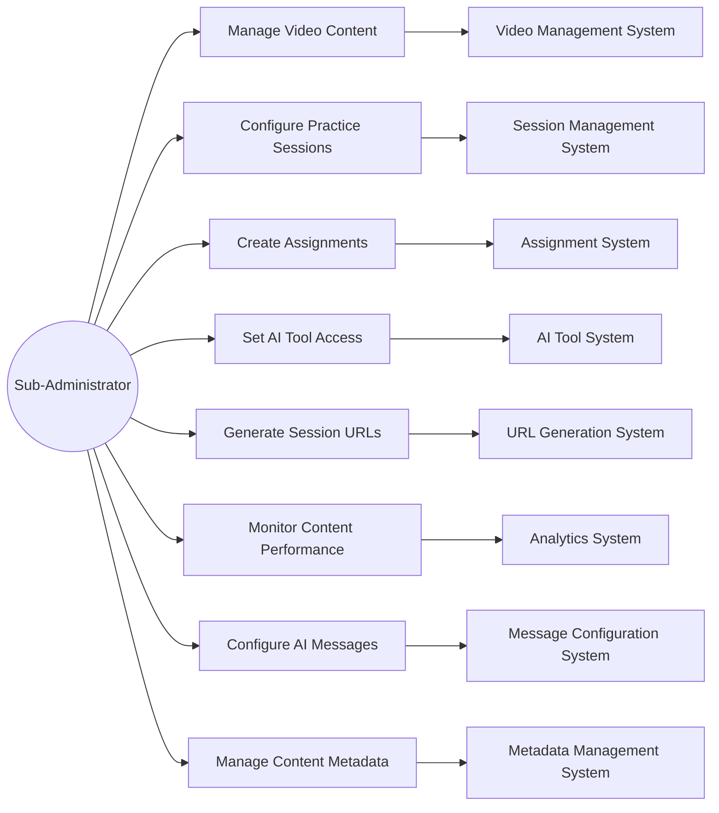

### Content Integration Use Cases
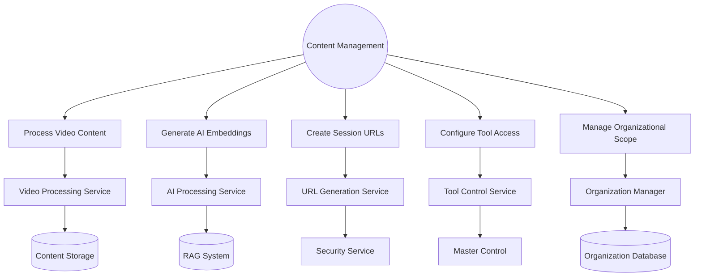

## Component Interaction Diagrams

### Content Management Architecture
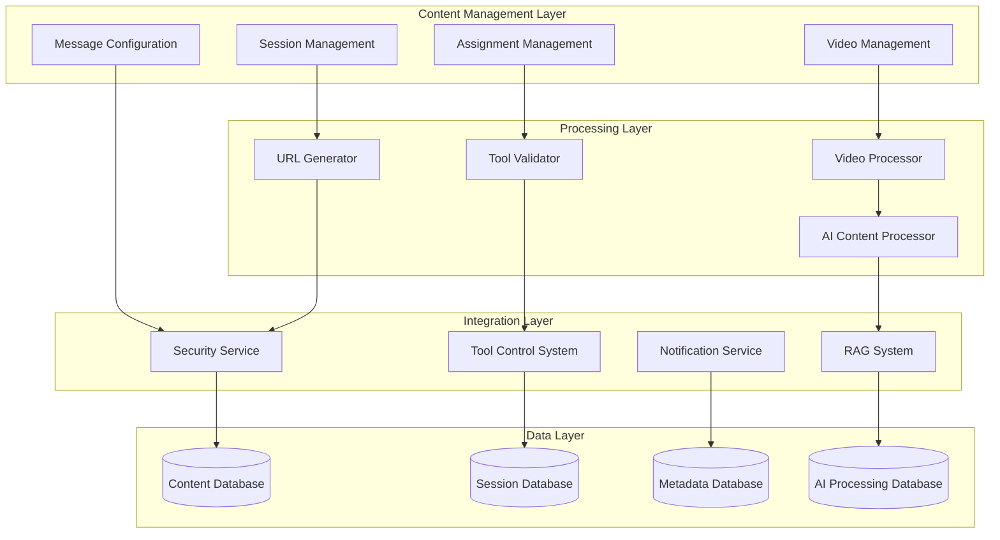

### Real-time Content Synchronization
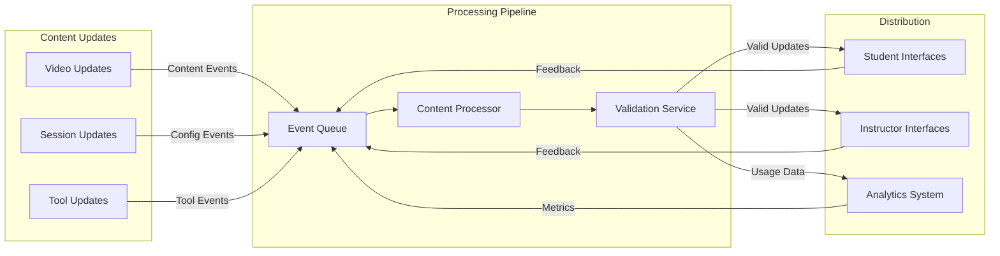