# Multi-Administrator Management Flows and Diagrams

## User Flow Diagrams

### Sub-Administrator Creation Flow
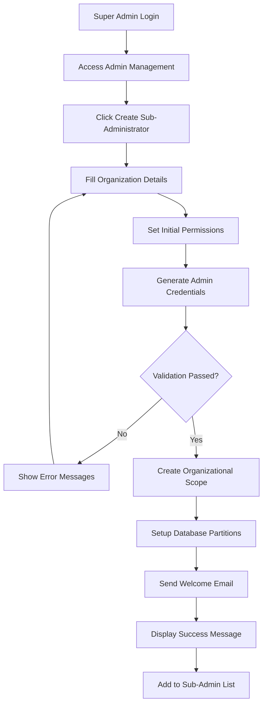

### Data Isolation Verification Flow
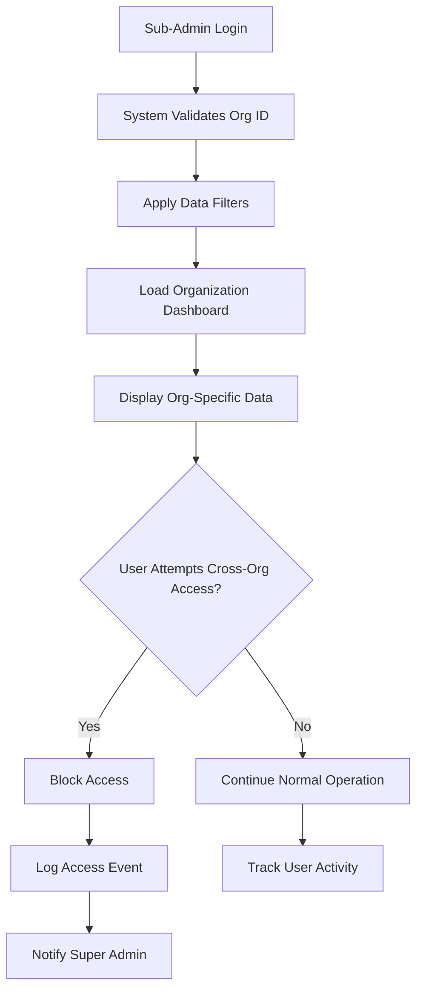

### Super Administrator Oversight Flow
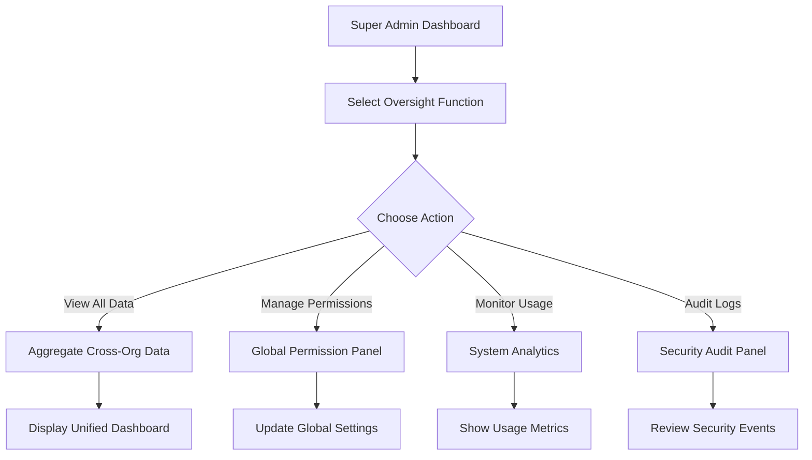

## System Architecture Diagrams

### Multi-Tenant Data Architecture
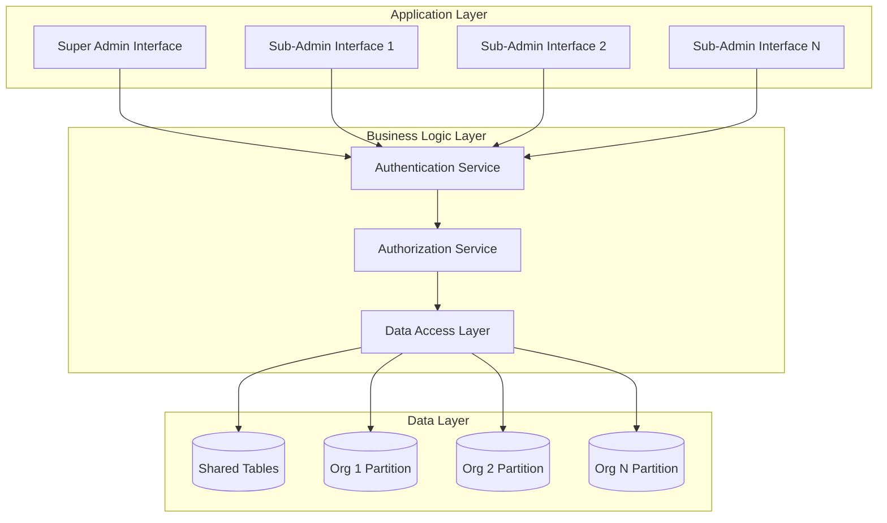

### Permission Hierarchy Diagram
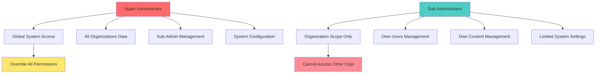

## Sequence Diagrams

### Sub-Administrator Creation Sequence
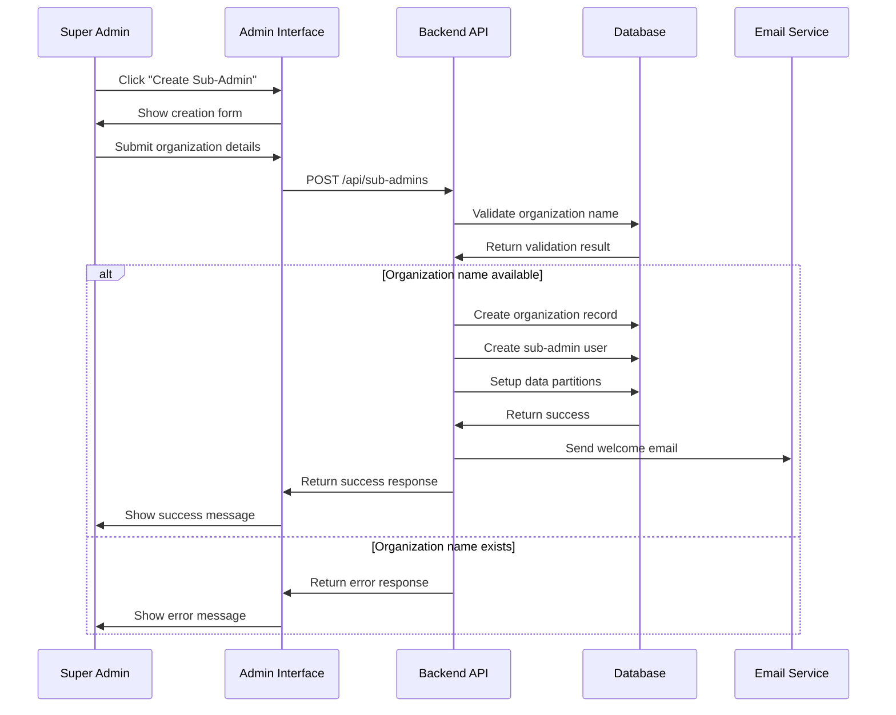

### Data Access Control Sequence
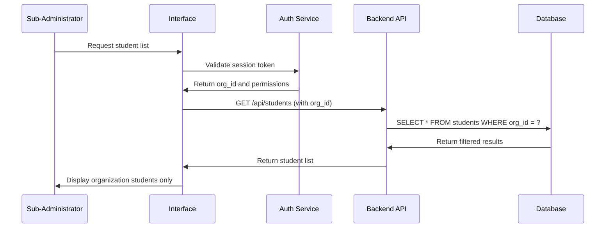

## State Diagrams

### Sub-Administrator Account States
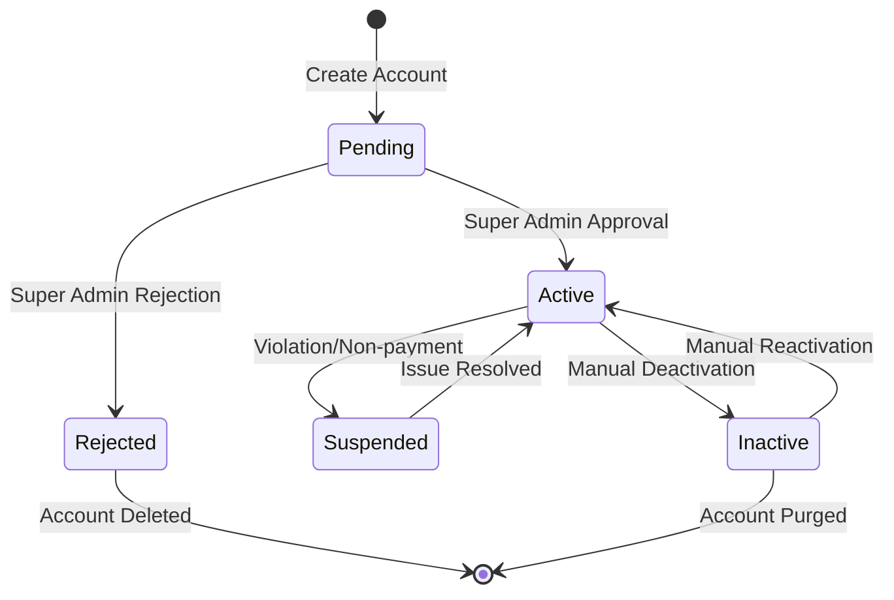

### Data Isolation States
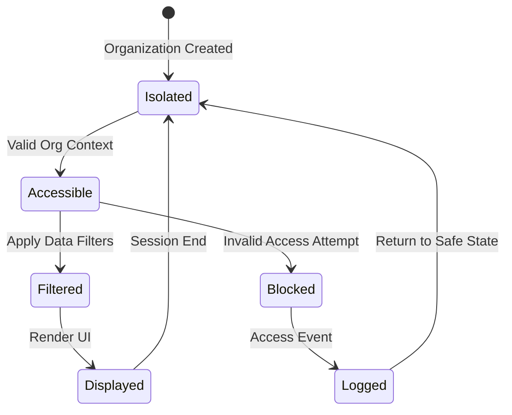

## Use Case Diagrams

### Super Administrator Use Cases
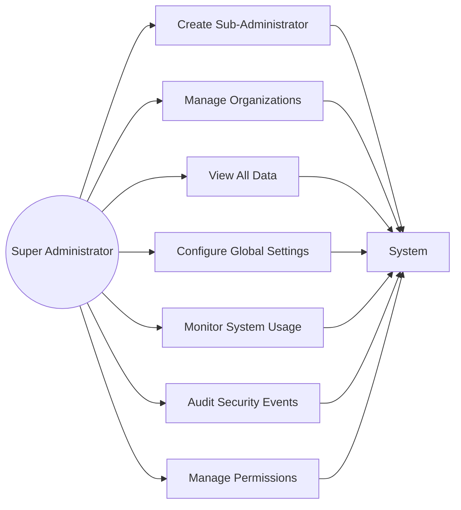

### Sub-Administrator Constraints
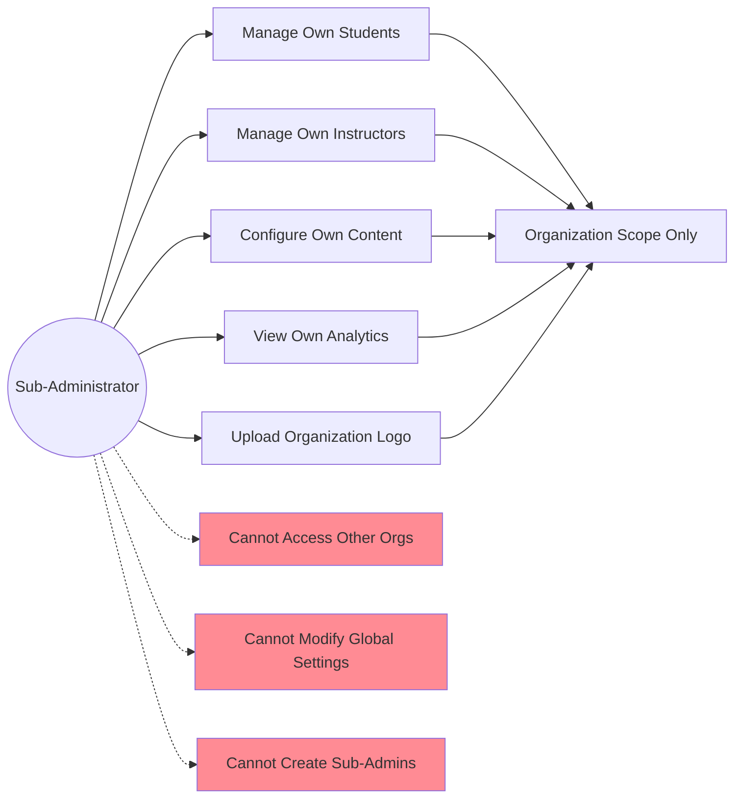